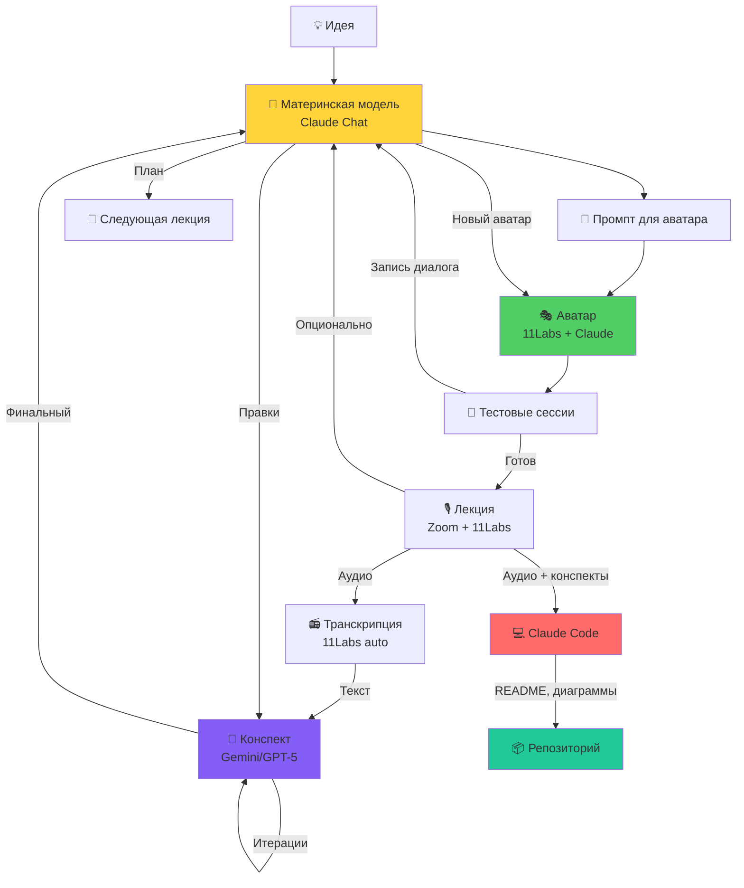
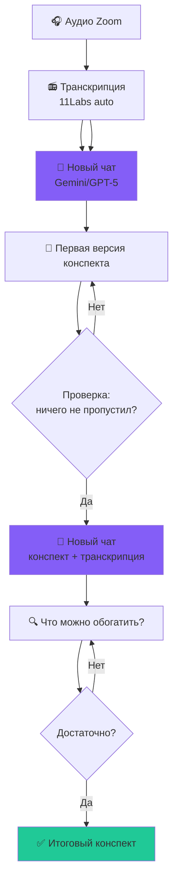
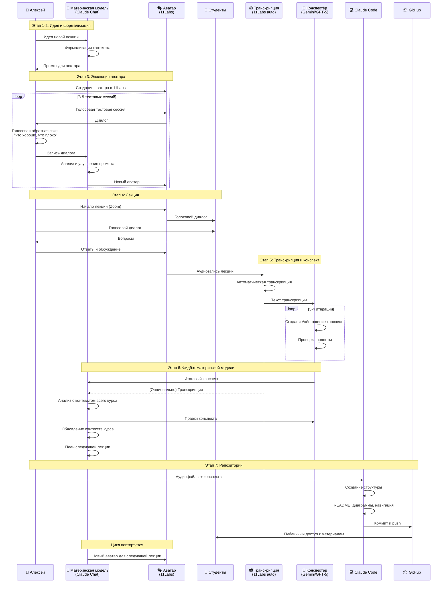

# 🎬 За кадром: Как создаётся этот курс

> *Мы учим vibe coding и сами его практикуем*

Этот документ показывает реальный workflow создания курса — от первой идеи до готового репозитория. Здесь нет теории, только практика того, как человек и AI создают образовательный контент в симбиозе.

---

## 🏗️ Архитектура системы



---

## 👥 Ключевые роли

| Компонент | Инструмент | Функция | Важные детали |
|-----------|-----------|---------|---------------|
| **Материнская модель** | Claude Chat | Формализация контекста, создание аватаров, итоговое обогащение | Максимальный контекст курса |
| **Аватар** | 11Labs + Claude | Голосовое взаимодействие на лекции | Эволюционирует через тестовые сессии |
| **Транскрибатор** | 11Labs (авто) | Аудио → текст | Первичная транскрипция |
| **Конспектёр** | Gemini/GPT-5 | Транскрипция → конспект | Лучше держат 2ч контекст, итеративная проверка |
| **Репо-менеджер** | Claude Code | Структура, README, диаграммы, связность | Быстрая итерация, визуализация |

---

## 📋 Workflow создания лекции: 7 этапов

### Этап 1: Зарождение идеи 💡

**Источники:**
- Чат с AI
- Обсуждение с реальными людьми
- Статьи в интернете
- Конференции
- Предыдущий опыт преподавания

**Результат:** сформированная потребность в новой теме лекции

---

### Этап 2: Формализация (Материнская модель) 🧠

**Инструмент:** Claude Chat

**Что происходит:**
- Создание контекста лекции
- Формирование промпта для аватара
- Материнская модель ЗНАЕТ весь курс целиком

**Результат:** промпт для создания аватара, который будет вести лекцию

---

### Этап 3: Эволюция аватара (Тестовые сессии) 🧪

**⚠️ Важное правило: Нет права править код аватара руками**

**Процесс:**
1. Создаётся аватар в 11Labs на базе промпта
2. Алексей проводит тестовую голосовую сессию с аватаром
3. Только голосовая обратная связь: "что хорошо, что плохо"
4. Запись диалога передаётся материнской модели
5. Материнская модель создаёт **нового** аватара с улучшениями
6. Повторяется 3-5 раз до удовлетворительного результата

**Почему это работает:**
- Эволюционный отбор через практику
- Обратная связь через естественный интерфейс (голос)
- Материнская модель накапливает контекст улучшений

**Результат:** готовый к лекции аватар

---

### Этап 4: Лекция 🎙️

**Формат:** Zoom + 11Labs

**Участники:**
- Алексей (человек-преподаватель)
- Аватар Claude (AI-соведущий через 11Labs)
- Студенты (слушают реальное взаимодействие)

**Что происходит:**
- Алексей и аватар ведут диалог в реальном времени
- Студенты задают вопросы
- Запись ведётся автоматически

**Длительность:** 80-110 минут (2 части по 40-55 мин)

**Результат:** аудиозапись лекции

---

### Этап 5: От аудио к конспекту 📄

**⚠️ Подводные камни:**
- Простая транскрипция с кодом работает плохо
- Нужны модели с большим контекстом
- Итеративная проверка обязательна

**Процесс:**



**Почему Gemini/GPT-5, а не Claude?**
- Лучше держат 2-часовой контекст
- Более рациональны для технических деталей
- Итеративная работа с длинным текстом

**Итерации:**
1. Первый проход: транскрипция → конспект
2. Проверка полноты: "ничего не пропустил?"
3. Новый чат: конспект + транскрипция → обогащение
4. Проверка качества
5. Повторяем до удовлетворения

**Результат:** структурированный конспект лекции (markdown)

---

### Этап 6: Фидбэк материнской модели 🔄

**Входные данные для материнской модели:**
- Итоговый конспект
- (Опционально) Транскрипция лекции

**Почему материнская модель:**
- У неё максимальный контекст всего курса
- Она видит связи между лекциями
- Она формировала исходный промпт для аватара

**Что делает материнская модель:**
- Даёт правки конспекту
- Обновляет контекст курса
- Формулирует тему следующей лекции
- Создаёт промпт для следующего аватара
- Правит домашние задания

**Результат:** обновлённый контекст курса, план следующей лекции

---

### Этап 7: Репозиторий (Claude Code) 💻

**Входные данные:**
- Аудиофайлы в папке `audio/`
- Конспекты в папке `materials/`

**Что делает Claude Code:**
- Создаёт единую структуру репозитория
- Пишет README с навигацией
- Добавляет перелинковку материалов
- Интегрирует аудиофайлы
- **Рисует диаграммы** (делает это лучше чатов!)
- Причёсывает форматирование
- Добавляет метаданные (лицензия, контакты)

**💡 Лайфхак:**

```
Базовый текст из чата →
Claude Code для итеративной доводки →
Быстрее и красивее, чем в чате
```

**Почему Claude Code для репо:**
- Быстрая итерация по файлам
- Лучшие mermaid диаграммы
- Видит всю структуру проекта
- Может коммитить изменения

**Результат:** публичный GitHub репозиторий с курсом

---

## 🤔 Почему такая архитектура?

### Сравнение компонентов

| Аспект | Материнская модель | Аватар | Конспектёр | Claude Code |
|--------|-------------------|--------|------------|-------------|
| **Инструмент** | Claude Chat | 11Labs + Claude | Gemini/GPT-5 | Claude Code |
| **Контекст** | Весь курс | Одна лекция | Транскрипция | Структура репо |
| **Задача** | Стратегия, эволюция | Тактика, диалог | Документация | Визуализация, структура |
| **Интерфейс** | Чат | Голос | Чат | Терминал + файлы |
| **Итерации** | Медленные, дорогие | Быстрые, голосовые | Средние | Быстрые, файловые |
| **Результат** | Аватары, план курса | Лекция | Конспект | README, диаграммы |

### Разделение труда

**Почему не один инструмент для всего?**

1. **Разные оптимизации:**
   - Gemini/GPT-5 лучше держат длинный контекст (2 часа аудио)
   - Claude Chat лучше формирует стратегию и удерживает контекст курса
   - Claude Code лучше рисует диаграммы и структурирует файлы
   - 11Labs даёт реальный голос для лекций

2. **Разные интерфейсы:**
   - Голос — для лекций и тестирования аватара
   - Чат — для стратегии и конспектов
   - Терминал — для работы с файлами

3. **Специализация:**
   - Каждый инструмент делает то, что у него лучше всего получается
   - Это и есть концепция мультиагентности!

---

## 📊 Метрики и наблюдения

### По лекциям 1-3

**Объём материалов:**
- Аудио: 6 файлов × 40-55 мин = ~5 часов живого диалога
- Конспекты: 3 файла × 5000+ слов
- Диаграмм: 11 mermaid в workshop3.md
- Модели: Sonnet 4 (лекции 1-2) → Sonnet 4.5 (лекция 3)

**Итерации:**
- По аватару: обычно 3-5 тестовых сессий
- По конспекту: 3-4 итерации с разными моделями
- По диаграммам: 2-3 правки каждой (mermaid капризный!)

### Что работает ✅

- **Голосовой интерфейс для лекций** — студенты видят реальный AI-симбиоз в действии
- **Итеративная эволюция аватара** — через практику, без правки промпта руками
- **Разные модели для разных задач** — каждая делает то, что лучше умеет
- **Материнская модель держит целостность** — курс эволюционирует как единое целое
- **Автоматизация рутины** — транскрипция, базовые конспекты, структура репо
- **Claude Code для визуализации** — диаграммы получаются лучше, чем в чатах

### Что не работает / сложно ❌

- **Транскрипция кода и технических терминов** — требует ручной проверки
- **Править аватара руками** — нарушает принцип vibe coding, нужна голосовая обратная связь
- **Создавать сложные диаграммы в чатах** — mermaid в Claude Code работает лучше
- **Использовать одну модель для всего** — специализация эффективнее

---

## 🎯 Вывод: Мы практикуем то, чему учим

Этот курс — **живая демонстрация принципов vibe coding:**

### ✅ Спецификация > Код
- Материнская модель формирует **спецификацию** (промпт для аватара)
- Аватары **исполняют** спецификацию
- Код аватара не правится руками — только через новую спецификацию

### ✅ Эволюция через практику
- Тестовые сессии улучшают аватара
- Обратная связь через естественный интерфейс (голос)
- Итеративное улучшение всех компонентов

### ✅ Специализация агентов
- Разные инструменты для разных задач
- Каждый делает то, что лучше умеет
- Материнская модель координирует

### ✅ Человек = Product Owner
- Алексей принимает стратегические решения
- AI исполняет тактические задачи
- Голосовая обратная связь вместо правки кода

### ✅ Итеративность
- Все процессы итеративны
- Постоянное улучшение через практику
- Нет "финальной версии" — только эволюция

---

## 🔮 Следующий шаг: Мультиагентная архитектура

**Текущее состояние:** все роли выполняет один человек (Алексей) + несколько инструментов

**Следующий этап:** явное разделение на специализированных агентов:
- **Course Manager Agent** — координация
- **Lecture Transcription Agent** — транскрипция
- **Diagram Specialist Agent** — диаграммы
- **Content Editor Agent** — редактура
- **Example Curator Agent** — сбор кейсов
- **Git & Repo Manager Agent** — управление репо
- **Q&A Agent** — ответы на вопросы студентов
- **Evolution Agent** — предложение улучшений

**Зачем:** ещё больше автоматизации, ещё быстрее итерации, ещё полнее демонстрация концепций курса

---

## 📈 Жизненный цикл лекции: Полная картина



---

> 💡 **Этот документ сам создан по описанному workflow:**
>
> Алексей описал голосом процесс → транскрипция → базовая структура в чате → Claude Code довёл до текущего вида с диаграммами
>
> *Мы практикуем то, чему учим.*

---

*Обновлено: Октябрь 2025*
