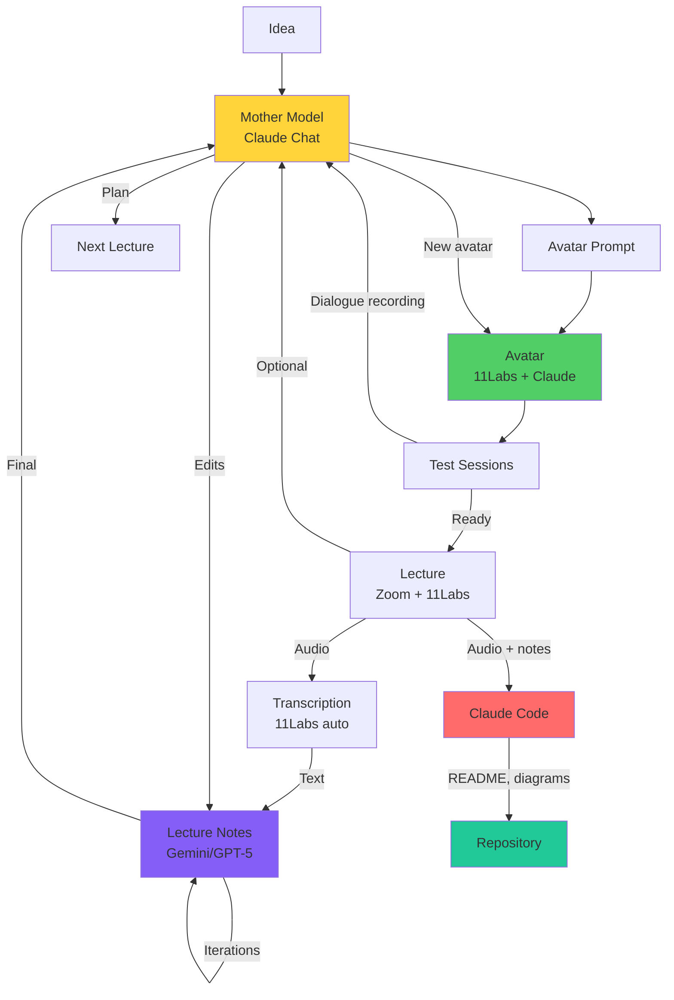
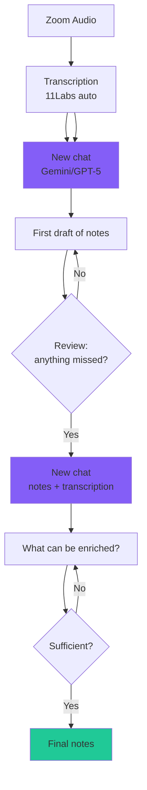
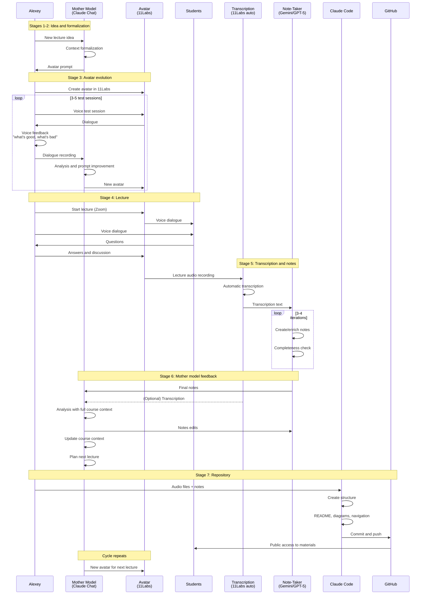

# Behind the Scenes: How This Course Is Made

> *We teach vibe coding and practice it ourselves*

This document shows the real workflow behind creating the course — from the first idea to a published repository. No theory here, just the practice of how a human and AI create educational content in symbiosis.

---

## System Architecture


```mermaid
graph TD
    I[Idea] --> MM[Mother Model<br/>Claude Chat]
    MM --> AP[Avatar Prompt]
    AP --> AV[Avatar<br/>11Labs + Claude]
    AV --> TS[Test Sessions]
    TS --> |Dialogue recording| MM
    MM --> |New avatar| AV
    TS --> |Ready| LEC[Lecture<br/>Zoom + 11Labs]
    LEC --> |Audio| TR[Transcription<br/>11Labs auto]
    TR --> |Text| CN[Lecture Notes<br/>Gemini/GPT-5]
    CN --> |Iterations| CN
    CN --> |Final| MM
    LEC --> |Optional| MM
    MM --> |Edits| CN
    MM --> |Plan| NL[Next Lecture]

    LEC --> |Audio + notes| CC[Claude Code]
    CC --> |README, diagrams| REPO[Repository]

    style MM fill:#ffd43b
    style AV fill:#51cf66
    style CN fill:#845ef7
    style CC fill:#ff6b6b
    style REPO fill:#20c997
```

---

## Key Roles

| Component | Tool | Function | Key Details |
|-----------|------|----------|-------------|
| **Mother Model** | Claude Chat | Context formalization, avatar creation, final enrichment | Maximum course context |
| **Avatar** | 11Labs + Claude | Voice interaction during lectures | Evolves through test sessions |
| **Transcriber** | 11Labs (auto) | Audio to text | Initial transcription |
| **Note-Taker** | Gemini/GPT-5 | Transcription to lecture notes | Better at holding 2h context, iterative review |
| **Repo Manager** | Claude Code | Structure, README, diagrams, cross-linking | Fast iteration, visualization |

---

## Lecture Creation Workflow: 7 Stages

### Stage 1: Idea Genesis

**Sources:**
- Chat with AI
- Discussions with real people
- Online articles
- Conferences
- Previous teaching experience

**Output:** a formed need for a new lecture topic

---

### Stage 2: Formalization (Mother Model)

**Tool:** Claude Chat

**What happens:**
- Creating the lecture context
- Forming the avatar prompt
- The mother model KNOWS the entire course

**Output:** a prompt for creating the avatar that will deliver the lecture

---

### Stage 3: Avatar Evolution (Test Sessions)

**Important rule: No manual editing of the avatar's code**

**Process:**
1. An avatar is created in 11Labs based on the prompt
2. Alexey conducts a test voice session with the avatar
3. Voice-only feedback: "what's good, what's bad"
4. The dialogue recording is passed to the mother model
5. The mother model creates a **new** avatar with improvements
6. Repeated 3-5 times until satisfactory

**Why this works:**
- Evolutionary selection through practice
- Feedback through a natural interface (voice)
- The mother model accumulates improvement context

**Output:** an avatar ready for the lecture

---

### Stage 4: The Lecture

**Format:** Zoom + 11Labs

**Participants:**
- Alexey (human instructor)
- Claude Avatar (AI co-lecturer via 11Labs)
- Students (witnessing real human-AI interaction)

**What happens:**
- Alexey and the avatar have a real-time dialogue
- Students ask questions
- Recording runs automatically

**Duration:** 80-110 minutes (2 parts, 40-55 min each)

**Output:** audio recording of the lecture

---

### Stage 5: From Audio to Lecture Notes

**Pitfalls:**
- Simple transcription with code works poorly
- Models with large context windows are needed
- Iterative review is mandatory

**Process:**


```mermaid
graph TD
    A[Zoom Audio] --> B[Transcription<br/>11Labs auto]
    B --> C1[New chat<br/>Gemini/GPT-5]
    B --> C1
    C1 --> D1[First draft of notes]
    D1 --> E1{Review:<br/>anything missed?}
    E1 --> |No| D1
    E1 --> |Yes| C2[New chat<br/>notes + transcription]
    C2 --> D2[What can be enriched?]
    D2 --> E2{Sufficient?}
    E2 --> |No| D2
    E2 --> |Yes| F[Final notes]

    style C1 fill:#845ef7
    style C2 fill:#845ef7
    style F fill:#20c997
```

**Why Gemini/GPT-5 instead of Claude?**
- Better at holding 2-hour context
- More rigorous with technical details
- Iterative work with long text

**Iterations:**
1. First pass: transcription to notes
2. Completeness check: "anything missed?"
3. New chat: notes + transcription to enrichment
4. Quality check
5. Repeat until satisfactory

**Output:** structured lecture notes (markdown)

---

### Stage 6: Mother Model Feedback

**Input to the mother model:**
- Final lecture notes
- (Optional) Lecture transcription

**Why the mother model:**
- It has maximum context of the entire course
- It sees connections between lectures
- It formed the original avatar prompt

**What the mother model does:**
- Provides edits to the notes
- Updates the course context
- Formulates the next lecture topic
- Creates the prompt for the next avatar
- Reviews homework assignments

**Output:** updated course context, plan for the next lecture

---

### Stage 7: Repository (Claude Code)

**Input:**
- Audio files in the `audio/` folder
- Lecture notes in the `materials/` folder

**What Claude Code does:**
- Creates unified repository structure
- Writes README with navigation
- Adds cross-linking between materials
- Integrates audio files
- **Draws diagrams** (does this better than chat interfaces!)
- Polishes formatting
- Adds metadata (license, contacts)

**Pro tip:**

```
Base text from chat →
Claude Code for iterative refinement →
Faster and better-looking than in chat
```

**Why Claude Code for the repo:**
- Fast iteration across files
- Better mermaid diagrams
- Sees the entire project structure
- Can commit changes directly

**Output:** public GitHub repository with the course

---

## Why This Architecture?

### Component Comparison

| Aspect | Mother Model | Avatar | Note-Taker | Claude Code |
|--------|-------------|--------|------------|-------------|
| **Tool** | Claude Chat | 11Labs + Claude | Gemini/GPT-5 | Claude Code |
| **Context** | Entire course | Single lecture | Transcription | Repo structure |
| **Task** | Strategy, evolution | Tactics, dialogue | Documentation | Visualization, structure |
| **Interface** | Chat | Voice | Chat | Terminal + files |
| **Iterations** | Slow, expensive | Fast, voice-based | Medium | Fast, file-based |
| **Output** | Avatars, course plan | Lecture | Notes | README, diagrams |

### Division of Labor

**Why not one tool for everything?**

1. **Different optimizations:**
   - Gemini/GPT-5 handle long context better (2 hours of audio)
   - Claude Chat is better at forming strategy and retaining course context
   - Claude Code is better at drawing diagrams and structuring files
   - 11Labs provides a real voice for lectures

2. **Different interfaces:**
   - Voice — for lectures and avatar testing
   - Chat — for strategy and notes
   - Terminal — for file operations

3. **Specialization:**
   - Each tool does what it does best
   - This IS the multi-agent concept!

---

## Metrics and Observations

### From Lectures 1-3

**Volume of materials:**
- Audio: 6 files x 40-55 min = ~5 hours of live dialogue
- Notes: 3 files x 5,000+ words
- Diagrams: 11 mermaid diagrams in workshop3.md
- Models: Sonnet 4 (lectures 1-2) -> Sonnet 4.5 (lecture 3)

**Iterations:**
- Avatar: typically 3-5 test sessions
- Notes: 3-4 iterations with different models
- Diagrams: 2-3 edits each (mermaid is finicky!)

### What Works

- **Voice interface for lectures** — students see real AI symbiosis in action
- **Iterative avatar evolution** — through practice, without manually editing the prompt
- **Different models for different tasks** — each does what it does best
- **Mother model maintains coherence** — the course evolves as a unified whole
- **Routine automation** — transcription, basic notes, repo structure
- **Claude Code for visualization** — diagrams turn out better than in chats

### What Doesn't Work / Is Difficult

- **Transcription of code and technical terms** — requires manual review
- **Manually editing the avatar** — violates vibe coding principles; voice feedback is needed
- **Creating complex diagrams in chats** — mermaid works better in Claude Code
- **Using one model for everything** — specialization is more effective

---

## Conclusion: We Practice What We Teach

This course is a **living demonstration of vibe coding principles:**

### Specification > Code
- The mother model creates the **specification** (avatar prompt)
- Avatars **execute** the specification
- Avatar code is never edited manually — only through a new specification

### Evolution Through Practice
- Test sessions improve the avatar
- Feedback through a natural interface (voice)
- Iterative improvement of all components

### Agent Specialization
- Different tools for different tasks
- Each does what it does best
- The mother model coordinates

### Human = Product Owner
- Alexey makes strategic decisions
- AI executes tactical tasks
- Voice feedback instead of code editing

### Iterative by Nature
- All processes are iterative
- Constant improvement through practice
- There is no "final version" — only evolution

---

## Next Step: Multi-Agent Architecture

**Current state:** all roles are performed by one person (Alexey) + several tools

**Next stage:** explicit separation into specialized agents:
- **Course Manager Agent** — coordination
- **Lecture Transcription Agent** — transcription
- **Diagram Specialist Agent** — diagrams
- **Content Editor Agent** — editing
- **Example Curator Agent** — case collection
- **Git & Repo Manager Agent** — repo management
- **Q&A Agent** — answering student questions
- **Evolution Agent** — suggesting improvements

**Why:** even more automation, even faster iterations, even fuller demonstration of course concepts

---

## Lecture Lifecycle: The Full Picture


```mermaid
sequenceDiagram
    participant A as Alexey
    participant MM as Mother Model<br/>(Claude Chat)
    participant AV as Avatar<br/>(11Labs)
    participant ST as Students
    participant TR as Transcription<br/>(11Labs auto)
    participant CN as Note-Taker<br/>(Gemini/GPT-5)
    participant CC as Claude Code
    participant GH as GitHub

    Note over A,MM: Stages 1-2: Idea and formalization
    A->>MM: New lecture idea
    MM->>MM: Context formalization
    MM->>A: Avatar prompt

    Note over A,AV: Stage 3: Avatar evolution
    A->>AV: Create avatar in 11Labs
    loop 3-5 test sessions
        A->>AV: Voice test session
        AV->>A: Dialogue
        A->>A: Voice feedback<br/>"what's good, what's bad"
        A->>MM: Dialogue recording
        MM->>MM: Analysis and prompt improvement
        MM->>AV: New avatar
    end

    Note over A,ST: Stage 4: Lecture
    A->>AV: Start lecture (Zoom)
    AV->>ST: Voice dialogue
    A->>ST: Voice dialogue
    ST->>A: Questions
    A->>AV: Answers and discussion

    Note over TR,CN: Stage 5: Transcription and notes
    AV->>TR: Lecture audio recording
    TR->>TR: Automatic transcription
    TR->>CN: Transcription text
    loop 3-4 iterations
        CN->>CN: Create/enrich notes
        CN->>CN: Completeness check
    end

    Note over MM,CN: Stage 6: Mother model feedback
    CN->>MM: Final notes
    TR-->>MM: (Optional) Transcription
    MM->>MM: Analysis with full course context
    MM->>CN: Notes edits
    MM->>MM: Update course context
    MM->>MM: Plan next lecture

    Note over A,GH: Stage 7: Repository
    A->>CC: Audio files + notes
    CC->>CC: Create structure
    CC->>CC: README, diagrams, navigation
    CC->>GH: Commit and push
    GH->>ST: Public access to materials

    Note over MM,AV: Cycle repeats
    MM->>AV: New avatar for next lecture
```

---

> **This document was itself created using the described workflow:**
>
> Alexey described the process by voice -> transcription -> basic structure in chat -> Claude Code refined it to the current state with diagrams
>
> *We practice what we teach.*

---

*Updated: October 2025*
