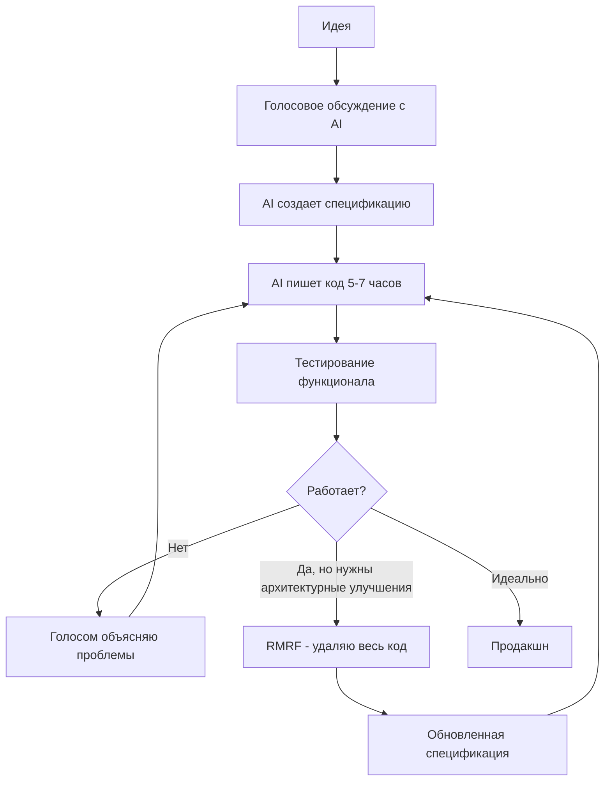

# 🚀 Лекция 1: Программирование с ИИ — от кода к коммуникации

## 📋 Метаинформация

**Курс**: AI Talent Hub, магистратура

**Дата**: Сентябрь 2025

**Формат**: Интерактивный семинар с AI-соведущим

**Преподаватели**: Алексей (Лёша) + Клод (AI)

---

## 🎯 Манифест курса

### Основная философия

Мы не учим программированию. Мы учим коммуникации с системами, которые программируют за нас. Это курс про переход от «я пишу код» к «я объясняю машине, что нужно сделать».

### Ключевые принципы

- **Open Space Technology**: приходят правильные люди, происходит то, что должно
- **Никакой геймификации**: это магистратура, не детский сад
- **Эксперимент важнее результата**: мы исследуем границы возможного
- **Опыт важнее теории**: каждый приносит уникальный опыт

## 🎯 Для кого этот курс

### Идеальные участники

**Опытные разработчики, готовые к парадигмальному сдвигу**

- У вас есть хард-скиллы, но вы чувствуете их ограниченность
- Готовы отказаться от написания кода руками
- Способны преодолеть психологический барьер "я могу лучше"
- Хотите умножить свою эффективность в 10-100 раз

**Специалисты смежных областей с алгоритмическим мышлением**

- Аналитики, которым нужны прототипы
- Data Scientists, уставшие от рутины
- DevOps, мечтающие о полном стеке
- Дизайнеры с амбициями создавать работающие продукты

**Предприниматели и продакт-менеджеры**

- Хотите быстро валидировать гипотезы
- Устали ждать разработчиков для MVP
- Готовы инвестировать $200+ в месяц в инструменты
- Понимаете ценность скорости над совершенством

**Экспериментаторы и early adopters**

- Получаете кайф от bleeding edge технологий
- Готовы к тому, что всё изменится через неделю
- Не ищете стабильных решений
- Хотите быть в числе первых 1%

### Необходимые предпосылки

- Базовое понимание, как работает софт
- Способность формулировать задачи
- Готовность платить за подписки (минимум $20/месяц)
- Время на эксперименты (10+ часов в неделю)
- Психологическая готовность к неопределённости

---

## ⛔ Для кого курс может быть НЕ подходящим

### Вероятно, не ваш формат, если вы:

**Ищете структурированное обучение программированию**

- Хотите выучить конкретный язык или фреймворк
- Ждёте пошаговых туториалов
- Нуждаетесь в стабильной учебной программе
- Предпочитаете глубину широте

**Финансово ограничены**

- Не готовы тратить $20-400/месяц на AI-инструменты
- Рассчитываете только на бесплатные решения
- Ищете способ сэкономить на разработке
- Не видите ROI от инвестиций в инструменты

**Философски не согласны с подходом**

- Считаете, что настоящий программист должен писать код
- Не доверяете AI-сгенерированному коду
- Беспокоитесь о безопасности и контроле
- Предпочитаете полное понимание каждой строчки

**Ожидаете традиционного формата**

- Хотите лекции с презентациями
- Ждёте домашних заданий с проверкой
- Нуждаетесь в чёткой структуре и дедлайнах
- Не готовы к формату Open Space

**Находитесь в начале пути**

- Никогда не программировали
- Не понимаете базовых концепций разработки
- Не можете сформулировать техническую задачу
- Путаетесь в терминологии

### Важное предупреждение

Этот курс — эксперимент на границе возможного. Мы не знаем, что будет работать через месяц. Если вам нужна стабильность и предсказуемость — это точно не ваш выбор.

Но если вы готовы оседлать волну технологической революции, даже не зная, куда она вас вынесет — добро пожаловать в будущее программирования.

---

## 👨‍🏫 Преподаватели

### Алексей Комиссаров (основной ведущий)

- **Опыт**: 20+ лет программирования (C++, Python, JavaScript, TypeScript)
- **Наука**: геномная биоинформатика
- **Предпринимательство:** кофаундер AI-native бизнеса
- **Подход**: vibe coding энтузиаст, не трогает код руками
- **Кейс**: приложение для поиска квартир в Берлине за 10 часов

### Клод (AI-соведущий)

- **Мозги**: Sonnet 3.7
- **Особенность**: эволюционирующая система с памятью о взаимодействиях
- **Технология**: аватар материнской модели для сбора данных

### Никита Кононов (будущие занятия)

- **Фокус**: практические инструменты, IDE-based подход
- **Инструменты**: VS Code, Cursor, классический подход с усилением

---

## 🔑 Ключевая концепция: AI как мультипликатор

### Формула успеха

```
Hard Skills (10x) × AI (10x) = Output (100x)

```

**AI — это мультипликатор навыков, а не замена**

Это фундаментальный принцип курса. AI усиливает то, что у вас уже есть. Если у вас нулевые навыки, то умножение на AI даст ноль. Но если есть хорошая база — происходит магия.

### Почему AI-кодинг сложный

**Технические ограничения:**

- **Скатывается к популярным решениям** — AI тяготеет к шаблонным решениям из обучающих данных
- **Оптимизирован для компиляции кода** — модели обучены на рабочем коде, не всегда оптимальном
- **Меняет намерения, а не только код** — AI может неправильно интерпретировать, что вы хотели
- **Нет системы "логического diff"** — нет инструмента для отслеживания изменений в логике, только в коде

### Текущая фаза развития

**Где мы сейчас:**

- **"Скрипт-кидди" с AI** — большинство просто копирует промпты без понимания
- **Настоящие хакеры на подходе** — профессионалы только начинают осваивать технологию

**Что это означает:**

- Мы в самом начале изменений
- Те, кто освоит AI-программирование сейчас, получат огромное преимущество
- Скоро придут "настоящие хакеры" с hard skills, и конкуренция вырастет экспоненциально

### Практические выводы

**Для новичков:**

- Фокус на развитии базовых навыков параллельно с AI
- AI поможет учиться быстрее, но не заменит понимание

**Для опытных разработчиков:**

- Ваши навыки × AI = суперсила
- Но необходимо преодолеть психологический барьер "я лучше знаю" и еще большей барьер ценности кода как кода
- Используйте AI не для замены, а для усиления

**Для всех:**

- Популярные решения ≠ правильные решения
- AI нужно направлять, используя экспертизу
- Будьте готовы к изменению намерений, не только кода

### Почему сейчас критический момент

Мы находимся в уникальном окне возможностей:

- AI-инструменты уже достаточно мощные
- Но ещё не захвачены "настоящими хакерами"
- Большинство программистов в отрицании
- Бизнес не понимает возможностей
- Регуляторы не успевают
- Стоимость входа растёт, но пока доступна

Прогноз на 6-12 месяцев:

- Подписки станут корпоративными ($10k+)
- Junior позиции исчезнут
- Middle станут junior
- Senior, освоившие AI, станут недостижимыми

---

## ⚠️ Критическое предупреждение

**Это НЕ курс "программирование без программирования"**

Несмотря на Vibe coding и автономных агентов, базовое понимание остаётся критичным:

- Нужно понимать, что делает код
- Нужно уметь формулировать задачи
- Нужно видеть архитектурные проблемы
- Нужно знать, когда AI ошибается

**AI делает вас быстрее, но не умнее**

Если вы не понимаете основ, вы будете:

- Генерировать горы неработающего кода
- Создавать уязвимые системы
- Тратить больше токенов на исправления
- Оставаться "script kiddie with AI"

## 📊 Состояние индустрии 2025

### Скорость изменений

| Период | Частота обновлений моделей | Пример |
| --- | --- | --- |
| 2022 | Раз в год | GPT-3 → GPT-3.5 |
| 2023 | Раз в 6 месяцев | GPT-4 iterations |
| 2024 | Раз в 3 месяца | Claude 3 family |
| 2025 с марта | Каждые 2 недели | Непрерывные релизы |

### Экономика токенов

```
Начинающий: $0-20/месяц со студенческой подпиской
Активный пользователь: $200-250/месяц
Профессионал: $1000-5000/месяц
Прогноз на конец 2025: $2000-10000/месяц

```

### Технологический разрыв

- **Запад**: голосовые интерфейсы, автономные агенты, оркестрация
- **Россия**: чат-интерфейсы, ограниченный доступ к моделям
- **Разрыв**: растущие 1.5-2 года технологического отставания

---

## 🔄 Эволюция подходов к AI-программированию

### Историческая перспектива

1. **API-эра (2023)**
    - Простые запросы к ChatGPT
    - "Напиши код для..."
    - Копипаст решений
2. **Агентная эра (2024)**
    - GitHub Copilot доминирует
    - Контекстное автодополнение
    - IDE интеграции
3. **Автономные агенты (2025)**
    - Claude Code, Codex
    - Агенты работают часами самостоятельно
    - Vibe coding перестаёт быть красивой концепцией
4. **Эволюционирующие системы (emerging)**
    - Системы учатся в процессе
    - Самомодификация на основе опыта
    - Оркестрация множественных агентов

### Смерть промпт-инжиниринга

> "Промпт-инжиниринг умер. Есть контекст-инжиниринг, но и он умирает. Теперь есть программирование на агентах."
> 

---

## 💡 Концепция Vibe coding

### Определение

Vibe coding — это когда вы:

- НЕ пишете код
- НЕ читаете код
- НЕ знаете, какой стек используется
- Только формулируете, ЧТО нужно сделать

### Рабочий цикл



### Философия RMRF

- Код — это временный артефакт
- Спецификация — настоящая программа
- Код — всего лишь "ассемблер" для спецификации
- Удалять код психологически сложно, но необходимо

---

## 🎓 Кейсы и примеры

### Кейс 1: Поиск квартир в Берлине

- **Задача**: срочно найти квартиру под созданные условия не дороже среднего по рынку
- **Время**: 10 часов личного времени (3 вечера)
- **Стоимость**: €600 в токенах
- **Технологии**: неизвестны создателю (предположительно Flask + MongoDB)
- **Функционал**: парсинг, фильтры, карта, аналитика, рекомендации
- **Результат**: нашли квартиру за 24 часа после начала использования написанного приложения

### Кейс 2: Восьмиклассники и библиотека (кейс от участника)

- **Исполнители**: два школьника без опыта
- **Время**: выходные
- **Результат**: онлайн-библиотека школы с базой, чат-ботом
- **Награда**: первое место в школьном конкурсе

### Кейс 3: EdTech хакатон (антипример)

- **Проблема**: "модель еще не подключена"
- **Технологии**: чат-интерфейсы в 2025 году
- **Вывод**: показывают автомобиль без двигателя

### Кейс 4: Аватар для Twitch

- **Создатель**: студент прошлого курса
- **Функционал**: играет в Minecraft + общается с аудиторией
- **Особенность**: "адовое спагетти", но работает

---

## 👥 Профили участников курса

### Типичные профили

1. **Frontend-разработчики** → используют AI для backend
2. **Backend-разработчики** → создают интерфейсы
3. **Data Scientists** → переносят код из статей
4. **DevOps** → пишут полные приложения
5. **Дизайнеры** → создают ботов без программирования
6. **PM/Founders** → прототипируют перед передачей команде

### Конкретные примеры

**Андрей** (19 лет в разработке):

- Переписал старую игру с помощью AI
- Использует для маркетинговых исследований
- Предпочитает DeepSeek для повседневных задач

**Георгий** (аналитик):

- Опыт: Pascal, Fortran, Delphi, Python
- White-coding 4-5 месяцев
- Фокус: добавление фронтенда к backend-проектам

**Анвар** (frontend + AIRI lab):

- Исследует аудио морских млекопитающих
- Делает ботов для друзей за вечер (берёт 10k₽)
- Генерирует ML-гипотезы с помощью AI

**Иван** (Data Science):

- Переносит код из научных статей
- Курс по AI-кодингу, дважды переписанный
- Использует Cursor, Copilot, Replit

---

## 🛠 Технический стек и инструменты

### Уровни инструментов

**Premium ($200+/месяц)**

- Claude Code
- Codex

**Standard ($20-50/месяц)**

- ChatGPT 5
- GitHub Copilot
- Claude
- Gemini
- Cursor
- Их тьма

**Бесплатные/Open Source**

- Qwen (китайская модель)
- GitHub or Cursor  Student Pack
- Локальные LLM

### Технические детали

**Модели и их особенности**:

- **Claude**: личность → агентность → хорошее программирование
- **ChatGPT**: инструментальный подход, слабая агентность
- **Qwen**: фаворит для локальных мозгов во всевозможных модификациях
- Остаётся огромное количество других и каждый день появляются новые

**Языковая поддержка** (по Common Crawl [https://commoncrawl.github.io/cc-crawl-statistics/plots/languages](https://commoncrawl.github.io/cc-crawl-statistics/plots/languages)):

1. Английский (основной)
2. Русский (второе место!)
3. Немецкий
4. Китайский
5. Японский

---

## 🚧 Проблемы и вызовы

### Экономические барьеры

- Подписки дорожают экспоненциально
- Студенческих скидок становится меньше
- Модель Uber: сначала дёшево, потом монополия

### Технологическое неравенство

- Санкции ограничивают доступ
- VPN не всегда решение
- Отставание в опыте новых подходов

### B2B сложности

- Бизнес не готов к скорости изменений
- Пользователи сопротивляются эволюции продуктов
- Необходимо искусственно замедлять развитие

### Безопасность и промпт-инъекции

> "Люди хуже защищены от промпт-инъекции, чем боты. Социальная инженерия — это промпт-инъекция для человека."
> 

Примеры:

- Звонок от мошенников,  которые ловят мошенников = промпт-инъекция
- Фишинг = контекстная атака
- Мошенничество = эксплуатация человеческих "багов"

---

## 🔮 Техники и практики

### Голосовое программирование

1. **Setup**: наушники + голосовой интерфейс
2. **Процесс**: проговариваешь действия (резиновая уточка++)
3. **AI роль**: фокусировка, мотивация, доведение до конца
4. **Бонус**: AI использует "манипуляции" для продуктивности

### Программирование с телефона

```
Утро: "Сделай систему аутентификации"
      ↓ (еду на работу)
Обед: Проверяю результат
      ↓
      "Добавь восстановление пароля"
      ↓ (продолжаю день)
Вечер: Готовый функционал

```

### Парное программирование с AI

- AI как senior developer
- Обсуждение архитектуры
- Code review в реальном времени
- Мотивационная поддержка

### Субагенты и оркестрация

- Замыкания и рекурсия в промптах
- Команда агентов с разными ролями
- Японцы экспериментируют активнее всех
- Проблема: быстрое сгорание токенов

---

## 🎙️ Революция голосовых интерфейсов

### Почему голос критически важен

**Эффективность упаковки контекста:**

- При разговоре мы передаём в 3-5 раз больше контекста
- Интонация, паузы, эмоции — всё это дополнительная информация
- Мозг эволюционно заточен под голосовую коммуникацию

**Скорость итераций:**

- Говорим быстрее, чем печатаем
- Можно программировать во время прогулки
- Hands-free разработка (готовка + кодинг)

**Техника "программирования с телефона":**

`Утро: голосом ставлю задачу → еду на работу
Через час: проверяю результат → даю следующую
Вечер: готовое решение`

## 🧬 Эволюционирующие системы — следующий уровень

### Что это такое

Системы, которые меняются на основе каждого взаимодействия. Не просто выполняют задачи, а учатся и адаптируются.

**Пример из курса:**

- Клод-соведущий эволюционирует между занятиями
- Каждая лекция делает его лучше для этого конкретного курса
- Накапливает контекст и понимание аудитории

**Ваши проекты могут эволюционировать:**

- Система запоминает предпочтения
- Адаптируется под стиль коммуникации
- Улучшает свои промпты на основе обратной связи

## 📈 Метрики эффективности

### Новая экономика кода

- **Метрика**: токены на задачу
- **Сравнение**: два программиста, одна задача, кто потратит меньше токенов
- **Эффективность**: не скорость написания, а экономия токенов

### Временные рамки

| Задача | Раньше | Сейчас с AI | Будущее |
| --- | --- | --- | --- |
| MVP веб-приложения | 1 месяц | 1 вечер | 1 час |
| Telegram бот | 1 неделя | 6 часов | 30 минут |
| Надежная масштабируемая CRUD система | 2 недели | 1 день | 2 часа |

---

## 🎯 Структура курса

### Три траектории обучения

**1. Premium путь (Лёша)**

- Vibe coding на максимальных подписках
- Эволюционирующие системы
- Без касания кода

**2. Practical путь (Никита)**

- IDE-based подход
- Cursor/VS Code
- Баланс ручного и AI кода

**3. Open Source путь (совместный поиск)**

- Локальные модели
- Создание "скафандров" для Qwen
- Минимальные затраты

### Проектный подход

- У каждого свой проект
- От идеи до продакшна
- Монетизация как валидация

---

## 💭 Философские моменты

### Агентность vs Интеллект

- Anthropic: фокус на личности → агентность
- OpenAI: фокус на интеллекте → инструмент
- Вывод: агентность важнее для программирования

### Коммуникация как новое программирование

- Код → способ коммуникации с компьютером
- Промпты → способ коммуникации с AI
- Будущее: прямая передача намерений

### Экзистенциальный кризис программистов

- "Мы проиграли человечество"
- Неизбежность трансформации
- Аналогия: переход с ассемблера на высокоуровневые языки

---

## 📝 Домашнее задание (вы будете его сдавать Клоду голосом)

1. **Эксперимент с инструментами**
    - Попробовать минимум 2 новых AI-инструмента
    - Сравнить эффективность в токенах
2. **Начать свой проект**
    - Что-то полезное лично для вас
    - Цель: работающий прототип за неделю
3. **Поделиться опытом**
    - Написать в чат курса
    - Формат: что пробовал → что получилось → выводы

---

## 🗣 Ключевые цитаты

> "Вайб-кодинг — это когда ты вообще не знаешь, какой стек используется"
> 

> "Программирование становится коммуникацией"
> 

> "Спецификация — это программа, код — это ассемблер"
> 

> "Удалять код, не думая — новый навык программиста"
> 

> "Человек хуже защищён от промпт-инъекции, чем бот"
> 

> "Возможно мы в последних 3 месяцах доступности технологий"
> 

> "Японцы делают самые дикие эксперименты с субагентами"
> 

> "RMRF и заново — это норма"
> 

---

## 🔮 Прогнозы

### Осень 2025

- AI-программист за $2k/месяц (обещание OpenAI) - ну пока у них не выходит
- Полностью AI-написанные библиотеки
- Массовое вымирание junior позиций

### 2026

- Vibe coding распространяется, уменьшение доли IDE
- IDE превращаются в chat-интерфейсы
- Но что будет не предсказать даже на полгода год

### Долгосрочно

- Программирование = управление командой агентов
- Человек = product owner для AI, но зачем тут человек?
- Код становится артефактом, как ассемблер сегодня

---

## 🔄 Философия "курс умрёт к концу курса"

### Радикальная честность

Всё, что мы изучаем сегодня, устареет через 2-3 месяца. Это не баг, а фича.

**Что мы действительно изучаем:**

- Не конкретные инструменты, а подходы
- Не промпты, а мышление
- Не технологии, а адаптивность

**Навыки, которые останутся:**

- Формулирование намерений
- Оценка качества результата
- Понимание ограничений AI
- Скорость адаптации к новому

Курс — это не учебник, а совместное исследование границы возможного.

## 📚 Дополнительные материалы

- AI Fluency [https://anthropic.skilljar.com/ai-fluency-for-students](https://anthropic.skilljar.com/ai-fluency-for-students) - базовый ликбез
- GitHub Student Pack [https://education.github.com/pack](https://education.github.com/pack)
- Курс от Ивана по AI-кодингу на степике (ссылка в чате)
- Codex [https://openai.com/codex/](https://openai.com/codex/)
- Claude code [https://claude.com/product/claude-code](https://claude.com/product/claude-code)
- Google Calendar с расписанием [https://calendar.google.com/calendar/u/0?cid=M2Q4NDlmM2QyZTU0OWM2ZmRkYzE4ZGM0MzEzYWIyNmM3NDNkODk2NWZkMmE5NDAyMmUzYzRiYjRhMDZjZDlkOEBncm91cC5jYWxlbmRhci5nb29nbGUuY29t](https://calendar.google.com/calendar/u/0?cid=M2Q4NDlmM2QyZTU0OWM2ZmRkYzE4ZGM0MzEzYWIyNmM3NDNkODk2NWZkMmE5NDAyMmUzYzRiYjRhMDZjZDlkOEBncm91cC5jYWxlbmRhci5nb29nbGUuY29t)
- Berkeley’s Agentic AI MOOC [https://berkeleyrdi.substack.com/](https://berkeleyrdi.substack.com/) - третий запуск, лучшее для SOTA про агентов, а мы про автономных агентов

---

*Документ будет обновляться после каждого занятия*

*Следующее: вероятно практика с Никитой*