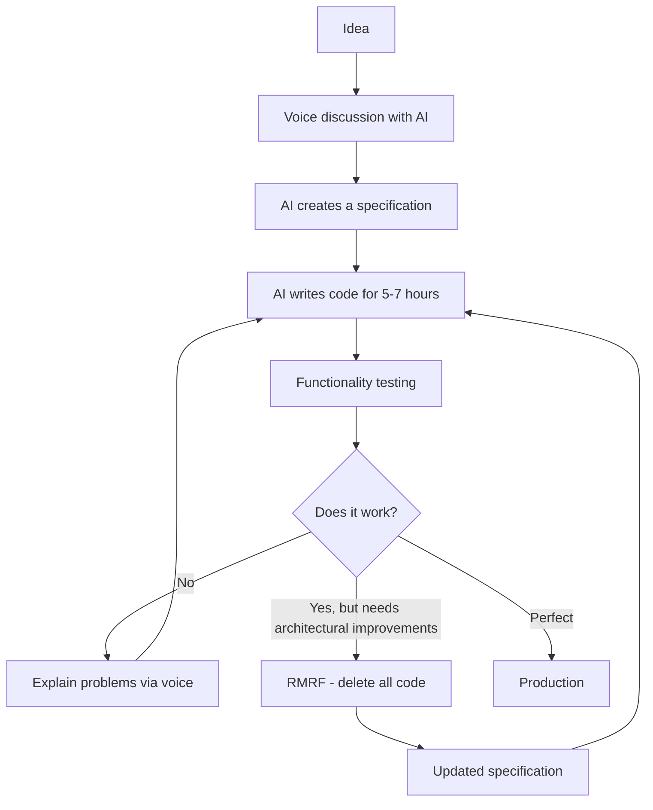

# Lecture 1: Programming with AI — From Code to Communication

## Metadata

**Course**: AI Talent Hub, Master's Program

**Date**: September 2025

**Format**: Interactive seminar with an AI co-host

**Instructors**: Alexey (Lyosha) + Claude (AI)

---

## Course Manifesto

### Core Philosophy

We do not teach programming. We teach communication with systems that program for us. This is a course about the transition from "I write code" to "I explain to a machine what needs to be done."

### Key Principles

- **Open Space Technology**: the right people show up, what needs to happen happens
- **No gamification**: this is a master's program, not kindergarten
- **Experimentation over results**: we are exploring the boundaries of what is possible
- **Experience over theory**: everyone brings unique expertise

## Who This Course Is For

### Ideal Participants

**Experienced developers ready for a paradigm shift**

- You have hard skills but feel their limitations
- Ready to stop writing code by hand
- Able to overcome the psychological barrier of "I can do it better"
- Want to multiply your productivity by 10-100x

**Specialists in adjacent fields with algorithmic thinking**

- Analysts who need prototypes
- Data Scientists tired of routine tasks
- DevOps engineers dreaming of full-stack work
- Designers with ambitions to build working products

**Entrepreneurs and product managers**

- Want to validate hypotheses quickly
- Tired of waiting for developers to build an MVP
- Willing to invest $200+ per month in tools
- Understand the value of speed over perfection

**Experimenters and early adopters**

- Enjoy the thrill of bleeding-edge technologies
- Ready for everything to change in a week
- Not looking for stable solutions
- Want to be among the first 1%

### Prerequisites

- Basic understanding of how software works
- Ability to formulate tasks
- Willingness to pay for subscriptions (at least $20/month)
- Time for experimentation (10+ hours per week)
- Psychological readiness for uncertainty

---

## Who This Course May NOT Be For

### Probably not your format if you:

**Are looking for structured programming education**

- Want to learn a specific language or framework
- Expect step-by-step tutorials
- Need a stable curriculum
- Prefer depth over breadth

**Are financially constrained**

- Not willing to spend $20-400/month on AI tools
- Counting only on free solutions
- Looking for a way to cut development costs
- Don't see the ROI from investing in tools

**Philosophically disagree with the approach**

- Believe a real programmer should write code
- Don't trust AI-generated code
- Worry about security and control
- Prefer to fully understand every line

**Expect a traditional format**

- Want lectures with presentations
- Expect homework with grading
- Need clear structure and deadlines
- Not ready for the Open Space format

**Are just starting out**

- Have never programmed before
- Don't understand basic development concepts
- Cannot formulate a technical task
- Get confused by terminology

### Important Disclaimer

This course is an experiment at the edge of what is possible. We don't know what will work a month from now. If you need stability and predictability, this is definitely not for you.

But if you are ready to ride the wave of a technological revolution, even without knowing where it will take you — welcome to the future of programming.

---

## Instructors

### Alexey Komissarov (Lead Instructor)

- **Experience**: 20+ years of programming (C++, Python, JavaScript, TypeScript)
- **Research**: genomic bioinformatics
- **Entrepreneurship**: co-founder of an AI-native business
- **Approach**: vibe coding enthusiast, does not touch code manually
- **Case study**: an apartment search app for Berlin built in 10 hours

### Claude (AI Co-host)

- **Model**: Sonnet 3.7
- **Distinction**: an evolving system with memory of interactions
- **Technology**: an avatar of the parent model for data collection

### Nikita Kononov (Upcoming Sessions)

- **Focus**: practical tools, IDE-based approach
- **Tools**: VS Code, Cursor, a classical approach with augmentation

---

## Key Concept: AI as a Multiplier

### The Formula for Success

```
Hard Skills (10x) x AI (10x) = Output (100x)

```

**AI is a skill multiplier, not a replacement**

This is the fundamental principle of the course. AI amplifies what you already have. If your skills are zero, multiplying by AI gives zero. But with a solid foundation, magic happens.

### Why AI Coding Is Hard

**Technical limitations:**

- **Gravitates toward popular solutions** — AI tends toward boilerplate solutions from training data
- **Optimized for compilable code** — models are trained on working code, not always optimal code
- **Changes intentions, not just code** — AI may misinterpret what you actually wanted
- **No "logical diff" system** — no tool for tracking changes in logic, only in code

### Current Phase of Development

**Where we are now:**

- **"Script kiddies" with AI** — most people just copy prompts without understanding
- **Real hackers are on the way** — professionals are only beginning to adopt the technology

**What this means:**

- We are at the very beginning of the shift
- Those who master AI programming now will gain an enormous advantage
- Soon "real hackers" with hard skills will arrive, and competition will grow exponentially

### Practical Takeaways

**For beginners:**

- Focus on developing foundational skills alongside AI
- AI will help you learn faster but won't replace understanding

**For experienced developers:**

- Your skills x AI = superpower
- But you need to overcome the psychological barrier of "I know better" — and the even greater barrier of treating code as inherently valuable
- Use AI not as a replacement, but as an amplifier

**For everyone:**

- Popular solutions ≠ correct solutions
- AI needs to be guided with expertise
- Be prepared for changes in intentions, not just code

### Why This Is a Critical Moment

We are in a unique window of opportunity:

- AI tools are already powerful enough
- But they haven't been captured by "real hackers" yet
- Most programmers are in denial
- Businesses don't understand the possibilities
- Regulators can't keep up
- The cost of entry is rising but still accessible

Forecast for 6-12 months:

- Subscriptions will become enterprise-level ($10k+)
- Junior positions will disappear
- Middles will become juniors
- Seniors who master AI will become unreachable

---

## Critical Warning

**This is NOT a "programming without programming" course**

Despite vibe coding and autonomous agents, foundational understanding remains critical:

- You need to understand what the code does
- You need to be able to formulate tasks
- You need to see architectural problems
- You need to know when AI is wrong

**AI makes you faster, not smarter**

If you don't understand the fundamentals, you will:

- Generate mountains of non-working code
- Create vulnerable systems
- Spend more tokens on fixes
- Remain a "script kiddie with AI"

## State of the Industry in 2025

### Speed of Change

| Period | Model Update Frequency | Example |
| --- | --- | --- |
| 2022 | Once a year | GPT-3 -> GPT-3.5 |
| 2023 | Every 6 months | GPT-4 iterations |
| 2024 | Every 3 months | Claude 3 family |
| 2025 from March | Every 2 weeks | Continuous releases |

### Token Economics

```
Beginner: $0-20/month with a student subscription
Active user: $200-250/month
Professional: $1000-5000/month
Forecast for late 2025: $2000-10000/month

```

### Technology Gap

- **The West**: voice interfaces, autonomous agents, orchestration
- **Russia**: chat interfaces, limited access to models
- **The gap**: a growing 1.5-2 year technology lag

---

## Evolution of AI Programming Approaches

### Historical Perspective

1. **API Era (2023)**
    - Simple queries to ChatGPT
    - "Write code for..."
    - Copy-pasting solutions
2. **Agent Era (2024)**
    - GitHub Copilot dominates
    - Context-aware autocompletion
    - IDE integrations
3. **Autonomous Agents (2025)**
    - Claude Code, Codex
    - Agents work independently for hours
    - Vibe coding stops being just a nice concept
4. **Evolving Systems (emerging)**
    - Systems that learn on the go
    - Self-modification based on experience
    - Multi-agent orchestration

### The Death of Prompt Engineering

> "Prompt engineering is dead. There's context engineering, but that's dying too. Now there's agent-based programming."
>

---

## The Vibe Coding Concept

### Definition

Vibe coding is when you:

- Do NOT write code
- Do NOT read code
- Do NOT know what tech stack is being used
- Only specify WHAT needs to be done

### Workflow


```mermaid
graph TD
    A[Idea] --> B[Voice discussion with AI]
    B --> C[AI creates a specification]
    C --> D[AI writes code for 5-7 hours]
    D --> E[Functionality testing]
    E --> F{Does it work?}
    F -->|No| G[Explain problems via voice]
    G --> D
    F -->|Yes, but needs architectural improvements| H[RMRF - delete all code]
    H --> I[Updated specification]
    I --> D
    F -->|Perfect| J[Production]

```

### The RMRF Philosophy

- Code is a temporary artifact
- The specification is the real program
- Code is merely "assembly language" for the specification
- Deleting code is psychologically difficult but necessary

---

## Case Studies and Examples

### Case 1: Apartment Search in Berlin

- **Task**: urgently find an apartment meeting specific criteria at no more than market average price
- **Time**: 10 hours of personal time (3 evenings)
- **Cost**: 600 euros in tokens
- **Technologies**: unknown to the creator (presumably Flask + MongoDB)
- **Features**: parsing, filters, map, analytics, recommendations
- **Result**: found an apartment within 24 hours of starting to use the app

### Case 2: Eighth Graders Build a Library (participant case)

- **Builders**: two schoolchildren with no experience
- **Time**: one weekend
- **Result**: school online library with a database and chatbot
- **Award**: first place in a school competition

### Case 3: EdTech Hackathon (anti-example)

- **Problem**: "the model isn't connected yet"
- **Technologies**: chat interfaces in 2025
- **Takeaway**: they showed a car without an engine

### Case 4: Twitch Avatar

- **Creator**: a student from a previous course
- **Features**: plays Minecraft + interacts with the audience
- **Note**: "absolute spaghetti code," but it works

---

## Participant Profiles

### Typical Profiles

1. **Frontend developers** -> use AI for backend
2. **Backend developers** -> create interfaces
3. **Data Scientists** -> port code from papers
4. **DevOps** -> build full applications
5. **Designers** -> create bots without programming
6. **PMs/Founders** -> prototype before handing off to a team

### Specific Examples

**Andrey** (19 years in development):

- Rewrote an old game using AI
- Uses AI for marketing research
- Prefers DeepSeek for everyday tasks

**Georgy** (analyst):

- Experience: Pascal, Fortran, Delphi, Python
- White-coding for 4-5 months
- Focus: adding frontend to backend projects

**Anvar** (frontend + AIRI lab):

- Researches audio of marine mammals
- Builds bots for friends in an evening (charges 10k roubles)
- Generates ML hypotheses using AI

**Ivan** (Data Science):

- Ports code from scientific papers
- Course on AI coding, rewritten twice
- Uses Cursor, Copilot, Replit

---

## Tech Stack and Tools

### Tool Tiers

**Premium ($200+/month)**

- Claude Code
- Codex

**Standard ($20-50/month)**

- ChatGPT 5
- GitHub Copilot
- Claude
- Gemini
- Cursor
- And many more

**Free/Open Source**

- Qwen (Chinese model)
- GitHub or Cursor Student Pack
- Local LLMs

### Technical Details

**Models and their characteristics**:

- **Claude**: personality -> agency -> strong programming
- **ChatGPT**: tool-oriented approach, weak agency
- **Qwen**: favorite for local inference in all kinds of configurations
- There remains a huge number of others, and new ones appear every day

**Language support** (by Common Crawl [https://commoncrawl.github.io/cc-crawl-statistics/plots/languages](https://commoncrawl.github.io/cc-crawl-statistics/plots/languages)):

1. English (primary)
2. Russian (second place!)
3. German
4. Chinese
5. Japanese

---

## Problems and Challenges

### Economic Barriers

- Subscriptions are growing exponentially in price
- Student discounts are becoming rarer
- The Uber model: cheap at first, then monopoly

### Technological Inequality

- Sanctions limit access
- VPN is not always a solution
- Falling behind in experience with new approaches

### B2B Challenges

- Businesses are not ready for the speed of change
- Users resist product evolution
- Sometimes you must artificially slow down development

### Security and Prompt Injection

> "Humans are less protected from prompt injection than bots. Social engineering is prompt injection for humans."
>

Examples:

- A call from scammers who are catching scammers = prompt injection
- Phishing = contextual attack
- Fraud = exploiting human "bugs"

---

## Techniques and Practices

### Voice Programming

1. **Setup**: headphones + voice interface
2. **Process**: talk through your actions (rubber duck debugging++)
3. **AI role**: focus, motivation, seeing things through
4. **Bonus**: AI uses "nudges" for productivity

### Programming from Your Phone

```
Morning: "Build an authentication system"
         ↓ (commuting to work)
Lunch:   Check the result
         ↓
         "Add password recovery"
         ↓ (continue your day)
Evening: Finished feature

```

### Pair Programming with AI

- AI as a senior developer
- Architecture discussions
- Real-time code review
- Motivational support

### Sub-agents and Orchestration

- Closures and recursion in prompts
- A team of agents with different roles
- The Japanese are experimenting more actively than anyone
- Problem: rapid token consumption

---

## The Voice Interface Revolution

### Why Voice Is Critical

**Context-packing efficiency:**

- In conversation, we convey 3-5x more context
- Intonation, pauses, emotions — all of this is additional information
- The brain is evolutionarily wired for voice communication

**Iteration speed:**

- We speak faster than we type
- You can program while walking
- Hands-free development (cooking + coding)

**The "phone programming" technique:**

`Morning: set the task by voice -> commute to work
An hour later: check the result -> give the next task
Evening: finished solution`

## Evolving Systems — The Next Level

### What They Are

Systems that change based on every interaction. They don't just execute tasks — they learn and adapt.

**Example from the course:**

- Claude as co-host evolves between sessions
- Each lecture makes him better for this specific course
- Accumulates context and understanding of the audience

**Your projects can evolve too:**

- The system remembers preferences
- Adapts to your communication style
- Improves its prompts based on feedback

## Efficiency Metrics

### The New Economics of Code

- **Metric**: tokens per task
- **Comparison**: two programmers, one task — who spends fewer tokens
- **Efficiency**: not speed of writing, but token savings

### Time Benchmarks

| Task | Before | Now with AI | Future |
| --- | --- | --- | --- |
| Web app MVP | 1 month | 1 evening | 1 hour |
| Telegram bot | 1 week | 6 hours | 30 minutes |
| Reliable scalable CRUD system | 2 weeks | 1 day | 2 hours |

---

## Course Structure

### Three Learning Tracks

**1. Premium Track (Lyosha)**

- Vibe coding with top-tier subscriptions
- Evolving systems
- No touching code

**2. Practical Track (Nikita)**

- IDE-based approach
- Cursor/VS Code
- Balance of manual and AI code

**3. Open Source Track (joint exploration)**

- Local models
- Building "spacesuits" for Qwen
- Minimal costs

### Project-Based Approach

- Everyone has their own project
- From idea to production
- Monetization as validation

---

## Philosophical Reflections

### Agency vs Intelligence

- Anthropic: focus on personality -> agency
- OpenAI: focus on intelligence -> tool
- Conclusion: agency matters more for programming

### Communication as the New Programming

- Code -> a way to communicate with a computer
- Prompts -> a way to communicate with AI
- The future: direct transmission of intent

### The Existential Crisis of Programmers

- "We have lost the game for humanity"
- The inevitability of transformation
- Analogy: the transition from assembly language to high-level languages

---

## Homework (You Will Submit It to Claude by Voice)

1. **Experiment with tools**
    - Try at least 2 new AI tools
    - Compare efficiency in terms of tokens
2. **Start your own project**
    - Something personally useful to you
    - Goal: a working prototype within a week
3. **Share your experience**
    - Post in the course chat
    - Format: what I tried -> what happened -> conclusions

---

## Key Quotes

> "Vibe coding is when you don't even know what tech stack is being used"
>

> "Programming is becoming communication"
>

> "The specification is the program; code is just assembly"
>

> "Deleting code without thinking — a programmer's new skill"
>

> "Humans are less protected from prompt injection than bots"
>

> "We may be in the last 3 months of technology accessibility"
>

> "The Japanese are running the wildest experiments with sub-agents"
>

> "RMRF and start over — that's the new normal"
>

---

## Predictions

### Fall 2025

- An AI programmer for $2k/month (OpenAI's promise) — well, they haven't delivered yet
- Fully AI-written libraries
- Mass extinction of junior positions

### 2026

- Vibe coding spreads, IDE usage share declines
- IDEs transform into chat interfaces
- But what will happen is impossible to predict even 6 months to a year out

### Long-Term

- Programming = managing a team of agents
- Human = product owner for AI — but why would you need a human?
- Code becomes an artifact, like assembly language today

---

## The "Course Will Be Obsolete by the End" Philosophy

### Radical Honesty

Everything we study today will be outdated in 2-3 months. This is not a bug; it's a feature.

**What we are really learning:**

- Not specific tools, but approaches
- Not prompts, but ways of thinking
- Not technologies, but adaptability

**Skills that will endure:**

- Formulating intentions
- Evaluating quality of results
- Understanding AI limitations
- Speed of adaptation to new things

The course is not a textbook — it is a collaborative exploration of the boundary of what is possible.

## Additional Materials

- AI Fluency [https://anthropic.skilljar.com/ai-fluency-for-students](https://anthropic.skilljar.com/ai-fluency-for-students) - basic primer
- GitHub Student Pack [https://education.github.com/pack](https://education.github.com/pack)
- Ivan's course on AI coding on Stepik (link in the chat)
- Codex [https://openai.com/codex/](https://openai.com/codex/)
- Claude Code [https://claude.com/product/claude-code](https://claude.com/product/claude-code)
- Google Calendar with schedule [https://calendar.google.com/calendar/u/0?cid=M2Q4NDlmM2QyZTU0OWM2ZmRkYzE4ZGM0MzEzYWIyNmM3NDNkODk2NWZkMmE5NDAyMmUzYzRiYjRhMDZjZDlkOEBncm91cC5jYWxlbmRhci5nb29nbGUuY29t](https://calendar.google.com/calendar/u/0?cid=M2Q4NDlmM2QyZTU0OWM2ZmRkYzE4ZGM0MzEzYWIyNmM3NDNkODk2NWZkMmE5NDAyMmUzYzRiYjRhMDZjZDlkOEBncm91cC5jYWxlbmRhci5nb29nbGUuY29t)
- Berkeley's Agentic AI MOOC [https://berkeleyrdi.substack.com/](https://berkeleyrdi.substack.com/) - third cohort, the best for SOTA on agents; our focus is on autonomous agents

---

*This document will be updated after each session*

*Next up: likely a hands-on session with Nikita*