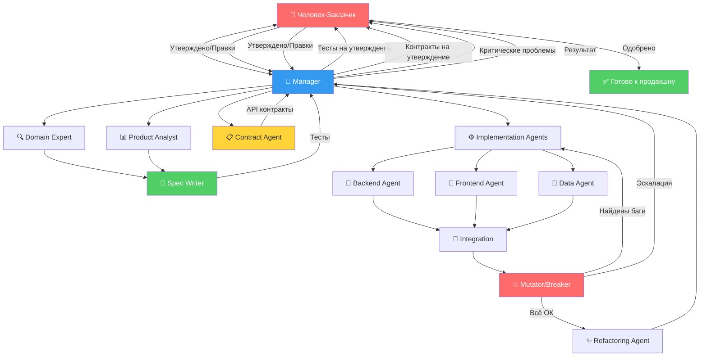
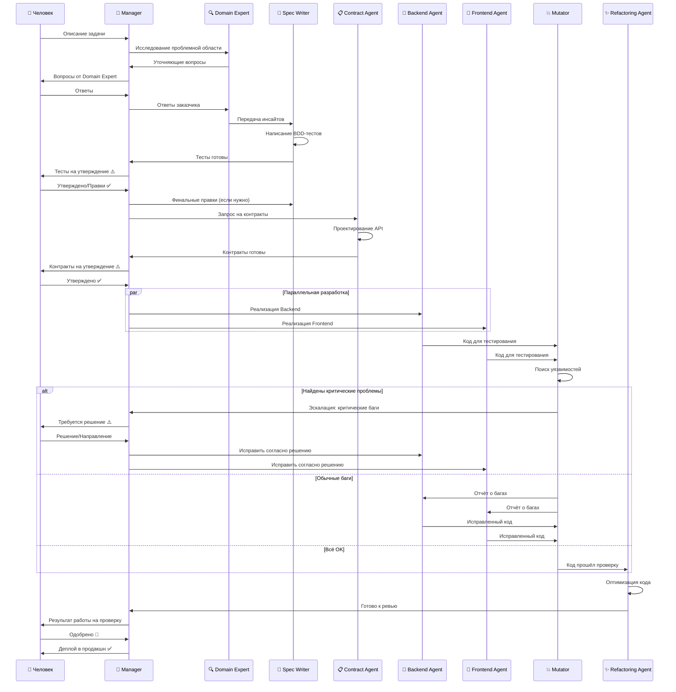

# 🚀 Лекция 3: Разработка через Спецификации и AI-Агентов

## 📋 Метаинформация

**Курс**: AI Talent Hub, магистратура

**Дата**: 1 Октября 2025

**Формат**: Интерактивный семинар с AI-соведущим

**Преподаватели**: Алексей (Лёша) + Клод (AI) + Никита Кононов

**«Термины и рамки»**

**Спецификация** = набор проверяемых требований (BDD/ATDD) + контракты API/данных.

**Тест** = исполняемая спецификация.

**Контракт** = формальная схема взаимодействия между компонентами (версионируемая).

**RGR-цикл** = Red→Green→Refactor как единица итерации.

**SLO** = целевые границы по латентности/стоимости/надёжности, проверяемые тестами.

**Ключевая идея:** Эта лекция раскрывает смену парадигмы в разработке программного обеспечения: мы уходим от модели "написать код, а потом проверить его" к "сначала детально описать, что мы хотим, а затем сгенерировать решение". В этом подходе тесты становятся не просто проверкой, а исчерпывающей спецификацией для команды AI-агентов. Это позволяет радикально ускорить, удешевить и, что самое важное, сделать процесс разработки более предсказуемым и гибким.

### 1. Новый Парадигм: От Кода к Спецификации

Традиционный подход, где разработчик сначала пишет код, а затем тесты, устарел. Он был оправдан, когда написание кода было медленным и дорогим. В эпоху AI, который способен генерировать тысячи строк кода за минуты, проверять такой объем вручную невозможно. Поэтому фокус смещается на создание точных, машиночитаемых спецификаций, которые AI может понять и реализовать.

- **Центральная роль тестирования:** Тесты перестают быть просто инструментом проверки после написания кода. Они превращаются в формальный контракт, описывающий, **что** система должна делать, а не **как** она это делает. AI-агент читает этот контракт и пишет код, который его выполняет.
- **Методологии на службе AI:**
    - **TDD (Test-Driven Development):** Это фундаментальный цикл. Например, вместо того чтобы сразу писать функцию сложения, вы сначала пишете тест: `assert сложение(2, 3) == 5`. Этот тест, естественно, падает (функции еще нет). Затем вы пишете простейший код, чтобы тест прошел: `def сложение(a, b): return 5`. Тест проходит! И только потом вы улучшаете код до `def сложение(a, b): return a + b`, будучи уверенными, что ничего не сломали. Это цикл `Red-Green-Refactor` (Красный-Зеленый-Рефакторинг).

    ```mermaid
    graph LR
        A[🔴 Red: Написать тест] --> B[Тест падает]
        B --> C[🟢 Green: Написать минимальный код]
        C --> D[Тест проходит]
        D --> E[🔵 Refactor: Улучшить код]
        E --> F[Тесты всё ещё проходят]
        F --> A

        style A fill:#ff6b6b
        style C fill:#51cf66
        style E fill:#339af0
    ```
    
    - **BDD (Behavior-Driven Development):** Это эволюция TDD, переводящая тесты на человеческий язык. Вместо технического синтаксиса мы используем почти естественную речь (часто на языке Gherkin), понятную всей команде. Например:
        
        ```
        Функционал: Авторизация пользователя
        
        Сценарий: Пользователь входит в систему с верными данными
          Дано: Зарегистрированный пользователь с логином "test" и паролем "pass123"
          Когда: Он вводит свой логин и пароль на странице входа
          Тогда: Он должен увидеть свою личную страницу
        
        Сценарий: Пользователь вводит неверный пароль
          Дано: Зарегистрированный пользователь с логином "test"
          Когда: Он вводит логин "test" и неверный пароль "wrong_pass"
          Тогда: Он должен увидеть сообщение об ошибке "Неверный логин или пароль"
        
        ```
        
    - **ATDD (Acceptance Test-Driven Development):** Это BDD на более высоком уровне. Тесты описывают не отдельные функции, а целые пользовательские истории, которые важны для бизнеса (критерии приемки).

**«Каталог нефункциональных требований (NFR), проверяемых тестами»**

- Латентность: P95 ответа ≤ X мс.
- Стоимость: $ на 1 сценарий ≤ Y. Guardrails с автосрабатыванием.
- Надёжность: доля зелёных прогонов ≥ Z% за N запусков.
- Безопасность: политика секретов, доступов и журналирования.
- Воспроизводимость: фиксированные сиды, версионирование датасетов/артефактов.
- Совместимость: поддержка L версий ОС/архитектур; контрактные тесты «старше/младше» схем.

### 2. Проектирование Команды AI-Агентов

Представьте себе не одного гениального, но хаотичного AI, а слаженную команду специалистов, как в реальной IT-компании. Каждый агент имеет свою узкую специализацию, что решает проблему смешивания контекстов и повышает качество конечного продукта.

**Базовая структура команды:**

- **Менеджер (Manager):** Он — project manager нашей AI-команды. Он **никогда не пишет код сам**. Его задача — координировать других агентов, следить, чтобы процесс шел по плану, задачи передавались нужным специалистам и чтобы команда не заходила в тупик.
- **Аналитик Проблемной Области (Domain Expert):** Это исследователь. Его задача — понять не то, *что* хочет заказчик, а *почему* он этого хочет.
    - **Пример вопроса:** Вместо "Какой чат-бот вам нужен?", он спросит: "Расскажите, как выглядит *самый неудачный* день в работе вашего рекрутера? Что его больше всего расстраивает и отнимает время?". Это помогает выявить реальную боль — например, не сам разговор с кандидатом, а невозможность до него дозвониться.
- **Продуктовый Аналитик (Product Analyst):** Этот агент берет результаты "расследования" от Domain Expert и превращает их в конкретные, измеримые бизнес-требования.
    - **Пример вывода:** "Основываясь на том, что рекрутеры тратят часы на прослушивание гудков, ключевой метрикой успеха будет повышение конверсии из 'попытки контакта' в 'начало диалога' на 40%".
- **Автор Спецификаций (Spec Writer):** Технический писатель команды. Он переводит бизнес-требования с человеческого языка на формальный язык BDD-тестов. Его работа — создать четкую и недвусмысленную "инструкцию" для агентов-исполнителей.
- **Агент по Контрактам (Contract Agent):** Архитектор API. Если наша система состоит из нескольких частей (например, мобильное приложение и сервер), этот агент проектирует "договор" между ними.
    - **Пример контракта:** `GET /api/user/{id}` должен возвращать JSON вида: `{"id": int, "name": string, "email": string, "is_active": boolean}`. Любое отклонение от этой схемы будет считаться ошибкой.
- **Агент-Исполнитель (Implementation Agent):** Это "разработчики" в нашей команде. Они получают на вход только тесты и контракты и пишут код, единственная цель которого — заставить тесты пройти. Они не знают о бизнес-целях, что защищает их от неверных интерпретаций.
- **Агент-Взломщик (Mutator/Breaker):** Это "тестировщик-хакер". После того как код написан, он целенаправленно пытается его сломать.
    - **Пример проверки:** "А что если в поле для возраста пользователь введет текст 'двадцать' вместо числа 20? А что если он введет отрицательное число? Система должна корректно обработать ошибку, а не упасть."
- **Агент по Рефакторингу (Refactoring Agent):** Это "чистильщик кода". Когда система работает, он приходит и делает код лучше: быстрее, эффективнее, понятнее для других агентов (и людей). Он не добавляет новой функциональности, только улучшает существующую.

Еще возможные агенты:

- **Product/Business Analyst**: формализует бизнес-метрики успеха и SLO.
- **Market Research Agent**: агрегирует «voice of customer» из внешних источников.
- **Data Steward**: политика данных, анонимизация, версии датасетов, лицензии.
- **Security Agent**: модель угроз, секреты, RBAC, отчёт о рисках.
- **Performance Agent**: профилирование, бюджеты CPU/RAM/IO, нагрузочные сценарии.
- **Observability Agent**: метрики/логи/трейсы, алерты по SLO.
- **Release Manager**: семантическое версионирование, changelog, релизные кандидаты.



**Архитектура команды AI-агентов**

Ключевые точки взаимодействия:
- **Единая точка контакта**: Человек общается ТОЛЬКО с Manager — все запросы, утверждения и эскалации идут через него
- **Manager как фильтр**: получает тесты от Spec Writer и контракты от Contract Agent, передает их человеку на утверждение
- **Параллельная разработка**: Backend, Frontend, Data работают одновременно после утверждения контрактов
- **Циклы обратной связи**: Mutator находит проблемы → Implementation исправляет, при критических проблемах → эскалация через Manager
- **Manager координирует**, но никогда не пишет код

**Тестовая пирамида для AI-режима**

Property-based на ядре, Contract-tests на границах, Approval-tests для отчётов/UI, Mutation-tests для проверки силы тестов.

### 3. Рабочий Процесс и Роль Человека

AI-команда не работает в вакууме. Человек остается в центре как принимающий решения "CEO" проекта, который задает направление и утверждает ключевые результаты.

**Пошаговый процесс:**



**Ключевые моменты процесса:**

1. **Интервью через Manager:** `Domain Expert` и `Product Analyst` формулируют вопросы, которые `Manager` передает человеку. Часто это происходит голосом для более эффективной коммуникации. Человек отвечает через `Manager`, который передает ответы агентам.
2. **Написание тестов:** `Spec Writer` создает полный набор сценариев и передает их `Manager`.
3. **Утверждение тестов (через Manager):** `Manager` представляет тесты человеку на утверждение. Человек утверждает или запрашивает правки. **Это самый важный этап.**
4. **Проектирование контрактов:** `Manager` запрашивает контракты у `Contract Agent`, который проектирует API. `Manager` передает контракты человеку на утверждение.
5. **Параллельная разработка:** После утверждения контрактов `Manager` запускает параллельную разработку: Backend-агент пишет логику для сохранения данных в базу, а Frontend-агент создает форму для ввода этих данных, доверяя контракту API. Это ускоряет процесс в разы.
6. **Тестирование и отладка:** `Mutator` ищет уязвимости. Обычные баги исправляются автоматически. При критических проблемах `Manager` эскалирует их человеку для принятия решения.
7. **Рефакторинг:** `Refactoring Agent` оптимизирует решение и передает результат `Manager`.
8. **Финальная проверка:** `Manager` представляет итоговый результат человеку на одобрение перед деплоем.
9. **Итерации:** Для добавления новой функциональности цикл повторяется.

**Точки эскалации (когда Manager обращается к человеку):**

Все взаимодействия идут через `Manager` — он единственная точка контакта между человеком и командой агентов:

- **Утверждение acceptance-тестов и контрактов.**
  - Manager: "Spec Writer подготовил тесты для функции регистрации. Прошу утвердить [передает тесты]"
  - Человек: "Отлично, но добавьте тест на случай короткого пароля"
  - Manager: "Понял, передам Spec Writer для доработки"

- **Разрешение противоречий в требованиях.**
  - Manager: "Обнаружено противоречие: Тест А требует публичный доступ, Тест Б — только для платных пользователей. Какое правило верное?"

- **Принятие ключевых архитектурных решений.**
  - Manager: "Domain Expert рекомендует выбрать между монолитом (быстрее старт) и микросервисами (гибкость в будущем). Ваше решение?"

- **Критические проблемы при интеграции.**
  - Manager: "Mutator обнаружил критическую проблему: Backend и Frontend не синхронизируются по контракту после 3 попыток. Contract Agent предлагает пересмотреть схему. Одобряете?"

- **Превышение бюджетных лимитов.**
  - Manager: "Израсходовано 80% месячного бюджета API. Варианты: продолжить разработку, оптимизировать использование токенов, или поставить на паузу?"

**Параллелизм и бутылочные горлышки:**

- Параллелятся после утверждения контрактов: Backend/Frontend/DevOps/Data.
- Узкие места: Spec Writer approve, Contract freeze, интеграция.
- Смягчение: инкрементальная интеграция, отдельные очереди на контрактные правки.

**Политики эскалации и остановки:**

- Конфликт тестов/требований → стоп, решение человека.
- Контракт-брейк после 3 неуспешных сборок → стоп, пересмотр схемы.
- Перерасход бюджета API/времени билда > X% → стоп, пересчёт SLO.
- Риски безопасности уровня High → стоп, патч/ревью Security Agent.

**Версионирование, воспроизводимость, окружения:**

- SemVer для сервисов и контрактов; back/forward-compat тесты.
- Lockfiles, Docker образы с хешами, фиксированные сиды.
- Среды: dev/stage/prod, миграции схем с миграционными тестами.
- Артефакты: реестр моделей/датасетов/отчётов с immutable ссылками.

**Управление стоимостью**

- Квоты и лимиты токенов/времени на прогон; авто-фаилфаст при превышении.
- Кэширование промежуточных артефактов; дедупликация прогонов; эмуляторы вместо LLM там, где это классификация.

### 4. Применение в Разных Областях

Этот подход универсален и масштабируется далеко за пределы стандартной веб-разработки.

- **Научные исследования (Биоинформатика):**
    - **Проблема:** Невозможно сравнить старые и новые инструменты для поиска повторов в геноме.
    - **Решение:** Создание системы-бенчмарка, которая генерирует синтетические геномы с известными параметрами.
    - **Результат:** Создание стандарта для всей научной области, гарантируя, что результаты, полученные в разных лабораториях, можно сравнивать между собой.
- **ML-исследования:**
    - **Проблема:** "Кризис воспроизводимости" в науке.
    - **Решение:** Создание "экспериментального стенда". Тесты пишутся на **воспроизводимость процесса**, а не только на итоговую точность.
    - **Результат:** Вместо скриншотов с метриками в статье вы можете предоставить "живой" стенд, где любой другой исследователь может запустить ваши тесты и подтвердить результаты.
    - **Repro-testbed как живой бенчмарк:** смена модели = сохранённые тесты, сравнение дифов метрик, публикация артефактов и команд запуска.
- **Маркетинг и Продвижение:**
    - **Задача:** Сделать научный инструмент популярным.
    - **Решение:** Создание `Marketing Agent`, который ведет себя как "digital science communicator".
    - **Результат:** Агент строит репутацию и доверие к продукту, автоматически выполняя работу комьюнити-менеджера.
- **Кейс: рекрутинг как multi-channel outreach:**
    - Задача: не диалог, а достижимость контакта; ранжирование каналов; антиспам-ограничения.
    - Решение: конечный автомат + лёгкий классификатор для роутинга; детерминированные реплики; SLO по P95≤2s и cost/session.
    - Тесты: достижение ответа ≤ K касаний; ≥ M% переходов к слоту; антиспам-лимиты не нарушаются.
- **Анти-паттерны и ограничения:**
    - Генерация кода без тестов → дрейф требований.
    - Менеджер, который пишет код → конфликт интересов и слепые зоны.
    - Неверсионируемые контракты → лавинообразные интеграционные поломки.
    - Флейки-тесты без карантина → ложные регрессии и выгорание пайплайна.

### 5. Выводы и Рекомендации для Практики

- **Свобода без страха:** Главное преимущество такого подхода — возможность вносить любые изменения в систему, будучи уверенным, что тесты поймают все "тихие" ошибки и сайд-эффекты. Это как страховка для вашего кода.
- **От MVP к Production-Ready:** Концепция MVP (Minimum Viable Product) родилась из-за ограниченности человеческих ресурсов. Когда у вас есть команда неутомимых AI-агентов, нет смысла искусственно резать функциональность. Можно сразу строить надежный продукт, просто добавляя фичи итеративно.
- **Критерии готовности (Definition of Done)**
    - Все acceptance/контрактные/нагрузочные тесты зелёные.
    - Покрытие критических путей ≥ T%; нет флейки в quarantine-списке.
    - Контракты и схемы версионированы, миграции протестированы.
    - Наблюдаемость и алерты по ключевым SLO включены.
    - Релизный артефакт, чеклист безопасности, changelog.
- **Checklist запуска:**
    - Утверждённые SLO по времени/стоимости/надёжности.
    - Политики данных/секретов/лицензий задокументированы.
    - Rollout: канареечный релиз, метрики до/после, план отката.
    - План деактивации legacy/миграции пользователей.
- **Домашнее задание:** Попробовать реализовать этот пайплайн на простом проекте. Цель — не столько получить работающий код, сколько **прочувствовать сам процесс** и смену мышления. Выступите в роли заказчика для AI, затем в роли "CEO", утверждающего тесты. Начинать с проектов, которые приносят личную пользу — это лучшая мотивация.

# Шаблоны для ATDD/BDD, контрактов, SLO и релизов

Ниже — готовые заготовки. Копируй, заполняй плейсхолдеры, держи их в репозитории (`/docs/specs`).

---

## 1) Шаблон ATDD/BDD (Gherkin)

```gherkin
# file: features/<feature_key>.feature
Feature: <краткое_имя_фичи>
  As <роль_пользователя>
  I want <цель/ценность>
  So that <бизнес-результат>

  Background:
    Given <начальные_условия/фикстуры>
    And <контекст/конфигурация>

  @acceptance @happy_path
  Scenario: <основной сценарий>
    Given <предусловие>
    When <действие>
    Then <проверяемый_результат>
    And <нфр_ограничение_или_побочный_эффект>

  @edge @negative
  Scenario: <краевой_случай>
    Given <нестандартное_состояние>
    When <действие>
    Then <корректная_обработка_ошибки>

  @nfr @performance
  Scenario: P95 latency ≤ <X> ms
    Given <нагрузочная_фикстура>
    When <операция>
    Then response time p95 <= <X> ms

```

**Guidelines:**

- Короткие шаги, один проверяемый факт на `Then`.
- Отражать бизнес-лексикон, не внутренние детали реализации.
- Метки (`@acceptance`, `@nfr`, `@security`) — для селективного прогона.

---

## 2) Шаблон Step Definition (псевдокод)

```python
# file: tests/steps/<feature_key>_steps.py
from behave import given, when, then

@given("<предусловие>")
def _(context):
    # TODO: инициализация фикстур/данных
    ...

@when("<действие>")
def _(context):
    # TODO: вызов системы через контракт/CLI/API
    context.result = ...

@then("<проверяемый_результат>")
def _(context):
    assert ...

```

---

## 3) Шаблон контракта (JSON Schema + SemVer)

```json
{
  "$schema": "https://json-schema.org/draft/2020-12/schema",
  "$id": "https://example.com/schemas/<service>/<resource>.schema.json",
  "title": "<Resource> v<MAJOR.MINOR>",
  "x-contract-version": "<MAJOR.MINOR.PATCH>",
  "type": "object",
  "required": ["id", "version"],
  "properties": {
    "id": {"type": "string", "format": "uuid"},
    "version": {"type": "string", "pattern": "^\\d+\\.\\d+\\.\\d+$"},
    "data": {
      "type": "object",
      "properties": {
        "<field>": {"type": "<string|number|integer|boolean|array|object>", "description": "<описание>"}
      },
      "additionalProperties": false
    },
    "meta": {
      "type": "object",
      "properties": {
        "created_at": {"type": "string", "format": "date-time"},
        "deprecated": {"type": "boolean", "default": false},
        "replaced_by": {"type": "string", "nullable": true}
      },
      "additionalProperties": false
    }
  },
  "additionalProperties": false
}

```

**Правила SemVer для контрактов:**

- MAJOR ↑ — ломающее изменение (удаление поля, изменение типа, смыслов).
- MINOR ↑ — обратная совместимость (добавление необязательного поля).
- PATCH ↑ — фиксы без изменения схемы.

**Контрактные тесты (чек-лист):**

- Producer валидирует выход против схемы.
- Consumer принимает неизвестные необязательные поля без падения.
- Back/forward-compat: JSON с предыдущими/следующими MINOR версиями.

---

## 4) Шаблон Changelog по контрактам

```markdown
# Contract Changelog: <service>/<resource>

## <X.Y.Z> — <YYYY-MM-DD>
- Type: <MAJOR|MINOR|PATCH>
- Changes:
  - <что изменили и зачем>
- Impact:
  - <кто затронут, миграции>
- Actions:
  - <шаги для потребителей>

```

---

## 5) SLO-карта (шаблон)

```markdown
# Service: <имя_сервиса>

| SLI                          | SLO Target          | Окно     | Источник метрик      | Алерт | Error budget |
|------------------------------|---------------------|----------|----------------------|-------|--------------|
| P95 latency (endpoint X)     | ≤ <N> ms            | 28 дней  | Prometheus/<метрика> | warn  | <M>%         |
| Success rate                 | ≥ <R>%              | 28 дней  | Logs/HTTP codes      | page  | <M>%         |
| Cost per scenario            | ≤ <$K>              | 7 дней   | Billing exporter     | warn  | n/a          |
| Uptime                       | ≥ 99.<XY>%          | 90 дней  | Uptime probe         | page  | <M>%         |

```

**Guardrails:** авто-фаилфаст, если бюджет ошибок исчерпан; остановка нагрузочных тестов при росте стоимости > X%.

---

## 6) НФТ/НФР тест-спека (латентность/стоимость/надёжность)

```yaml
# file: tests/nfr/<component>_nfr.yaml
component: <имя>
scenarios:
  - name: p95_latency_endpoint_x
    load: { rps: <N>, duration: <min> }
    assert:
      - metric: latency_p95_ms
        op: <=
        value: <X>
  - name: cost_per_run
    context: { provider: <llm|cloud>, model: <id> }
    assert:
      - metric: cost_usd
        op: <=
        value: <K>
  - name: reliability_7d
    assert:
      - metric: success_rate
        op: ">="
        value: <R>

```

---

## 7) Чеклист релиза/отката (Release/Rollback)

```markdown
# Release Checklist v<версия>
- [ ] Все acceptance/contract/NFR тесты зелёные
- [ ] Миграции данных прогнаны на staging; rollback-скрипт готов
- [ ] Контракты: SemVer обновлён, совместимость проверена
- [ ] Observability: новые метрики/логи/трейсы добавлены
- [ ] Security: секреты в vault, токены с минимальными правами
- [ ] Changelog написан, owner ответственности назначен
- [ ] Canaries: % трафика, критерии остановки, план отката

# Rollback Plan
- [ ] Условия триггера (SLO breach, инцидент, регрессия)
- [ ] Командa отката (контакты)
- [ ] Пошаговый откат (версии артефактов, миграции down)
- [ ] Проверка после отката (здоровье метрик)

```

---

## 8) Политика эскалаций (шаблон)

```markdown
# Escalation Policy
- Конфликт тестов/требований → стоп пайплайна, решение владельца продукта
- 3 провала интеграции подряд → пересмотр контракта (Contract Agent), approve владельца
- Перерасход бюджета API > <X>% за сутки → авто-стоп, пересчёт SLO
- Security High/Critical → немедленный стоп, патч, постмортем

```

---

## 9) Спека наблюдаемости (Observability Spec)

```yaml
service: <имя>
dashboards:
  - name: Latency & Errors
    charts:
      - metric: http_server_duration_seconds_bucket
        view: histogram_quantile_p95
      - metric: http_requests_total{code!~"2.."}
        view: rate
  - name: Cost
    charts:
      - metric: llm_cost_usd
        view: sum_by(model)
alerts:
  - name: p95_latency_breach
    expr: p95_latency_ms > <N> for 5m
    route: page
  - name: cost_spike
    expr: increase(llm_cost_usd[1h]) > <K>
    route: warn

```

---

## 10) Политика управления стоимостью

```markdown
- Лимиты: токены/время/запуски на PR
- Кэширование артефактов LLM и детерминированные ответы там, где возможно
- Замена LLM → лёгкий классификатор/эвристика при простых задачах
- Отчёты по стоимости в PR комментариях, цель ≤ <$K> / сценарий

```

---

## 11) Мини-шаблоны артефактов

### 11.1 Gherkin заготовка (быстрая)

```gherkin
Scenario: <что должно случиться>
  Given <предусловие>
  When <действие>
  Then <результат>

```

### 11.2 JSON-сообщение по контракту (пример)

```json
{
  "id": "<uuid>",
  "version": "<MAJOR.MINOR.PATCH>",
  "data": { "<field>": "<value>" },
  "meta": { "created_at": "<iso8601>", "deprecated": false }
}

```

### 11.3 SLO запись (одно SLI)

```yaml
sli: latency_p95_ms
slo: <= <N>
window: 28d
source: prometheus
alert: warn
budget: <M>%

```

---

## 12) Definition of Done (DoD) — вставь в README проекта

```markdown
- Зеленые acceptance/contract/NFR тесты
- Покрытие критических путей ≥ <T>%
- Контракты версионированы, миграции проверены
- Наблюдаемость и алерты включены
- Релизный артефакт + rollback-план готов

```