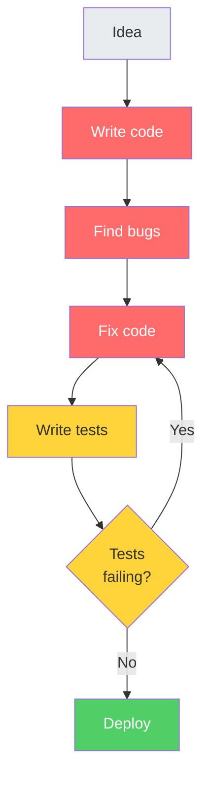
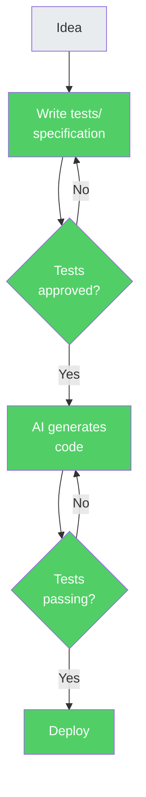
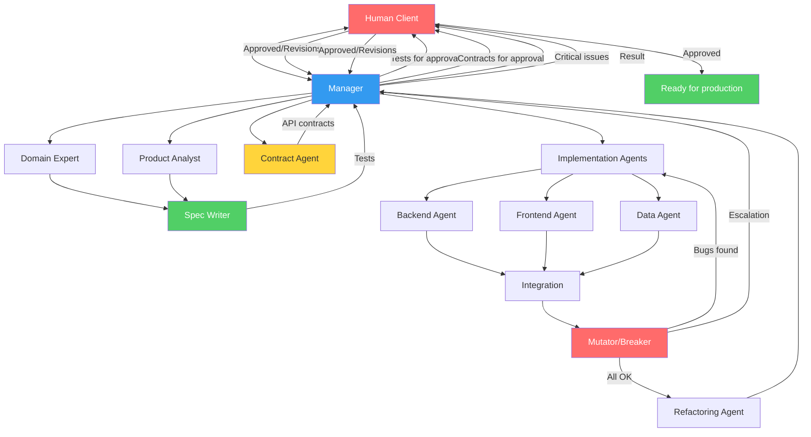
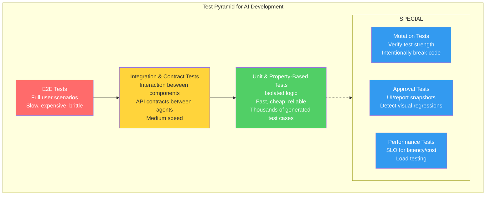
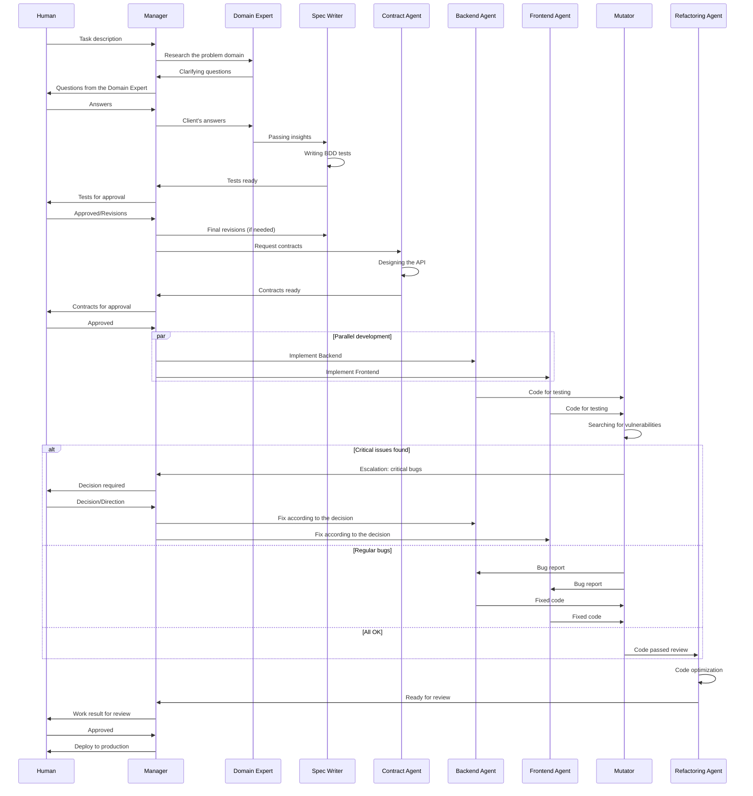
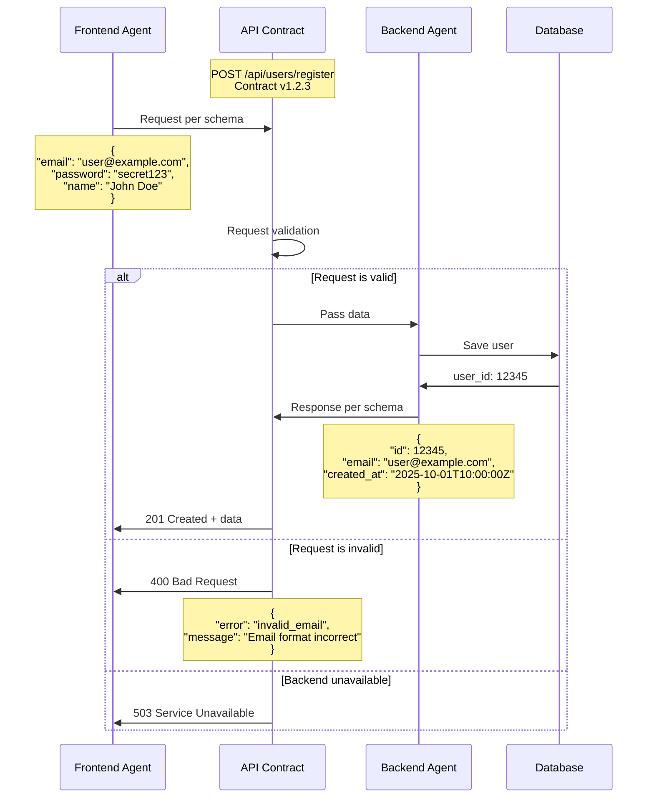
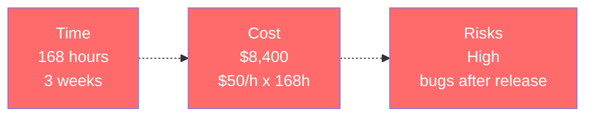
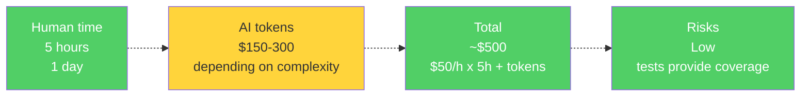
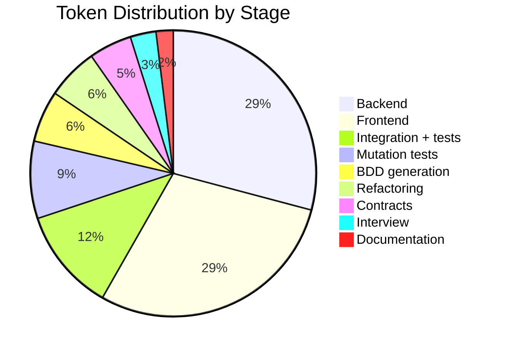

# Lecture 3: Development Through Specifications and AI Agents

## Metadata

**Course**: AI Talent Hub, Master's Program

**Date**: October 1, 2025

**Format**: Interactive seminar with an AI co-host

**Instructors**: Alexey (Lyosha) + Claude (AI) + Nikita Kononov

**Terms and Definitions**

**Specification** = a set of verifiable requirements (BDD/ATDD) + API/data contracts.

**Test** = an executable specification.

**Contract** = a formal schema describing the interaction between components (versioned).

**RGR cycle** = Red-Green-Refactor as a unit of iteration.

**SLO** = target boundaries for latency/cost/reliability, verified by tests.

**Key idea:** This lecture reveals a paradigm shift in software development: we move away from the "write code, then verify it" model to "first describe in detail what we want, then generate the solution." In this approach, tests are no longer just a verification step — they become an exhaustive specification for a team of AI agents. This enables a radically faster, cheaper, and — most importantly — more predictable and flexible development process.

### 1. The New Paradigm: From Code to Specification

The traditional approach, where a developer first writes code and then tests, is outdated. It was justified when writing code was slow and expensive. In the age of AI, which can generate thousands of lines of code in minutes, manually verifying such a volume is impossible. Therefore, the focus shifts to creating precise, machine-readable specifications that AI can understand and implement.

**Comparing approaches:**

**Traditional development:**

```mermaid
graph TD
    T1[Idea] --> T2[Write code]
    T2 --> T3[Find bugs]
    T3 --> T4[Fix code]
    T4 --> T5[Write tests]
    T5 --> T6{Tests<br/>failing?}
    T6 -->|Yes| T4
    T6 -->|No| T7[Deploy]

    style T1 fill:#e9ecef
    style T2 fill:#ff6b6b,color:#fff
    style T3 fill:#ff6b6b,color:#fff
    style T4 fill:#ff6b6b,color:#fff
    style T5 fill:#ffd43b
    style T6 fill:#ffd43b
    style T7 fill:#51cf66,color:#fff
```

**AI agents + Specifications:**

```mermaid
graph TD
    A1[Idea] --> A2[Write tests/<br/>specification]
    A2 --> A3{Tests<br/>approved?}
    A3 -->|No| A2
    A3 -->|Yes| A4[AI generates<br/>code]
    A4 --> A5{Tests<br/>passing?}
    A5 -->|No| A4
    A5 -->|Yes| A6[Deploy]

    style A1 fill:#e9ecef
    style A2 fill:#51cf66,color:#fff
    style A3 fill:#51cf66,color:#fff
    style A4 fill:#51cf66,color:#fff
    style A5 fill:#51cf66,color:#fff
    style A6 fill:#51cf66,color:#fff
```

**Key differences:**

| Aspect | Traditional | AI Agents |
|--------|-------------|-----------|
| **What does the human write** | Code | Specifications/Tests |
| **Iteration speed** | Hours to days | Minutes to hours |
| **Cost of changes** | High (refactoring) | Low (RMRF + regeneration) |
| **Entry barrier** | Knowledge of languages/frameworks | Ability to formulate requirements |
| **When bugs are found** | After writing code | Before writing code |
| **Human's role** | Developer | Product Owner / CEO |

- **The central role of testing:** Tests cease to be merely a post-implementation verification tool. They become a formal contract describing **what** the system should do, not **how** it does it. The AI agent reads this contract and writes code to fulfill it.
- **Methodologies in service of AI:**
    - **TDD (Test-Driven Development):** This is the fundamental cycle. For example, instead of immediately writing an addition function, you first write a test: `assert add(2, 3) == 5`. This test naturally fails (the function does not exist yet). Then you write the simplest code to make the test pass: `def add(a, b): return 5`. The test passes! Only then do you improve the code to `def add(a, b): return a + b`, confident that nothing is broken. This is the `Red-Green-Refactor` cycle.

    ```mermaid
    graph LR
        A[Red: Write a test] --> B[Test fails]
        B --> C[Green: Write minimal code]
        C --> D[Test passes]
        D --> E[Refactor: Improve code]
        E --> F[Tests still pass]
        F --> A

        style A fill:#ff6b6b
        style C fill:#51cf66
        style E fill:#339af0
    ```

    - **BDD (Behavior-Driven Development):** This is an evolution of TDD that translates tests into human language. Instead of technical syntax, we use near-natural language (often in Gherkin format), understandable to the entire team. For example:

        ```gherkin
        Feature: User Authentication

        Scenario: User logs in with valid credentials
          Given a registered user with username "test" and password "pass123"
          When they enter their username and password on the login page
          Then they should see their personal dashboard

        Scenario: User enters an incorrect password
          Given a registered user with username "test"
          When they enter username "test" and incorrect password "wrong_pass"
          Then they should see an error message "Invalid username or password"

        ```

        **BDD test lifecycle with AI agents:**

        ```mermaid
        sequenceDiagram
            participant PM as Product Owner
            participant M as Manager
            participant SW as Spec Writer
            participant IMPL as Implementation Agent
            participant TEST as Test Runner

            PM->>M: "We need user authentication"
            M->>SW: Create BDD scenarios

            SW->>SW: Writes Gherkin
            Note over SW: Feature: Authentication<br/>Scenario: Successful login<br/>Given/When/Then

            SW->>M: BDD scenarios ready
            M->>PM: For approval
            PM->>M: Approved

            M->>IMPL: Implement according to BDD
            IMPL->>IMPL: Generates code

            IMPL->>TEST: Run BDD tests
            TEST->>TEST: Executes scenarios

            alt Tests green
                TEST->>M: All scenarios passed
                M->>PM: Ready for deployment
            else Tests red
                TEST->>IMPL: Scenario X failed
                IMPL->>IMPL: Fixes code
                IMPL->>TEST: Re-run
            end
        ```

        **Benefits of BDD with AI:**
        - The Product Owner writes in natural language without knowing how to code
        - The specification simultaneously serves as documentation and tests
        - AI understands Gherkin and generates code to match the scenarios
        - Changing requirements = changing Gherkin, and AI automatically adapts the code

    - **ATDD (Acceptance Test-Driven Development):** This is BDD at a higher level. Tests describe not individual functions but entire user stories that matter to the business (acceptance criteria).

**Catalog of Non-Functional Requirements (NFR) Verified by Tests**

- Latency: P95 response time <= X ms.
- Cost: $ per scenario <= Y. Guardrails with auto-triggering.
- Reliability: share of green runs >= Z% over N runs.
- Security: secrets policy, access controls, and audit logging.
- Reproducibility: fixed seeds, versioned datasets/artifacts.
- Compatibility: support for L OS versions/architectures; contract tests for older/newer schema versions.

### 2. Designing the AI Agent Team

Imagine not a single brilliant but chaotic AI, but a well-coordinated team of specialists, like in a real IT company. Each agent has its own narrow specialization, which solves the problem of mixing contexts and improves the quality of the final product.

**Basic team structure:**

- **Manager:** The project manager of our AI team. They **never write code themselves**. Their job is to coordinate other agents, ensure the process follows the plan, tasks are routed to the right specialists, and the team does not get stuck.
- **Domain Expert:** The researcher. Their task is to understand not *what* the client wants, but *why* they want it.
    - **Example question:** Instead of "What kind of chatbot do you need?", they would ask: "Tell me about the *worst* day in your recruiter's work. What frustrates them the most and takes up the most time?" This helps uncover the real pain point — for example, not the conversation with the candidate itself, but the inability to reach them.
- **Product Analyst:** This agent takes the "investigation" results from the Domain Expert and turns them into specific, measurable business requirements.
    - **Example output:** "Based on the finding that recruiters spend hours listening to dial tones, the key success metric will be a 40% increase in conversion from 'contact attempt' to 'conversation started'."
- **Spec Writer:** The team's technical writer. They translate business requirements from human language into the formal language of BDD tests. Their job is to create a clear, unambiguous "instruction manual" for the implementation agents.
- **Contract Agent:** The API architect. If our system consists of multiple parts (e.g., a mobile app and a server), this agent designs the "agreement" between them.
    - **Example contract:** `GET /api/user/{id}` should return JSON in the format: `{"id": int, "name": string, "email": string, "is_active": boolean}`. Any deviation from this schema will be considered an error.
- **Implementation Agent:** These are the "developers" on our team. They receive only tests and contracts as input and write code whose sole purpose is to make the tests pass. They are unaware of business goals, which protects them from misinterpretation.
- **Mutator/Breaker:** The "hacker-tester." After the code is written, they deliberately try to break it.
    - **Example check:** "What if the user enters the text 'twenty' instead of the number 20 in the age field? What if they enter a negative number? The system should handle the error gracefully rather than crash."
- **Refactoring Agent:** The "code cleaner." Once the system works, they come in and make the code better: faster, more efficient, more readable for other agents (and humans). They do not add new functionality — only improve what already exists.

Additional possible agents:

- **Product/Business Analyst**: formalizes business success metrics and SLOs.
- **Market Research Agent**: aggregates "voice of customer" from external sources.
- **Data Steward**: data policy, anonymization, dataset versioning, licenses.
- **Security Agent**: threat model, secrets, RBAC, risk report.
- **Performance Agent**: profiling, CPU/RAM/IO budgets, load test scenarios.
- **Observability Agent**: metrics/logs/traces, SLO-based alerts.
- **Release Manager**: semantic versioning, changelog, release candidates.


```mermaid
graph TD
    H[Human Client] <--> M[Manager]

    M --> DE[Domain Expert]
    M --> PA[Product Analyst]

    DE --> SW[Spec Writer]
    PA --> SW

    SW --> |Tests| M
    M --> |Tests for approval| H
    H --> |Approved/Revisions| M

    M --> CA[Contract Agent]
    CA --> |API contracts| M
    M --> |Contracts for approval| H
    H --> |Approved/Revisions| M

    M --> IMPL[Implementation Agents]

    IMPL --> BE[Backend Agent]
    IMPL --> FE[Frontend Agent]
    IMPL --> DATA[Data Agent]

    BE --> INT[Integration]
    FE --> INT
    DATA --> INT

    INT --> MUT[Mutator/Breaker]
    MUT --> |Bugs found| IMPL
    MUT --> |Escalation| M
    M --> |Critical issues| H
    MUT --> |All OK| REF[Refactoring Agent]

    REF --> M
    M --> |Result| H
    H --> |Approved| DONE[Ready for production]

    style H fill:#ff6b6b,color:#fff
    style M fill:#339af0,color:#fff
    style SW fill:#51cf66,color:#fff
    style CA fill:#ffd43b
    style MUT fill:#ff6b6b,color:#fff
    style DONE fill:#51cf66,color:#fff
```

**AI agent team architecture**

Key interaction points:
- **Single point of contact**: The human communicates ONLY with the Manager — all requests, approvals, and escalations go through them
- **Manager as a filter**: receives tests from the Spec Writer and contracts from the Contract Agent, passes them to the human for approval
- **Parallel development**: Backend, Frontend, and Data work simultaneously after contracts are approved
- **Feedback loops**: Mutator finds issues -> Implementation fixes them; for critical issues -> escalation through the Manager
- **Manager coordinates** but never writes code

**Test pyramid for the AI workflow**


```mermaid
graph TB
    subgraph "Test Pyramid for AI Development"
        E2E["E2E Tests<br/>Full user scenarios<br/>Slow, expensive, brittle"]

        INT["Integration & Contract Tests<br/>Interaction between components<br/>API contracts between agents<br/>Medium speed"]

        UNIT["Unit & Property-Based Tests<br/>Isolated logic<br/>Fast, cheap, reliable<br/>Thousands of generated test cases"]

        SPECIAL["Special Test Types"]
    end

    subgraph SPECIAL
        MUT["Mutation Tests<br/>Verify test strength<br/>Intentionally break code"]

        APPR["Approval Tests<br/>UI/report snapshots<br/>Detect visual regressions"]

        PERF["Performance Tests<br/>SLO for latency/cost<br/>Load testing"]
    end

    E2E --> INT
    INT --> UNIT
    UNIT -.-> SPECIAL

    style E2E fill:#ff6b6b,color:#fff
    style INT fill:#ffd43b
    style UNIT fill:#51cf66,color:#fff
    style MUT fill:#339af0,color:#fff
    style APPR fill:#339af0,color:#fff
    style PERF fill:#339af0,color:#fff
```

**Key differences from the traditional pyramid:**
- **Property-based tests at the base**: AI generates thousands of test cases automatically
- **Contract tests are critical**: they ensure synchronization of parallel agent work
- **Mutation tests are mandatory**: they verify that tests actually catch bugs
- **Approval tests for AI-generated UI**: quickly detect visual changes

### 3. The Workflow and the Human's Role

The AI team does not work in a vacuum. The human remains at the center as the decision-making "CEO" of the project, setting direction and approving key results.

**Step-by-step process:**


```mermaid
sequenceDiagram
    participant H as Human
    participant M as Manager
    participant DE as Domain Expert
    participant SW as Spec Writer
    participant CA as Contract Agent
    participant BE as Backend Agent
    participant FE as Frontend Agent
    participant MUT as Mutator
    participant REF as Refactoring Agent

    H->>M: Task description
    M->>DE: Research the problem domain
    DE->>M: Clarifying questions
    M->>H: Questions from the Domain Expert
    H->>M: Answers
    M->>DE: Client's answers
    DE->>SW: Passing insights

    SW->>SW: Writing BDD tests
    SW->>M: Tests ready
    M->>H: Tests for approval
    H->>M: Approved/Revisions
    M->>SW: Final revisions (if needed)

    M->>CA: Request contracts
    CA->>CA: Designing the API
    CA->>M: Contracts ready
    M->>H: Contracts for approval
    H->>M: Approved

    par Parallel development
        M->>BE: Implement Backend
        M->>FE: Implement Frontend
    end

    BE->>MUT: Code for testing
    FE->>MUT: Code for testing

    MUT->>MUT: Searching for vulnerabilities
    alt Critical issues found
        MUT->>M: Escalation: critical bugs
        M->>H: Decision required
        H->>M: Decision/Direction
        M->>BE: Fix according to the decision
        M->>FE: Fix according to the decision
    else Regular bugs
        MUT->>BE: Bug report
        MUT->>FE: Bug report
        BE->>MUT: Fixed code
        FE->>MUT: Fixed code
    else All OK
        MUT->>REF: Code passed review
    end

    REF->>REF: Code optimization
    REF->>M: Ready for review
    M->>H: Work result for review
    H->>M: Approved
    M->>H: Deploy to production
```

**Key process moments:**

1. **Interview through the Manager:** `Domain Expert` and `Product Analyst` formulate questions, which the `Manager` relays to the human. This often happens via voice for more effective communication. The human answers through the `Manager`, who passes the responses to the agents.
2. **Writing tests:** The `Spec Writer` creates a complete set of scenarios and passes them to the `Manager`.
3. **Approving tests (through the Manager):** The `Manager` presents the tests to the human for approval. The human approves or requests revisions. **This is the most important step.**
4. **Designing contracts:** The `Manager` requests contracts from the `Contract Agent`, who designs the API. The `Manager` passes the contracts to the human for approval.
5. **Parallel development:** After contracts are approved, the `Manager` launches parallel development: the Backend agent writes the logic for saving data to the database, while the Frontend agent creates the input form, trusting the API contract. This speeds up the process many times over.
6. **Testing and debugging:** The `Mutator` searches for vulnerabilities. Regular bugs are fixed automatically. For critical issues, the `Manager` escalates them to the human for a decision.
7. **Refactoring:** The `Refactoring Agent` optimizes the solution and passes the result to the `Manager`.
8. **Final review:** The `Manager` presents the final result to the human for approval before deployment.
9. **Iterations:** To add new functionality, the cycle repeats.

**Escalation points (when the Manager reaches out to the human):**

All interactions go through the `Manager` — they are the sole point of contact between the human and the agent team:

- **Approval of acceptance tests and contracts.**
  - Manager: "The Spec Writer has prepared tests for the registration feature. Please approve [passes tests]"
  - Human: "Great, but add a test for the short password case"
  - Manager: "Understood, I'll pass this to the Spec Writer for revision"

- **Resolving requirement conflicts.**
  - Manager: "A conflict was found: Test A requires public access, Test B requires paid-users-only access. Which rule is correct?"

- **Making key architectural decisions.**
  - Manager: "The Domain Expert recommends choosing between a monolith (faster start) and microservices (future flexibility). What is your decision?"

- **Critical integration issues.**
  - Manager: "The Mutator found a critical issue: Backend and Frontend are failing to synchronize on the contract after 3 attempts. The Contract Agent suggests revising the schema. Do you approve?"

- **Exceeding budget limits.**
  - Manager: "80% of the monthly API budget has been spent. Options: continue development, optimize token usage, or pause?"

**Parallelism and bottlenecks:**

- Parallelized after contract approval: Backend/Frontend/DevOps/Data.
- Bottlenecks: Spec Writer approval, contract freeze, integration.
- Mitigation: incremental integration, separate queues for contract changes.

**Escalation and halt policies:**

- Test/requirement conflict -> halt, human decision.
- Contract break after 3 failed builds -> halt, schema revision.
- API budget/build time overrun > X% -> halt, SLO recalculation.
- High-severity security risks -> halt, patch/review by the Security Agent.

**Versioning, reproducibility, environments:**

- SemVer for services and contracts; back/forward-compat tests.
- Lockfiles, Docker images with hashes, fixed seeds.
- Environments: dev/stage/prod, schema migrations with migration tests.
- Artifacts: model/dataset/report registry with immutable references.

**Cost management**

- Token/time quotas per run; auto-failfast on overrun.
- Caching intermediate artifacts; deduplicating runs; using emulators instead of LLM where the task is classification.

---

### 3.1 Timeline: From Idea to Production

**Comparing time investment:**


```mermaid
gantt
    title Web Application Development: Traditional vs AI Agents
    dateFormat X
    axisFormat %H h

    section Traditional
    Requirements analysis          :t1, 0, 8h
    Architecture design            :t2, after t1, 16h
    Backend development            :t3, after t2, 40h
    Frontend development           :t4, after t2, 40h
    Integration                    :t5, after t3, 16h
    Testing                        :t6, after t5, 24h
    Bug fixing                     :t7, after t6, 16h
    Documentation                  :t8, after t7, 8h

    section AI Agents
    Interview + BDD (human)        :a1, 0, 2h
    Test approval (human)          :a2, after a1, 1h
    Contracts (human)              :a3, after a2, 1h
    Backend (AI in parallel)       :a4, after a3, 4h
    Frontend (AI in parallel)      :a5, after a3, 4h
    Integration (AI)               :a6, after a4, 2h
    Mutation tests (AI)            :a7, after a6, 1h
    Refactoring (AI)               :a8, after a7, 1h
    Review (human)                 :a9, after a8, 1h
```

**Total time:**

| Stage | Traditional | AI Agents | Speedup |
|-------|-------------|-----------|---------|
| **Total time** | 168 hours (3+ weeks) | 13 hours (1-2 days) | **13x** |
| **Human time** | 168 hours | 5 hours | **34x** |
| **Parallelism** | Minimal | Maximum | — |

**Distribution of work between human and AI:**

| Stage | Who performs | Time |
|-------|-------------|------|
| **AI Agents: Human involvement** | | |
| Interview + BDD | Human (with agent assistance) | 2 hours |
| Test approval | Human | 1 hour |
| Contract approval | Human | 1 hour |
| Final review | Human | 1 hour |
| **Total human time** | | **5 hours** |
| **AI Agents: Autonomous work** | | |
| Backend development | AI (in parallel with Frontend) | 4 hours |
| Frontend development | AI (in parallel with Backend) | 4 hours |
| Integration | AI | 2 hours |
| Mutation tests | AI | 1 hour |
| Refactoring | AI | 1 hour |
| **Total AI work** | | **8 hours** (in parallel) |
| **Total calendar time** | | **13 hours** |

**Key takeaways:**
- **Human involvement**: only approvals and strategic decisions (5 hours)
- **Autonomous AI work**: all implementation without human involvement (8 hours)
- **Parallelism**: Backend and Frontend are developed simultaneously (saving 4 hours)
- **Critical path**: test approval -> contract approval -> parallel development -> review

---

### 3.2 API Contract Example Between Agents

**Visualizing Backend <-> Frontend interaction:**


```mermaid
sequenceDiagram
    participant FE as Frontend Agent
    participant API as API Contract
    participant BE as Backend Agent
    participant DB as Database

    Note over API: POST /api/users/register<br/>Contract v1.2.3

    FE->>API: Request per schema
    Note over FE: {<br/>"email": "user@example.com",<br/>"password": "secret123",<br/>"name": "John Doe"<br/>}

    API->>API: Request validation
    alt Request is valid
        API->>BE: Pass data
        BE->>DB: Save user
        DB->>BE: user_id: 12345
        BE->>API: Response per schema
        Note over BE: {<br/>"id": 12345,<br/>"email": "user@example.com",<br/>"created_at": "2025-10-01T10:00:00Z"<br/>}
        API->>FE: 201 Created + data
    else Request is invalid
        API->>FE: 400 Bad Request
        Note over API: {<br/>"error": "invalid_email",<br/>"message": "Email format incorrect"<br/>}
    else Backend unavailable
        API->>FE: 503 Service Unavailable
    end
```

**Contract structure (JSON Schema):**

```json
{
  "$schema": "http://json-schema.org/draft-07/schema",
  "version": "1.2.3",
  "endpoint": "POST /api/users/register",
  "request": {
    "type": "object",
    "required": ["email", "password"],
    "properties": {
      "email": {"type": "string", "format": "email"},
      "password": {"type": "string", "minLength": 8},
      "name": {"type": "string"}
    }
  },
  "responses": {
    "201": {
      "description": "User successfully created",
      "schema": {
        "type": "object",
        "properties": {
          "id": {"type": "integer"},
          "email": {"type": "string"},
          "created_at": {"type": "string", "format": "date-time"}
        }
      }
    },
    "400": {"description": "Invalid request data"},
    "503": {"description": "Service temporarily unavailable"}
  }
}
```

**Benefits of contracts:**
- Frontend and Backend work in parallel, trusting the contract
- The Contract Agent automatically generates validation
- Contract changes are versioned (SemVer)
- Contract tests automatically verify that both sides comply with the schema

---

### 3.3 Responsibility Matrix (RACI)

**Who is responsible for what in the AI team:**


```mermaid
graph TD
    subgraph "RACI Matrix"
        direction TB

        H["Human (Product Owner)"]
        M["Manager"]
        TEAM["Agent Team"]
    end

    subgraph "Tasks and Roles"
        T1["Requirements formulation"]
        T2["Writing BDD tests"]
        T3["Test approval"]
        T4["Contract design"]
        T5["Contract approval"]
        T6["Writing code"]
        T7["Testing"]
        T8["Refactoring"]
        T9["Deployment"]
        T10["Architectural decisions"]
    end

    H -->|"R (Responsible)"| T1
    H -->|"A (Accountable)"| T3
    H -->|"A (Accountable)"| T5
    H -->|"A (Accountable)"| T10

    M -->|"R (Responsible)"| T3
    M -->|"R (Responsible)"| T5
    M -->|"C (Consulted)"| T1
    M -->|"I (Informed)"| T6
    M -->|"I (Informed)"| T7

    TEAM -->|"R (Responsible)"| T2
    TEAM -->|"R (Responsible)"| T4
    TEAM -->|"R (Responsible)"| T6
    TEAM -->|"R (Responsible)"| T7
    TEAM -->|"R (Responsible)"| T8
    TEAM -->|"C (Consulted)"| T9

    style H fill:#ff6b6b,color:#fff
    style M fill:#339af0,color:#fff
    style TEAM fill:#51cf66,color:#fff
```

**RACI breakdown:**

| Task | Human | Manager | Agents | Explanation |
|------|-------|---------|--------|-------------|
| **Requirements formulation** | **R** (does) | C (consulted) | C (consulted) | Human formulates, agents help structure |
| **Writing BDD tests** | I (informed) | I (informed) | **R** (does) | Spec Writer writes, human approves through Manager |
| **Test approval** | **A** (approves) | **R** (presents) | I (informed) | Critical control point |
| **Contract design** | I (informed) | I (informed) | **R** (does) | Contract Agent designs |
| **Contract approval** | **A** (approves) | **R** (presents) | I (informed) | Critical control point |
| **Writing code** | — | I (informed) | **R** (does) | Fully autonomous agent work |
| **Testing** | — | I (informed) | **R** (does) | Automated, escalation for critical bugs |
| **Refactoring** | — | I (informed) | **R** (does) | Automated optimization |
| **Deployment** | **A** (approves) | **R** (executes) | C (consulted) | Final human approval |
| **Architectural decisions** | **A** (decides) | **R** (proposes options) | C (consulted) | Strategic decisions rest with the human |

**Key principles:**
- **Human** = Product Owner, makes strategic decisions
- **Manager** = single point of interaction, coordinates and presents results
- **Agents** = autonomous team of implementers, experts, and reviewers

---

### 3.4 Development Cost Diagram

**Comparing token and time costs:**

**Traditional development:**

```mermaid
graph LR
    T_TIME["Time<br/>168 hours<br/>3 weeks"]
    T_COST["Cost<br/>$8,400<br/>$50/h x 168h"]
    T_RISK["Risks<br/>High<br/>bugs after release"]

    T_TIME -.-> T_COST
    T_COST -.-> T_RISK

    style T_TIME fill:#ff6b6b,color:#fff
    style T_COST fill:#ff6b6b,color:#fff
    style T_RISK fill:#ff6b6b,color:#fff
```

**AI agents:**

```mermaid
graph LR
    A_TIME["Human time<br/>5 hours<br/>1 day"]
    A_TOKENS["AI tokens<br/>$150-300<br/>depending on complexity"]
    A_COST["Total<br/>~$500<br/>$50/h x 5h + tokens"]
    A_RISK["Risks<br/>Low<br/>tests provide coverage"]

    A_TIME -.-> A_TOKENS
    A_TOKENS -.-> A_COST
    A_COST -.-> A_RISK

    style A_TIME fill:#51cf66,color:#fff
    style A_TOKENS fill:#ffd43b
    style A_COST fill:#51cf66,color:#fff
    style A_RISK fill:#51cf66,color:#fff
```

**Comparison:**
- **Time**: 168h vs 5h = **34x speedup**
- **Cost**: $8,400 vs $500 = **17x savings (94%)**
- **Risks**: high vs low = **predictable outcomes**

**Token cost breakdown by stage:**

| Stage | Tokens (approximate) | Cost | % of total |
|-------|----------------------|------|------------|
| **Interview + analysis** | 50k tokens | $7.50 | 3% |
| **BDD test generation** | 100k tokens | $15 | 6% |
| **Contract design** | 75k tokens | $11.25 | 5% |
| **Backend development** | 500k tokens | $75 | 30% |
| **Frontend development** | 500k tokens | $75 | 30% |
| **Integration and tests** | 200k tokens | $30 | 12% |
| **Mutation tests** | 150k tokens | $22.50 | 9% |
| **Refactoring** | 100k tokens | $15 | 6% |
| **Documentation** | 25k tokens | $3.75 | 2% |
| **TOTAL** | ~1.7M tokens | **~$255** | 100% |

**Cost distribution chart:**


```mermaid
pie title Token Distribution by Stage
    "Backend" : 30
    "Frontend" : 30
    "Integration + tests" : 12
    "Mutation tests" : 9
    "BDD generation" : 6
    "Refactoring" : 6
    "Contracts" : 5
    "Interview" : 3
    "Documentation" : 2
```

**Factors affecting cost:**

**Reduce cost:**
- Reusing contracts and tests
- Caching intermediate results
- Using cheaper models for simple tasks
- Property-based tests instead of manually writing cases

**Increase cost:**
- Frequent requirement changes without updating tests
- Lack of clear contracts (more integration iterations)
- Complex business logic (more edge cases)
- High performance requirements (more optimizations)

**ROI (Return on Investment):**

```
Traditional development: $8,400 over 3 weeks
AI agents: $500 in 1 day

Savings: $7,900 (94%)
Speedup: 21x in calendar time
```

---

### 4. Applications Across Different Domains

This approach is universal and scales well beyond standard web development.

- **Scientific Research (Bioinformatics):**
    - **Problem:** Impossible to compare old and new tools for finding repeats in genomes.
    - **Solution:** Creating a benchmarking system that generates synthetic genomes with known parameters.
    - **Result:** Establishing a standard for an entire scientific field, ensuring that results obtained in different laboratories can be compared.
- **ML Research:**
    - **Problem:** The "reproducibility crisis" in science.
    - **Solution:** Creating an "experimental test bench." Tests are written for **process reproducibility**, not just final accuracy.
    - **Result:** Instead of screenshots with metrics in a paper, you can provide a "live" test bench where any other researcher can run your tests and confirm the results.
    - **Repro-testbed as a live benchmark:** swapping models = preserved tests, comparing metric diffs, publishing artifacts and launch commands.
- **Marketing and Promotion:**
    - **Task:** Make a scientific tool popular.
    - **Solution:** Creating a `Marketing Agent` that behaves like a "digital science communicator."
    - **Result:** The agent builds reputation and trust in the product, automatically performing the work of a community manager.
- **Case study: Recruiting as multi-channel outreach:**
    - Task: not dialogue, but contact reachability; channel ranking; anti-spam constraints.
    - Solution: finite state machine + lightweight classifier for routing; deterministic replies; SLO targeting P95<=2s and cost/session.
    - Tests: achieving a response within <= K touches; >= M% transitions to a slot; anti-spam limits not violated.
- **Anti-patterns and limitations:**
    - Generating code without tests -> requirement drift.
    - Manager who writes code -> conflict of interest and blind spots.
    - Unversioned contracts -> cascading integration failures.
    - Flaky tests without quarantine -> false regressions and pipeline burnout.

### 5. Conclusions and Practical Recommendations

- **Freedom without fear:** The main advantage of this approach is the ability to make any changes to the system, confident that tests will catch all "silent" errors and side effects. It is like insurance for your code.
- **From MVP to Production-Ready:** The MVP (Minimum Viable Product) concept was born from limited human resources. When you have a team of tireless AI agents, there is no point in artificially cutting functionality. You can build a robust product from the start, simply adding features iteratively.
- **Definition of Done criteria**
    - All acceptance/contract/load tests are green.
    - Coverage of critical paths >= T%; no flaky tests in the quarantine list.
    - Contracts and schemas are versioned, migrations are tested.
    - Observability and alerts on key SLOs are enabled.
    - Release artifact, security checklist, changelog.
- **Launch checklist:**
    - Approved SLOs for time/cost/reliability.
    - Data/secrets/license policies are documented.
    - Rollout: canary release, before/after metrics, rollback plan.
    - Legacy deactivation/user migration plan.
- **Homework:** Try implementing this pipeline on a simple project. The goal is not so much to get working code, but to **experience the process itself** and the shift in mindset. Play the role of a client for the AI, then the role of a "CEO" approving tests. Start with projects that bring you personal value — that is the best motivation.

# Templates for ATDD/BDD, Contracts, SLOs, and Releases

Below are ready-made templates. Copy them, fill in the placeholders, and keep them in your repository (`/docs/specs`).

---

## 1) ATDD/BDD Template (Gherkin)

```gherkin
# file: features/<feature_key>.feature
Feature: <short_feature_name>
  As <user_role>
  I want <goal/value>
  So that <business_outcome>

  Background:
    Given <initial_conditions/fixtures>
    And <context/configuration>

  @acceptance @happy_path
  Scenario: <main scenario>
    Given <precondition>
    When <action>
    Then <verifiable_result>
    And <nfr_constraint_or_side_effect>

  @edge @negative
  Scenario: <edge case>
    Given <non_standard_state>
    When <action>
    Then <correct_error_handling>

  @nfr @performance
  Scenario: P95 latency <= <X> ms
    Given <load_fixture>
    When <operation>
    Then response time p95 <= <X> ms

```

**Guidelines:**

- Short steps, one verifiable fact per `Then`.
- Reflect business vocabulary, not internal implementation details.
- Tags (`@acceptance`, `@nfr`, `@security`) — for selective test runs.

---

## 2) Step Definition Template (pseudocode)

```python
# file: tests/steps/<feature_key>_steps.py
from behave import given, when, then

@given("<precondition>")
def _(context):
    # TODO: initialize fixtures/data
    ...

@when("<action>")
def _(context):
    # TODO: call the system via contract/CLI/API
    context.result = ...

@then("<verifiable_result>")
def _(context):
    assert ...

```

---

## 3) Contract Template (JSON Schema + SemVer)

```json
{
  "$schema": "https://json-schema.org/draft/2020-12/schema",
  "$id": "https://example.com/schemas/<service>/<resource>.schema.json",
  "title": "<Resource> v<MAJOR.MINOR>",
  "x-contract-version": "<MAJOR.MINOR.PATCH>",
  "type": "object",
  "required": ["id", "version"],
  "properties": {
    "id": {"type": "string", "format": "uuid"},
    "version": {"type": "string", "pattern": "^\\d+\\.\\d+\\.\\d+$"},
    "data": {
      "type": "object",
      "properties": {
        "<field>": {"type": "<string|number|integer|boolean|array|object>", "description": "<description>"}
      },
      "additionalProperties": false
    },
    "meta": {
      "type": "object",
      "properties": {
        "created_at": {"type": "string", "format": "date-time"},
        "deprecated": {"type": "boolean", "default": false},
        "replaced_by": {"type": "string", "nullable": true}
      },
      "additionalProperties": false
    }
  },
  "additionalProperties": false
}

```

**SemVer rules for contracts:**

- MAJOR up — breaking change (field removal, type change, semantic change).
- MINOR up — backward compatible (adding an optional field).
- PATCH up — fixes without schema changes.

**Contract tests (checklist):**

- Producer validates output against the schema.
- Consumer accepts unknown optional fields without crashing.
- Back/forward-compat: JSON with previous/next MINOR versions.

---

## 4) Contract Changelog Template

```markdown
# Contract Changelog: <service>/<resource>

## <X.Y.Z> — <YYYY-MM-DD>
- Type: <MAJOR|MINOR|PATCH>
- Changes:
  - <what changed and why>
- Impact:
  - <who is affected, migrations>
- Actions:
  - <steps for consumers>

```

---

## 5) SLO Card (template)

```markdown
# Service: <service_name>

| SLI                          | SLO Target          | Window   | Metrics Source        | Alert | Error budget |
|------------------------------|---------------------|----------|-----------------------|-------|--------------|
| P95 latency (endpoint X)     | <= <N> ms           | 28 days  | Prometheus/<metric>   | warn  | <M>%         |
| Success rate                 | >= <R>%             | 28 days  | Logs/HTTP codes       | page  | <M>%         |
| Cost per scenario            | <= <$K>             | 7 days   | Billing exporter      | warn  | n/a          |
| Uptime                       | >= 99.<XY>%         | 90 days  | Uptime probe          | page  | <M>%         |

```

**Guardrails:** auto-failfast if error budget is exhausted; stop load tests if cost increases > X%.

---

## 6) NFT/NFR Test Spec (latency/cost/reliability)

```yaml
# file: tests/nfr/<component>_nfr.yaml
component: <name>
scenarios:
  - name: p95_latency_endpoint_x
    load: { rps: <N>, duration: <min> }
    assert:
      - metric: latency_p95_ms
        op: <=
        value: <X>
  - name: cost_per_run
    context: { provider: <llm|cloud>, model: <id> }
    assert:
      - metric: cost_usd
        op: <=
        value: <K>
  - name: reliability_7d
    assert:
      - metric: success_rate
        op: ">="
        value: <R>

```

---

## 7) Release/Rollback Checklist

```markdown
# Release Checklist v<version>
- [ ] All acceptance/contract/NFR tests are green
- [ ] Data migrations run on staging; rollback script ready
- [ ] Contracts: SemVer updated, compatibility verified
- [ ] Observability: new metrics/logs/traces added
- [ ] Security: secrets in vault, tokens with minimal permissions
- [ ] Changelog written, ownership assigned
- [ ] Canaries: % of traffic, stop criteria, rollback plan

# Rollback Plan
- [ ] Trigger conditions (SLO breach, incident, regression)
- [ ] Rollback team (contacts)
- [ ] Step-by-step rollback (artifact versions, down migrations)
- [ ] Post-rollback verification (metrics health)

```

---

## 8) Escalation Policy (template)

```markdown
# Escalation Policy
- Test/requirement conflict -> pipeline halt, product owner decision
- 3 consecutive integration failures -> contract revision (Contract Agent), owner approval
- API budget overrun > <X>% per day -> auto-halt, SLO recalculation
- Security High/Critical -> immediate halt, patch, postmortem

```

---

## 9) Observability Spec

```yaml
service: <name>
dashboards:
  - name: Latency & Errors
    charts:
      - metric: http_server_duration_seconds_bucket
        view: histogram_quantile_p95
      - metric: http_requests_total{code!~"2.."}
        view: rate
  - name: Cost
    charts:
      - metric: llm_cost_usd
        view: sum_by(model)
alerts:
  - name: p95_latency_breach
    expr: p95_latency_ms > <N> for 5m
    route: page
  - name: cost_spike
    expr: increase(llm_cost_usd[1h]) > <K>
    route: warn

```

---

## 10) Cost Management Policy

```markdown
- Limits: tokens/time/runs per PR
- Cache LLM artifacts and use deterministic responses where possible
- Replace LLM with lightweight classifier/heuristic for simple tasks
- Cost reports in PR comments, target <= <$K> / scenario

```

---

## 11) Mini Artifact Templates

### 11.1 Gherkin Quick Template

```gherkin
Scenario: <what should happen>
  Given <precondition>
  When <action>
  Then <result>

```

### 11.2 Contract JSON Message (example)

```json
{
  "id": "<uuid>",
  "version": "<MAJOR.MINOR.PATCH>",
  "data": { "<field>": "<value>" },
  "meta": { "created_at": "<iso8601>", "deprecated": false }
}

```

### 11.3 SLO Entry (single SLI)

```yaml
sli: latency_p95_ms
slo: <= <N>
window: 28d
source: prometheus
alert: warn
budget: <M>%

```

---

## 12) Definition of Done (DoD) — add to your project README

```markdown
- Green acceptance/contract/NFR tests
- Coverage of critical paths >= <T>%
- Contracts versioned, migrations verified
- Observability and alerts enabled
- Release artifact + rollback plan ready

```
