# 🚀 Лекция 4: Автономная AI-разработка в действии - от данных к инсайтам

## 📋 Метаинформация

**Курс**: AI Talent Hub, магистратура ИТМО

**Дата**: 8 Октября 2025

**Формат**: Live coding session с AI-соведущим

**Преподаватели**: Алексей (Лёша) + Claude (AI голосовой агент) + Никита Кононов

**Длительность**: 2 часа 23 минуты непрерывной работы

**Ключевая идея:** Эта лекция — живая демонстрация того, как меняется сам процесс интеллектуального труда в эпоху AI. Мы не просто разрабатываем систему анализа домашних заданий — мы наблюдаем фундаментальный сдвиг: когда исполнение становится мгновенным, узким местом оказывается не "как делать", а "что делать и зачем". Это история о том, как три часа ушло не на программирование, а на непрерывное принятие стратегических решений.

---

## 1. Контекст и Постановка Задачи

### 1.1 Проблема: Невозможность проверки домашних заданий вручную

**Масштаб:**
- 28 студентов на курсе
- 3 домашних задания (голосовые записи через Eleven Labs)
- Потенциально 166 разговоров для анализа
- ~593 килосимвола текста транскриптов

**Традиционный подход (невозможный):**
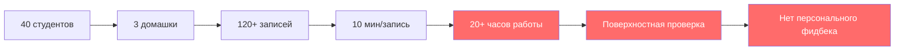

**Реальность проверки домашних заданий:**
> "Если вы думаете, что ваши домашние проверяют когда вас 50 человек на курсе, то люди будут делать вид что проверяют. 50 домашних по 10 минут — это 500 минут на одну домашку. На 10 лекций — это 5000 минут за семестр. Это просто нереально."

**Альтернатива без AI:**
- ✅ Peer review (студенты проверяют друг друга)
- ✅ Автоматические флаги "сдал/не сдал"
- ❌ Качественная персонализированная обратная связь каждому

### 1.2 Зачем проверять домашние задания?

**Цепочка "зачем" (копаем глубже):**

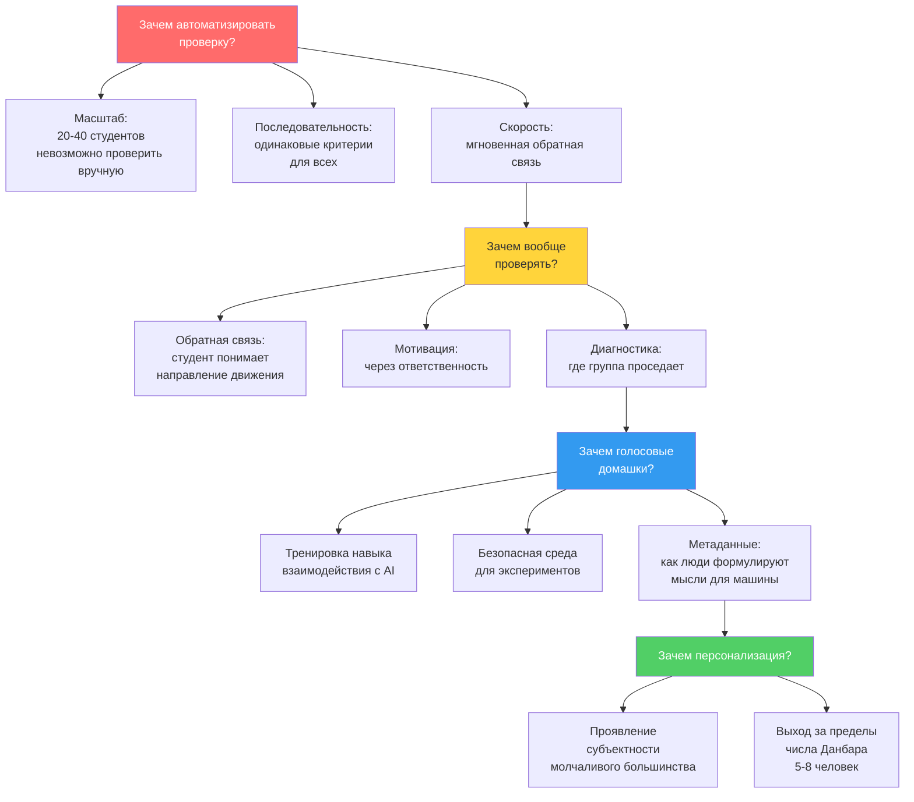

**Критическое наблюдение:**
> "Зачем можно копать до философии существования образования. Остановимся на практическом уровне — мы поняли ценность для студентов, для процесса, для демонстрации возможностей."

---

## 2. Архитектура Решения

### 2.1 Что мы хотим построить

**Уровень 1: Базовая статистика**
- Забрать все транскрипции с Eleven Labs
- Подсчитать количество попыток на каждую домашку
- Уникально идентифицировать студентов

**Уровень 2: Содержательный анализ**
- Сопоставить ответы с заданиями из конспектов
- Проверить покрытие ключевых концепций
- Оценить структурированность мышления

**Уровень 3: Сегментация и персонализация**
- Разделить студентов на группы
- Выявить паттерны успеха/провала
- Сгенерировать персональный фидбек каждому

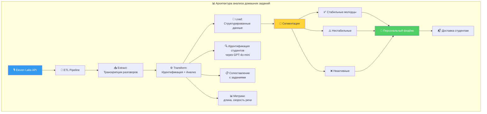

### 2.2 Технический стек

**Почему именно эти инструменты:**

| Инструмент | Роль | Почему выбран |
|------------|------|---------------|
| **Claude Sonnet 4.5** | Основной агент для кодинга | Высокая автономность, лучшее использование инструментов |
| **GPT-4o-mini** | Идентификация студентов | Дешевле, достаточно для простых задач классификации |
| **Gemini** | Анализ больших текстов | Огромный контекст (до 2M токенов) |
| **Eleven Labs** | Источник данных | Голосовые домашки студентов |
| **FastAPI** | Бэкенд | Быстрая разработка, автоматическая документация |
| **Python** | Язык разработки | Богатая экосистема для data science |

**Важное наблюдение о моделях:**
> "У нас одна и та же модель Claude Sonnet 4.5 и у голосового агента и у агента-программиста, поэтому у них не должно быть проблем с переводами контекста. Если вы используете разные модели, у вас зачастую будут проблемы."

---

## 3. Процесс Разработки: Live Coding в действии

### 3.1 Подготовка: полчаса обсуждения "зачем" и "что"

**Критический инсайт:**
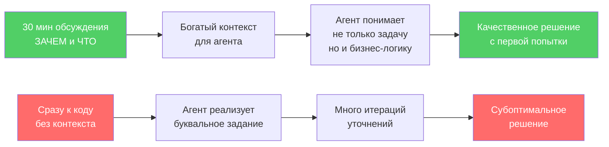

**Техника обогащения контекста:**
> "Когда вы что-то делаете первый раз, делайте это руками. Сделайте раз пять руками, вы поймете что автоматизировать. То что я делаю руками, я вижу как это делается, я могу это автоматизировать."

### 3.2 Реальная разработка: что заняло время

**Timeline реальной сессии:**

```mermaid
gantt
    title Реальное распределение времени (2ч 23мин)
    dateFormat X
    axisFormat %H:%M

    section Планирование
    Обсуждение ЗАЧЕМ           :plan1, 0, 30m
    Формулировка ЧТО           :plan2, after plan1, 15m

    section Техн. проблемы
    Поиск ключа Eleven Labs    :tech1, after plan2, 10m
    Настройка прав доступа     :tech2, after tech1, 5m
    Проблемы с NumPy на Mac    :tech3, after tech2, 15m
    Поиск ключа OpenAI         :tech4, after tech3, 8m
    Неправильный ключ          :tech5, after tech4, 5m

    section Работа AI
    Написание кода (агент)     :code1, after plan2, 20m
    Написание кода (агент)     :code2, after tech2, 15m
    Написание кода (агент)     :code3, after tech4, 25m

    section Анализ данных
    Получение данных           :data1, after code2, 5m
    Визуализация               :data2, after code3, 10m
    Идентификация студентов    :data3, after data2, 30m
    Мета-анализ                :data4, after data3, 40m

    section Рефлексия
    Обсуждение философии       :think1, after data4, 20m
```

**Распределение реального времени:**
- 🗣️ **Планирование и обсуждение**: ~45 минут (25%)
- 🔧 **Решение технических проблем**: ~43 минуты (24%)
- 🤖 **Автономная работа агента**: ~60 минут (33%)
- 📊 **Анализ данных**: ~85 минут (47%)
- 🧠 **Рефлексия и философия**: ~20 минут (11%)

**Критическое наблюдение:**
> "Программирование у нас заняло минимум времени. Больше всего заняло планирование. Мы программировали до того момента, который мы смогли спроектировать."

### 3.3 Человеческие ошибки vs ошибки AI

**Все критические ошибки были со стороны человека:**

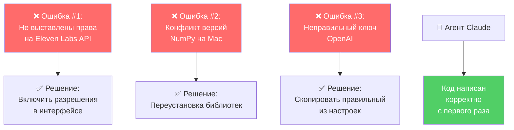

**Ключевое наблюдение:**
> "За весь наш live coding ошибки только с моей стороны. Все три. Система нормально реализовала, а мы не могли нормальные ключи вставить."

---

## 4. Работа с Данными и Инсайты

### 4.1 Базовая статистика

**Результаты сбора данных:**

| Метрика | Значение | Интерпретация |
|---------|----------|---------------|
| Всего разговоров | 166 | До очистки от пустых |
| После очистки | 97 | Реальные попытки сдачи |
| Студентов всего | 28 | Зарегистрировано на курсе |
| Идентифицировано | 54% | Представились чётко |
| Уникальных студентов | 21 | Делали хоть одну домашку |
| Неактивных | 9 (32%) | Ни разу не попробовали |

**Динамика по домашкам:**

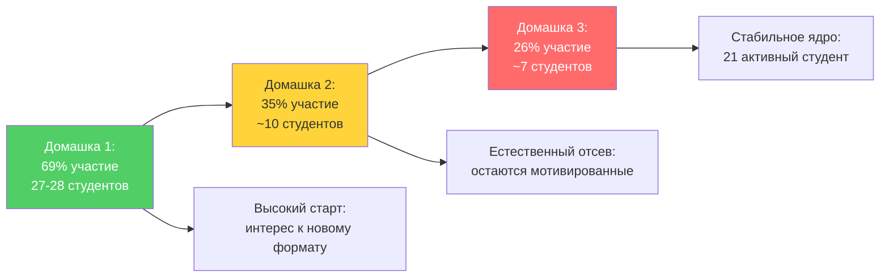

### 4.2 Паттерны активности

**Временные волны сдачи:**

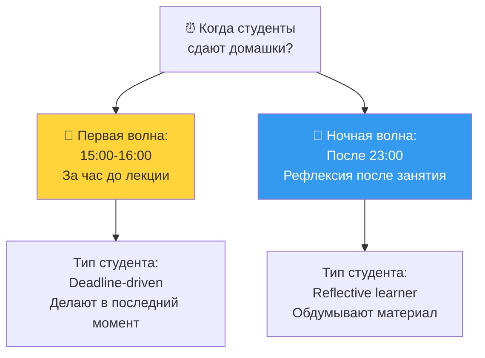

**Метрики речи:**

| Метрика | Значение | Норма | Интерпретация |
|---------|----------|-------|---------------|
| Средняя длительность | 5.8 мин | - | Студенты стараются дать развёрнутый ответ |
| Медианная длительность | 6.8 мин | - | Половина говорит >7 минут |
| Средняя скорость речи | 50 слов/мин | 100-150 | Студенты формулируют мысли вслух, не зачитывают |
| Максимальная скорость | 104 слова/мин | 100-150 | Вероятно зачитывал заготовку |
| Минимальная скорость | 1 слово | - | Технические ошибки или отказ |

**Критический инсайт о скорости речи:**
> "50 слов в минуту вместо 100-150 — это не баг, это реальность формулирования мыслей вслух. Студент не читает готовый текст, он думает и говорит одновременно, отсюда паузы, переформулировки, поиск слов."

### 4.3 Идентификация студентов через LLM

**Проблема и решение:**

```python
# Регулярные выражения НЕ работают для русской речи:
# ❌ "Я Иван" → распознано как "я вам"
# ❌ "Меня зовут Дмитрий" → "мне знают Митрий"
# ❌ "Дима Шершов" → просто "Дима"

# Решение: использовать GPT-4o-mini с контекстом
def identify_student(transcript: str, student_list: list[str]) -> str:
    """
    Идентификация через LLM с нечётким сопоставлением
    """
    prompt = f"""
    Дан список студентов: {student_list}
    Дана транскрипция начала разговора: {transcript[:500]}

    Определи имя студента из списка, если он представился.
    Если не представился или имени нет в списке: верни "UNKNOWN"
    Верни только имя без пояснений.
    """
    # GPT-4o-mini: $0.15 / 1M tokens (дёшево)
    response = openai.chat.completions.create(
        model="gpt-4o-mini",
        messages=[{"role": "user", "content": prompt}],
        temperature=0
    )
    return response.choices[0].message.content
```

**Результаты:**
- 54 студента из 97 разговоров идентифицированы
- 21 уникальное имя (остальные — повторные попытки)
- 36 неопознанных (не представились вообще)

---

## 5. Сегментация и Персонализация

### 5.1 Три группы студентов

**Модель сегментации:**

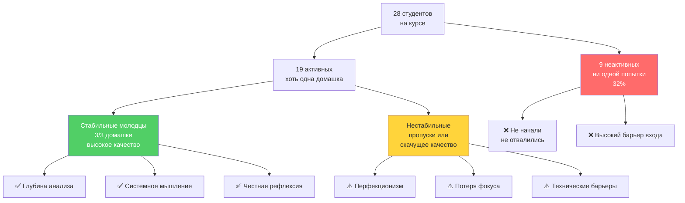

### 5.2 Паттерны успеха (что работает у сильных студентов)

**Выявленные паттерны:**

1. **Честность в рефлексии**
   - Не показуха "я всё понял"
   - Открыто говорят где застряли

2. **Связь с реальными задачами**
   - Не абстрактные эксперименты
   - Применение к своим проектам

3. **Глубина против ширины**
   - Лучше один эксперимент глубоко
   - Чем три поверхностно

4. **Системное мышление**
   - Понимание границ применимости
   - Осознание trade-offs

5. **Философская рефлексия**
   - Связь технических решений
   - С более широким контекстом

### 5.3 Что мешает нестабильным

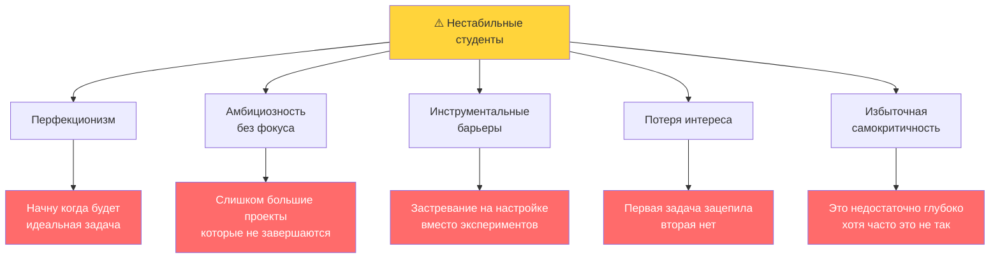

### 5.4 Пример персонального фидбека

**Структура обратной связи:**

```markdown
## Студент А

**Траектория:** Домашка 1 ✅ | Домашка 2 ⚠️ | Домашка 3 ❌

**Сильные стороны:**
- Сильное начало с глубоким техническим пониманием
- Хорошее освоение кастомных моделей

**На что обратить внимание:**
- Снижение детализации во второй домашке
- Отсутствие третьей домашки — возможно потеря мотивации

**Рекомендации:**
- Попробуйте держать уровень детализации первой домашки
- Если застряли технически — обращайтесь за поддержкой
- Рассмотрите привязку экспериментов к личным проектам

---

## Студент Б

**Траектория:** Домашка 1 ✅ | Домашка 2 ✅ | Домашка 3 ✅

**Сильные стороны:**
- Стабильное участие во всех домашках
- Глубокая рефлексия о применимости инструментов
- Связь с реальными бизнес-задачами

**На что обратить внимание:**
- Продолжайте в том же духе
- Можете взять более сложные задачи

**Рекомендации:**
- Рассмотрите роль ментора для нестабильных студентов
- Попробуйте advanced треки с мультиагентными системами
```

---

## 6. Философия Автономной Разработки

### 6.1 Парадокс бесконечных возможностей

**Фундаментальная проблема:**

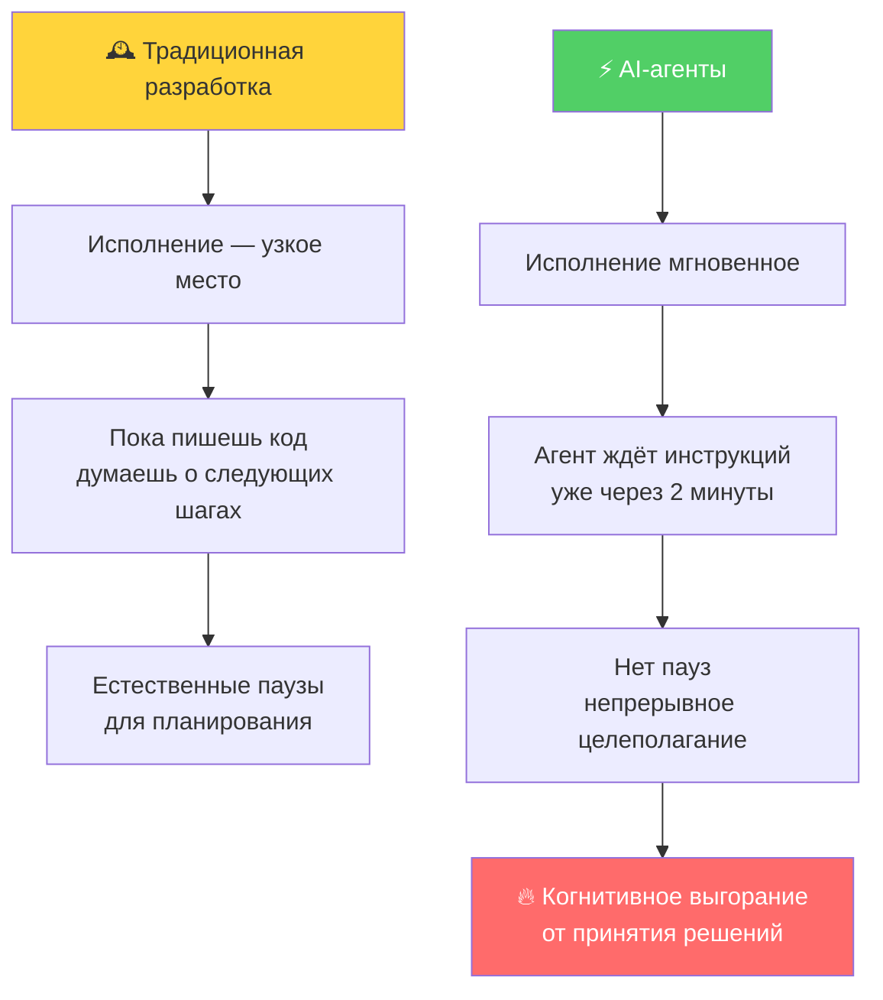

**Цитата из лекции:**
> "Мы привыкли что когда программируем, это занимает достаточно много времени, и мы в процессе можем подумать, планировать. А здесь мы получаем результат почти мгновенно и не готовы к следующим шагам. Нам нужно входить, подумать что делать следующее."

### 6.2 Аналогия с пищевым изобилием

**"Интеллектуальный диабет":**

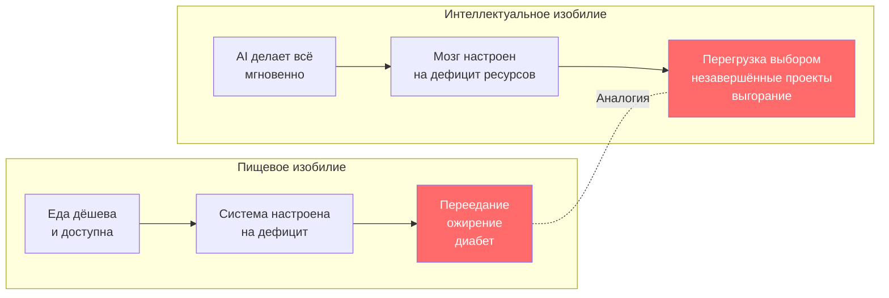

**Цитата:**
> "Мы оказались с едой в ситуации когда еда в бесконечном доступе, дешёвая, доступная и сверхэнергетически присыщенная, при этом вся наша система настроена на то чтобы еды было мало. Мы оказались в точно такой же ситуации с интеллектуальным трудом."

### 6.3 Техники "интеллектуальной гигиены"

**Предложенные подходы:**

1. **Принудительные ограничения (как диета)**
   ```
   Правило: Максимум 3 новых направления в день
   Остальное — только доработка начатого
   ```

2. **Цикл рефлексии**
   ```
   После каждого результата → пауза 5 минут
   Записать: "Зачем это? Что дальше? Стоит ли продолжать?"
   ```

3. **Стратегические сессии отдельно**
   ```
   Утро: час планирования БЕЗ агента (ручка + бумага)
   День: исполнение СТРОГО по списку
   ```

4. **Метрики завершённости, не скорости**
   ```
   Считать: "Сколько довёл до реального использования"
   Не считать: "Сколько задач запустил"
   ```

5. **Коллективная калибровка**
   ```
   Регулярные сессии: проговорить ЗАЧЕМ делал X
   Внешний наблюдатель видит бесцельное жрательство задач
   ```

### 6.4 Новая роль человека

**Сдвиг фокуса:**

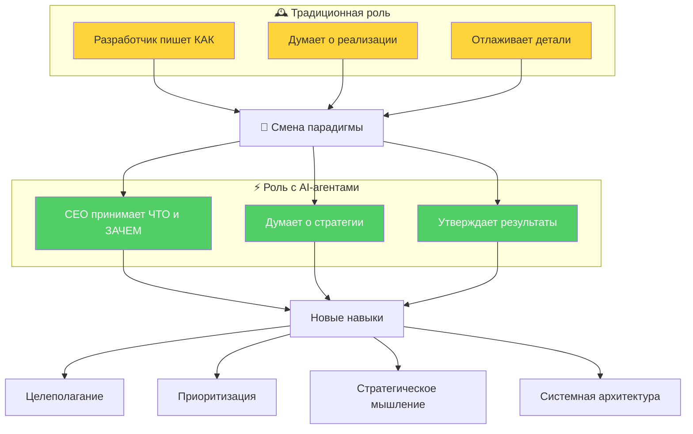

**Цитата:**
> "Когда можешь делать всё, тебе становится весьма сложно выбирать что именно ты хочешь делать на следующем шаге. Не только в программировании, но и в творчестве, образовании, управлении. Фокус с 'как делать' смещается на 'как выбирать что делать и почему'."

---

## 7. Технические Детали и Лайфхаки

### 7.1 Работа с контекстом

**Техника обогащения контекста через голос:**

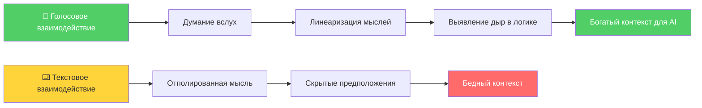

**Принцип "утки" (Rubber Duck Debugging):**
> "Раньше программисты таскали резиновую утку на стол, теперь есть LLM который ещё и отвечает полезно. Проговаривание вслух заставляет линеаризовать мысль — в голове идеи существуют как размытое облако связей, а когда формулируешь голосом приходится выстроить последовательность."

### 7.2 Эволюция автономности Claude

**Прогресс в планировании:**

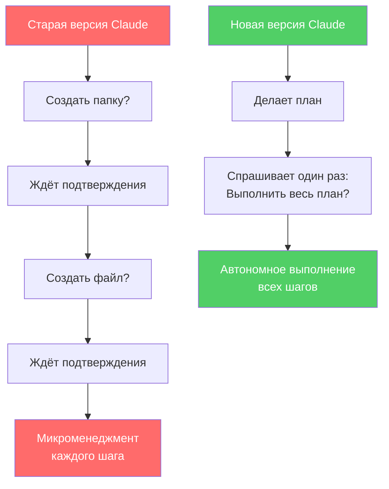

**Цитата:**
> "Раньше он спрашивал: может создам папочку? может создам файл? Сейчас он спрашивает: вот план, можно я его исполню? Всё что в плане написано, мы уже подразумеваем что мы его автономно туда запустили."

### 7.3 Генерация промптов AI для AI

**Антипаттерн: человек пишет промпты**
```python
# ❌ Человек пишет промпт для LLM
prompt = """
Проанализируй транскрипцию и определи:
1. Полноту ответа
2. Уверенность в формулировках
3. Использование терминологии
"""
# Результат: субоптимальный, пропущены технические детали
```

**Паттерн: AI пишет промпты для AI**
```python
# ✅ Просим AI создать оптимальный промпт
meta_prompt = """
Создай промпт для анализа студенческих ответов.
Промпт должен выявлять: глубину понимания, структурированность,
использование терминологии, честность рефлексии.
Формат вывода: JSON с полями для каждого критерия.
"""

# AI создаёт промпт который:
# - Использует правильные триггерные фразы
# - Структурирован для другой модели
# - Включает примеры и ограничения
```

**Цитата:**
> "Думать о том что вы напишете промпт лучше чем машина — это заблуждение. LLM пишет промпты для других LLM лучше чем человек, потому что понимает какие фразы триггерят нужное поведение."

### 7.4 Управление стоимостью

**Распределение токенов в проекте:**

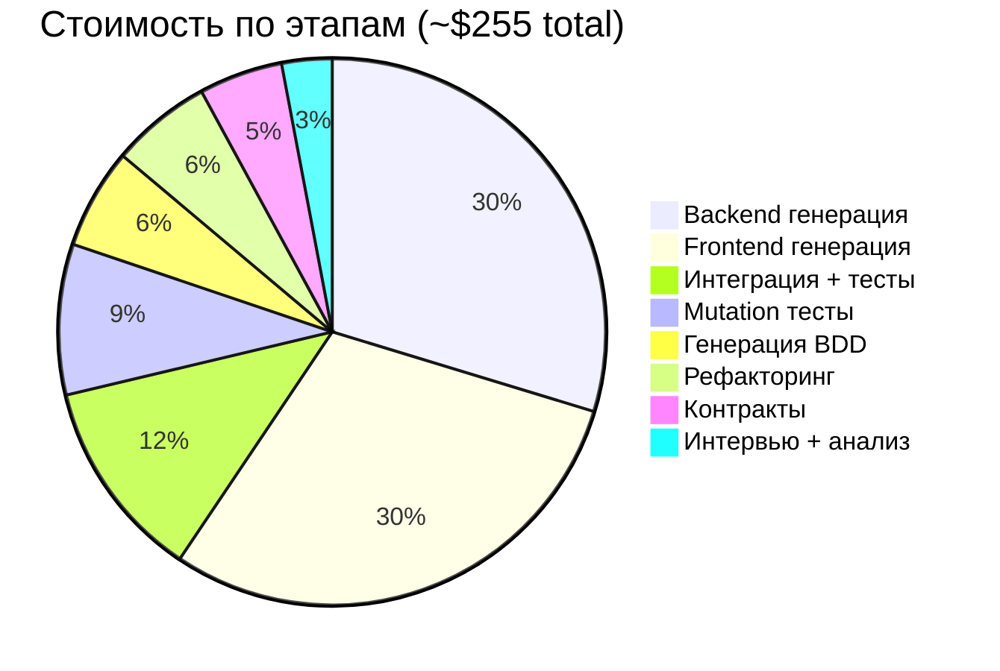

**Оптимизация стоимости:**
- ✅ GPT-4o-mini для простых задач (идентификация имён)
- ✅ Gemini для больших контекстов (дешевле на токен)
- ✅ Claude Sonnet 4.5 для сложной генерации кода
- ❌ Избегать GPT-4 для рутинных задач (дороже в 10x)

---

## 8. Результаты и Выводы

### 8.1 Достигнутые результаты

**За 3 часа live coding:**

✅ **Собрали и структурировали данные:**
- 166 разговоров с Eleven Labs
- 97 реальных попыток после очистки
- Идентифицировано 54% студентов
- Выявлено 21 уникальный активный студент

✅ **Провели многоуровневый анализ:**
- Базовая статистика (длительность, скорость речи, временные паттерны)
- Сопоставление с заданиями
- Сегментация на 3 группы
- Персональный фидбек каждому

✅ **Создали воспроизводимый pipeline:**
- ETL для обработки голосовых данных
- Автоматизированная идентификация через LLM
- Шаблоны промптов для анализа
- Готовая система для следующих домашек

✅ **Выявили мета-паттерны:**
- Что работает у сильных студентов
- Что мешает нестабильным
- Причины неактивности

### 8.2 ROI: традиционная vs AI-подход

**Сравнение затрат:**

| Метрика | Традиционная проверка | AI-автоматизация | Выигрыш |
|---------|----------------------|------------------|---------|
| **Время на проверку** | 20+ часов (10 мин × 120 студентов) | 3 часа (включая разработку) | **7x** |
| **Стоимость** | $1000 ($50/час × 20ч) | $~300 (токены + время) | **3x** |
| **Качество фидбека** | Поверхностное ("Хорошо/Плохо") | Персонализированное + инсайты | **∞** |
| **Воспроизводимость** | Каждый раз с нуля | Один раз настроил → переиспользуй | **∞** |
| **Масштабируемость** | Линейная (больше студентов = больше времени) | Логарифмическая (стоимость почти не растёт) | **∞** |

### 8.3 Ключевые уроки

**1. Контекст дороже кода:**
```
30 минут обсуждения "зачем" → качественное решение
vs
Сразу к коду → много итераций уточнений
```

**2. Человеческие ошибки > ошибки AI:**
```
Все критические проблемы: настройка окружения, ключи, права доступа
Код агента: работал корректно с первого раза
```

**3. Новое узкое место — целеполагание:**
```
Традиционная разработка: узкое место = исполнение
AI-разработка: узкое место = принятие решений "что делать дальше"
```

**4. Масштабирование персонализации:**
```
Без AI: персонализация возможна только для 5-8 человек (число Данбара)
С AI: персонализация масштабируется на десятки/сотни студентов
```

**5. Фокус на результатах, не задачах:**
```
Не: "Я сделал телеграм-бота"
А: "Студенты получили полезный фидбек и изменили поведение"
```

### 8.4 Применимость подхода

**Где этот подход работает:**

✅ **Data Science и Analytics:**
- Автоматизация исследовательского анализа
- Генерация инсайтов из больших датасетов
- Персонализация рекомендаций

✅ **Образование:**
- Автоматизированная проверка заданий
- Персональный фидбек студентам
- Выявление проблемных тем

✅ **Customer Support:**
- Анализ обращений пользователей
- Выявление паттернов проблем
- Автоматизация рутинных ответов

✅ **Research:**
- Обработка результатов экспериментов
- Сравнение подходов
- Автоматизация документирования

❌ **Где подход НЕ работает (пока):**
- Задачи требующие физического взаимодействия
- Высококритичные системы (медицина, авиация) без человеческого надзора
- Творческие задачи требующие уникального культурного контекста

---

## 9. Домашнее Задание

### 9.1 Основное задание

**Создайте свою систему анализа данных с AI-агентами:**

1. **Выберите личную задачу:**
   - Анализ своих финансов
   - Трекинг привычек
   - Анализ времени на задачах
   - Обработка личной переписки

2. **Пройдите полный цикл:**
   - 📝 Проговорите голосом: "Зачем мне это нужно?" (запишите)
   - 🎯 Сформулируйте: "Что я хочу узнать?"
   - 🤖 Делегируйте AI: сбор и анализ данных
   - 📊 Получите инсайты
   - 🔄 Примените на практике

3. **Зафиксируйте метанаблюдения:**
   - Где вы застряли?
   - Что заняло больше всего времени?
   - Какие решения приходилось принимать?
   - Почувствовали ли "интеллектуальное изобилие"?

### 9.2 Дополнительное задание (для продвинутых)

**Эксперимент с "интеллектуальной гигиеной":**

Выберите одну технику из лекции и применяйте неделю:

1. **Ограничение задач:** Максимум 3 новых направления в день
2. **Цикл рефлексии:** 5 минут паузы после каждого результата
3. **Раздельное планирование:** Утро без AI, день с AI по списку
4. **Метрики завершённости:** Считайте доведённое до конца

Зафиксируйте:
- Что изменилось в продуктивности?
- Стало ли меньше незавершённых проектов?
- Изменилось ли ощущение контроля?

### 9.3 Критерии успеха

✅ **Минимум (зачёт):**
- Выбрана личная задача
- Проговорен "зачем" вопрос
- Использован AI для анализа данных
- Получен хотя бы один инсайт

✅ **Хорошо:**
- Полный цикл от вопроса до применения
- Зафиксированы метанаблюдения
- Выявлены паттерны в своём поведении

✅ **Отлично:**
- Применена техника "интеллектуальной гигиены"
- Создан воспроизводимый pipeline
- Выявлены ограничения подхода

---

## 10. Дополнительные Материалы

### 10.1 Рекомендуемое чтение

- **Про TDD/BDD:**
  - Kent Beck "Test-Driven Development: By Example"
  - Dan North "Introducing BDD"

- **Про работу с AI:**
  - Anthropic "Prompt Engineering Guide"
  - OpenAI "Best Practices for Prompt Engineering"

- **Про когнитивную нагрузку:**
  - Daniel Kahneman "Thinking, Fast and Slow"
  - Cal Newport "Deep Work"

### 10.2 Инструменты и ресурсы

**AI-инструменты для разработки:**
- Claude (Anthropic) - лучшая автономность
- GPT-4o-mini - дешёвые рутинные задачи
- Gemini - огромный контекст

**Инструменты для анализа данных:**
- Python + pandas для обработки
- Matplotlib/Seaborn для визуализации
- Jupyter для исследовательского анализа

**Инструменты для голосового взаимодействия:**
- Eleven Labs - голосовые агенты
- Whisper - транскрипция
- ElevenLabs API - программный доступ

### 10.3 Философия и метакогниция

**Ключевые вопросы для рефлексии:**

1. Как изменится ваша работа когда исполнение станет бесплатным?
2. Готовы ли вы к роли CEO, а не разработчика?
3. Как сохранить фокус в эпоху бесконечных возможностей?
4. Что делать с "интеллектуальным изобилием"?

---

## Заключение

**Главный takeaway лекции:**

> Когда AI делает исполнение мгновенным, критичными становятся не технические навыки, а способность:
> - Формулировать правильные вопросы
> - Принимать стратегические решения
> - Управлять своим вниманием
> - Фокусироваться на результатах, не задачах

**Метафора лекции:**
```
Традиционная разработка = Дефицит ресурсов
AI-разработка = Изобилие возможностей

Проблема не в том КАК делать
Проблема в том ЧТО делать из бесконечного

Как с едой: не голод проблема, а выбор из буфета
```

**Финальная мысль:**
> "Три часа говорения выжали когнитивную энергию не на программирование, а на непрерывное принятие решений высокого уровня. Каждые две минуты вопрос 'что дальше?', без передышки на рутинную реализацию."

---

**До следующей лекции! 🚀**
