# Lecture 4: Autonomous AI Development in Action — From Data to Insights

## Overview

**Course**: AI Talent Hub, ITMO Master's Program

**Date**: October 8, 2025

**Format**: Live coding session with an AI co-instructor

**Instructors**: Alexey (Lesha) + Claude (AI voice agent) + Nikita Kononov

**Duration**: 2 hours 23 minutes of continuous work

**Key idea:** This lecture is a live demonstration of how the very process of intellectual labor is changing in the AI era. We are not just building a homework analysis system — we are observing a fundamental shift: when execution becomes instantaneous, the bottleneck is no longer "how to do it" but "what to do and why." This is the story of how three hours were spent not on programming, but on continuous strategic decision-making.

---

## 1. Context and Problem Statement

### 1.1 The Problem: Impossibility of Manual Homework Review

**Scale:**
- 28 students in the course
- 3 homework assignments (voice recordings via Eleven Labs)
- Potentially 166 conversations to analyze
- ~593 kilocharacters of transcript text

**Traditional approach (infeasible):**
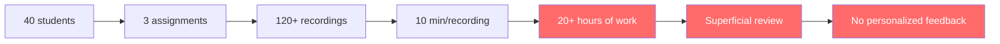
```mermaid
graph LR
    A[40 students] --> B[3 assignments]
    B --> C[120+ recordings]
    C --> D[10 min/recording]
    D --> E[20+ hours of work]
    E --> F[Superficial review]
    F --> G[No personalized feedback]

    style E fill:#ff6b6b,color:#fff
    style F fill:#ff6b6b,color:#fff
    style G fill:#ff6b6b,color:#fff
```

**The reality of grading homework:**
> "If you think your homework gets properly reviewed when there are 50 of you in the course — people will just pretend to review it. 50 assignments at 10 minutes each — that's 500 minutes for one assignment. Over 10 lectures — that's 5,000 minutes per semester. It's simply impossible."

**Alternatives without AI:**
- ✅ Peer review (students review each other)
- ✅ Automatic pass/fail flags
- ❌ High-quality personalized feedback for every student

### 1.2 Why Review Homework at All?

**The "why" chain (digging deeper):**

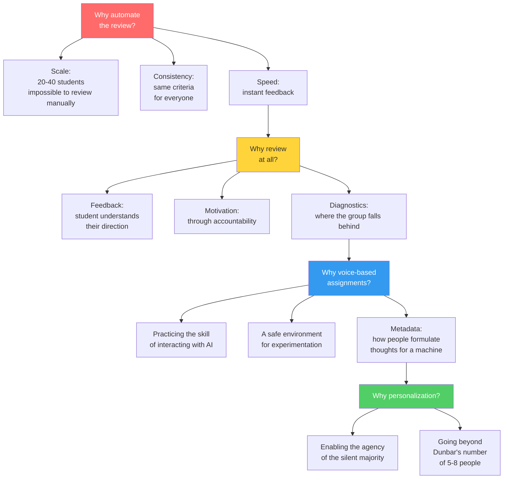
```mermaid
graph TD
    Z1[Why automate<br/>the review?] --> Z2[Scale:<br/>20-40 students<br/>impossible to review manually]
    Z1 --> Z3[Consistency:<br/>same criteria<br/>for everyone]
    Z1 --> Z4[Speed:<br/>instant feedback]

    Z4 --> Z5[Why review<br/>at all?]
    Z5 --> Z6[Feedback:<br/>student understands<br/>their direction]
    Z5 --> Z7[Motivation:<br/>through accountability]
    Z5 --> Z8[Diagnostics:<br/>where the group falls behind]

    Z8 --> Z9[Why voice-based<br/>assignments?]
    Z9 --> Z10[Practicing the skill<br/>of interacting with AI]
    Z9 --> Z11[A safe environment<br/>for experimentation]
    Z9 --> Z12[Metadata:<br/>how people formulate<br/>thoughts for a machine]

    Z12 --> Z13[Why personalization?]
    Z13 --> Z14[Enabling the agency<br/>of the silent majority]
    Z13 --> Z15[Going beyond<br/>Dunbar's number<br/>of 5-8 people]

    style Z1 fill:#ff6b6b,color:#fff
    style Z5 fill:#ffd43b
    style Z9 fill:#339af0,color:#fff
    style Z13 fill:#51cf66,color:#fff
```

**Critical observation:**
> "You can keep asking 'why' all the way down to the philosophy of education's very existence. Let's stop at the practical level — we understand the value for students, for the process, and for demonstrating what's possible."

---

## 2. Solution Architecture

### 2.1 What We Want to Build

**Level 1: Basic Statistics**
- Pull all transcriptions from Eleven Labs
- Count the number of attempts per assignment
- Uniquely identify students

**Level 2: Content Analysis**
- Match responses to assignments from the lecture notes
- Check coverage of key concepts
- Assess structured thinking

**Level 3: Segmentation and Personalization**
- Divide students into groups
- Identify patterns of success/failure
- Generate personalized feedback for each student

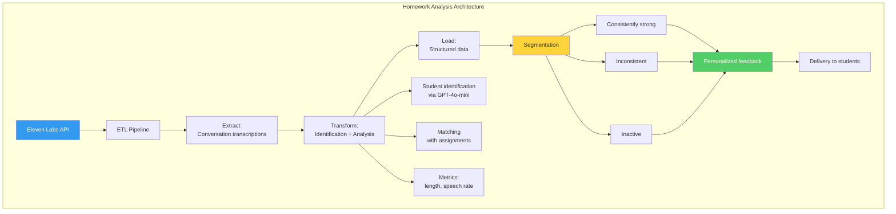
```mermaid
graph TB
    subgraph "Homework Analysis Architecture"
        API[Eleven Labs API] --> ETL[ETL Pipeline]

        ETL --> EXTRACT[Extract:<br/>Conversation transcriptions]
        EXTRACT --> TRANSFORM[Transform:<br/>Identification + Analysis]
        TRANSFORM --> LOAD[Load:<br/>Structured data]

        TRANSFORM --> ID[Student identification<br/>via GPT-4o-mini]
        TRANSFORM --> MATCH[Matching<br/>with assignments]
        TRANSFORM --> METRICS[Metrics:<br/>length, speech rate]

        LOAD --> SEGMENT[Segmentation]

        SEGMENT --> STABLE[Consistently strong]
        SEGMENT --> UNSTABLE[Inconsistent]
        SEGMENT --> INACTIVE[Inactive]

        STABLE --> FEEDBACK[Personalized feedback]
        UNSTABLE --> FEEDBACK
        INACTIVE --> FEEDBACK

        FEEDBACK --> DELIVERY[Delivery to students]
    end

    style API fill:#339af0,color:#fff
    style SEGMENT fill:#ffd43b
    style FEEDBACK fill:#51cf66,color:#fff
```

### 2.2 Technology Stack

**Why these specific tools:**

| Tool | Role | Why chosen |
|------|------|------------|
| **Claude Sonnet 4.5** | Primary coding agent | High autonomy, best tool usage |
| **GPT-4o-mini** | Student identification | Cheaper, sufficient for simple classification tasks |
| **Gemini** | Large text analysis | Massive context (up to 2M tokens) |
| **Eleven Labs** | Data source | Student voice homework |
| **FastAPI** | Backend | Rapid development, automatic documentation |
| **Python** | Programming language | Rich data science ecosystem |

**Important observation about models:**
> "We have the same model — Claude Sonnet 4.5 — for both the voice agent and the programming agent, so there shouldn't be any context translation issues. If you use different models, you'll often run into problems."

---

## 3. Development Process: Live Coding in Action

### 3.1 Preparation: Half an Hour Discussing "Why" and "What"

**Critical insight:**
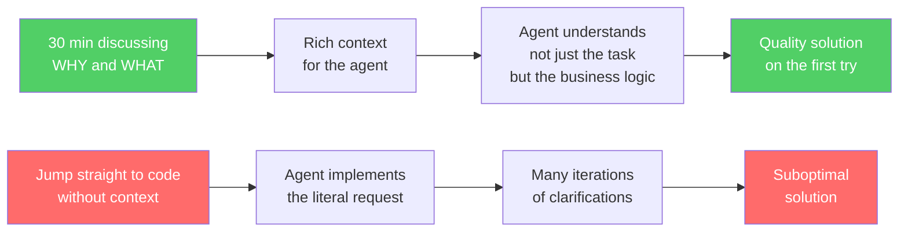
```mermaid
graph LR
    A[30 min discussing<br/>WHY and WHAT] --> B[Rich context<br/>for the agent]
    B --> C[Agent understands<br/>not just the task<br/>but the business logic]
    C --> D[Quality solution<br/>on the first try]

    A2[Jump straight to code<br/>without context] --> B2[Agent implements<br/>the literal request]
    B2 --> C2[Many iterations<br/>of clarifications]
    C2 --> D2[Suboptimal<br/>solution]

    style A fill:#51cf66,color:#fff
    style D fill:#51cf66,color:#fff
    style A2 fill:#ff6b6b,color:#fff
    style D2 fill:#ff6b6b,color:#fff
```

**Context enrichment technique:**
> "When you're doing something for the first time, do it manually. Do it manually five times and you'll understand what to automate. When I do something by hand, I see how it works, and then I can automate it."

### 3.2 The Actual Development: Where the Time Went

**Timeline of the real session:**


```mermaid
gantt
    title Actual Time Distribution (2h 23min)
    dateFormat X
    axisFormat %H:%M

    section Planning
    Discussing WHY              :plan1, 0, 30m
    Formulating WHAT            :plan2, after plan1, 15m

    section Tech Issues
    Finding Eleven Labs key     :tech1, after plan2, 10m
    Setting up permissions      :tech2, after tech1, 5m
    NumPy issues on Mac         :tech3, after tech2, 15m
    Finding OpenAI key          :tech4, after tech3, 8m
    Wrong API key               :tech5, after tech4, 5m

    section AI Work
    Writing code (agent)        :code1, after plan2, 20m
    Writing code (agent)        :code2, after tech2, 15m
    Writing code (agent)        :code3, after tech4, 25m

    section Data Analysis
    Fetching data               :data1, after code2, 5m
    Visualization               :data2, after code3, 10m
    Student identification      :data3, after data2, 30m
    Meta-analysis               :data4, after data3, 40m

    section Reflection
    Discussing philosophy       :think1, after data4, 20m
```

**Actual time distribution:**
- **Planning and discussion**: ~45 minutes (25%)
- **Resolving technical issues**: ~43 minutes (24%)
- **Autonomous agent work**: ~60 minutes (33%)
- **Data analysis**: ~85 minutes (47%)
- **Reflection and philosophy**: ~20 minutes (11%)

**Critical observation:**
> "Programming took us the least amount of time. Planning took the most. We programmed up to the point we had been able to design."

### 3.3 Human Errors vs. AI Errors

**All critical errors were on the human side:**

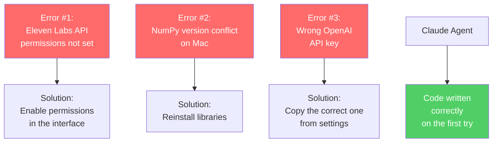
```mermaid
graph TD
    E1[Error #1:<br/>Eleven Labs API<br/>permissions not set] --> FIX1[Solution:<br/>Enable permissions<br/>in the interface]

    E2[Error #2:<br/>NumPy version conflict<br/>on Mac] --> FIX2[Solution:<br/>Reinstall libraries]

    E3[Error #3:<br/>Wrong OpenAI<br/>API key] --> FIX3[Solution:<br/>Copy the correct one<br/>from settings]

    AI[Claude Agent] --> CODE[Code written<br/>correctly<br/>on the first try]

    style E1 fill:#ff6b6b,color:#fff
    style E2 fill:#ff6b6b,color:#fff
    style E3 fill:#ff6b6b,color:#fff
    style CODE fill:#51cf66,color:#fff
```

**Key observation:**
> "Throughout our entire live coding session, all the errors were on my side. All three. The system implemented everything correctly, while we couldn't even put in the right API keys."

---

## 4. Working with Data and Insights

### 4.1 Basic Statistics

**Data collection results:**

| Metric | Value | Interpretation |
|--------|-------|----------------|
| Total conversations | 166 | Before removing empty ones |
| After cleanup | 97 | Actual submission attempts |
| Total students | 28 | Enrolled in the course |
| Identified | 54% | Clearly introduced themselves |
| Unique students | 21 | Submitted at least one assignment |
| Inactive | 9 (32%) | Never even tried |

**Dynamics across assignments:**

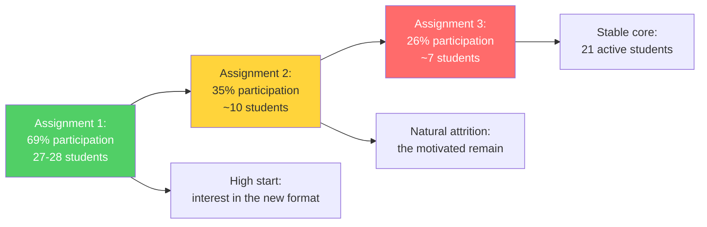
```mermaid
graph LR
    HW1[Assignment 1:<br/>69% participation<br/>27-28 students] --> HW2[Assignment 2:<br/>35% participation<br/>~10 students]
    HW2 --> HW3[Assignment 3:<br/>26% participation<br/>~7 students]

    HW1 --> INSIGHT1[High start:<br/>interest in the new format]
    HW2 --> INSIGHT2[Natural attrition:<br/>the motivated remain]
    HW3 --> INSIGHT3[Stable core:<br/>21 active students]

    style HW1 fill:#51cf66,color:#fff
    style HW2 fill:#ffd43b
    style HW3 fill:#ff6b6b,color:#fff
```

### 4.2 Activity Patterns

**Submission time waves:**

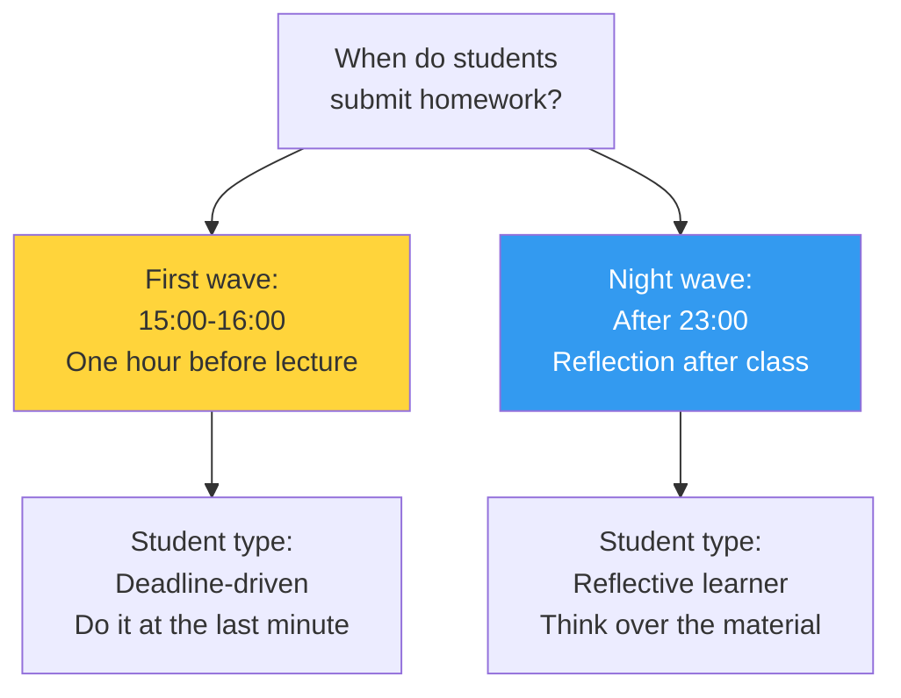
```mermaid
graph TD
    TIME[When do students<br/>submit homework?]

    TIME --> WAVE1[First wave:<br/>15:00-16:00<br/>One hour before lecture]
    TIME --> WAVE2[Night wave:<br/>After 23:00<br/>Reflection after class]

    WAVE1 --> TYPE1[Student type:<br/>Deadline-driven<br/>Do it at the last minute]
    WAVE2 --> TYPE2[Student type:<br/>Reflective learner<br/>Think over the material]

    style WAVE1 fill:#ffd43b
    style WAVE2 fill:#339af0,color:#fff
```

**Speech metrics:**

| Metric | Value | Norm | Interpretation |
|--------|-------|------|----------------|
| Average duration | 5.8 min | - | Students try to give a detailed answer |
| Median duration | 6.8 min | - | Half speak for >7 minutes |
| Average speech rate | 50 words/min | 100-150 | Students formulate thoughts aloud, not reading prepared text |
| Maximum speech rate | 104 words/min | 100-150 | Likely reading from a prepared script |
| Minimum speech rate | 1 word | - | Technical errors or refusal |

**Critical insight about speech rate:**
> "50 words per minute instead of 100-150 — that's not a bug, that's the reality of formulating thoughts out loud. The student isn't reading prepared text — they're thinking and speaking simultaneously, hence the pauses, rephrasing, and searching for words."

### 4.3 Student Identification via LLM

**Problem and solution:**

```python
# Regular expressions DON'T work for Russian speech:
# ❌ "Я Иван" → recognized as "я вам"
# ❌ "Меня зовут Дмитрий" → "мне знают Митрий"
# ❌ "Дима Шершов" → just "Дима"

# Solution: use GPT-4o-mini with context
def identify_student(transcript: str, student_list: list[str]) -> str:
    """
    Identification via LLM with fuzzy matching
    """
    prompt = f"""
    Given the student list: {student_list}
    Given the beginning of the conversation transcript: {transcript[:500]}

    Identify the student's name from the list, if they introduced themselves.
    If they didn't introduce themselves or the name isn't in the list: return "UNKNOWN"
    Return only the name without explanations.
    """
    # GPT-4o-mini: $0.15 / 1M tokens (cheap)
    response = openai.chat.completions.create(
        model="gpt-4o-mini",
        messages=[{"role": "user", "content": prompt}],
        temperature=0
    )
    return response.choices[0].message.content
```

**Results:**
- 54 students out of 97 conversations were identified
- 21 unique names (the rest were repeat attempts)
- 36 unidentified (never introduced themselves)

---

## 5. Segmentation and Personalization

### 5.1 Three Student Groups

**Segmentation model:**

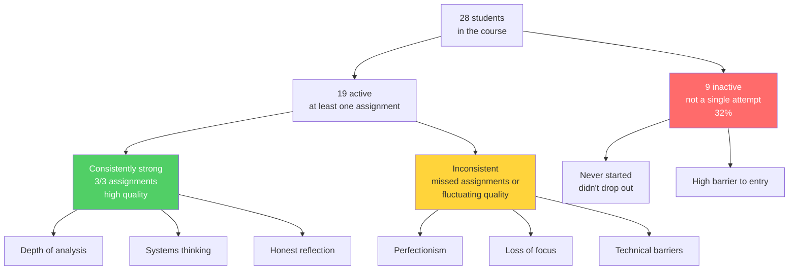
```mermaid
graph TB
    ALL[28 students<br/>in the course] --> ACTIVE[19 active<br/>at least one assignment]
    ALL --> GHOST[9 inactive<br/>not a single attempt<br/>32%]

    ACTIVE --> STABLE[Consistently strong<br/>3/3 assignments<br/>high quality]
    ACTIVE --> UNSTABLE[Inconsistent<br/>missed assignments or<br/>fluctuating quality]

    STABLE --> S1[Depth of analysis]
    STABLE --> S2[Systems thinking]
    STABLE --> S3[Honest reflection]

    UNSTABLE --> U1[Perfectionism]
    UNSTABLE --> U2[Loss of focus]
    UNSTABLE --> U3[Technical barriers]

    GHOST --> G1[Never started<br/>didn't drop out]
    GHOST --> G2[High barrier to entry]

    style STABLE fill:#51cf66,color:#fff
    style UNSTABLE fill:#ffd43b
    style GHOST fill:#ff6b6b,color:#fff
```

### 5.2 Success Patterns (What Works for Strong Students)

**Identified patterns:**

1. **Honesty in reflection**
   - No showing off with "I understood everything"
   - Openly discuss where they got stuck

2. **Connection to real-world tasks**
   - Not abstract experiments
   - Applying concepts to their own projects

3. **Depth over breadth**
   - Better to explore one experiment deeply
   - Than three superficially

4. **Systems thinking**
   - Understanding the boundaries of applicability
   - Awareness of trade-offs

5. **Philosophical reflection**
   - Connecting technical decisions
   - To a broader context

### 5.3 What Holds Back the Inconsistent Students

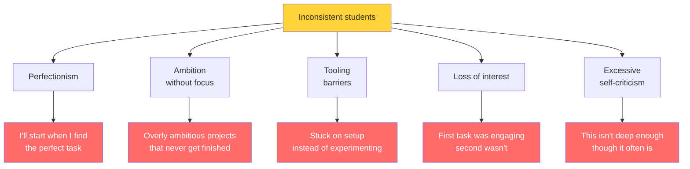
```mermaid
graph TD
    UNSTABLE[Inconsistent students] --> P1[Perfectionism]
    UNSTABLE --> P2[Ambition<br/>without focus]
    UNSTABLE --> P3[Tooling<br/>barriers]
    UNSTABLE --> P4[Loss of interest]
    UNSTABLE --> P5[Excessive<br/>self-criticism]

    P1 --> F1["I'll start when I find<br/>the perfect task"]
    P2 --> F2[Overly ambitious projects<br/>that never get finished]
    P3 --> F3[Stuck on setup<br/>instead of experimenting]
    P4 --> F4[First task was engaging<br/>second wasn't]
    P5 --> F5["This isn't deep enough"<br/>though it often is]

    style UNSTABLE fill:#ffd43b
    style F1 fill:#ff6b6b,color:#fff
    style F2 fill:#ff6b6b,color:#fff
    style F3 fill:#ff6b6b,color:#fff
    style F4 fill:#ff6b6b,color:#fff
    style F5 fill:#ff6b6b,color:#fff
```

### 5.4 Personalized Feedback Example

**Feedback structure:**

```markdown
## Student A

**Trajectory:** Assignment 1 ✅ | Assignment 2 ⚠️ | Assignment 3 ❌

**Strengths:**
- Strong start with deep technical understanding
- Good command of custom models

**Areas for attention:**
- Declining detail in the second assignment
- Missing third assignment — possible loss of motivation

**Recommendations:**
- Try to maintain the level of detail from the first assignment
- If you're stuck technically — reach out for support
- Consider tying experiments to personal projects

---

## Student B

**Trajectory:** Assignment 1 ✅ | Assignment 2 ✅ | Assignment 3 ✅

**Strengths:**
- Consistent participation in all assignments
- Deep reflection on tool applicability
- Connection to real business problems

**Areas for attention:**
- Keep up the great work
- You can take on more challenging tasks

**Recommendations:**
- Consider a mentoring role for inconsistent students
- Try advanced tracks with multi-agent systems
```

---

## 6. Philosophy of Autonomous Development

### 6.1 The Paradox of Infinite Possibilities

**The fundamental problem:**

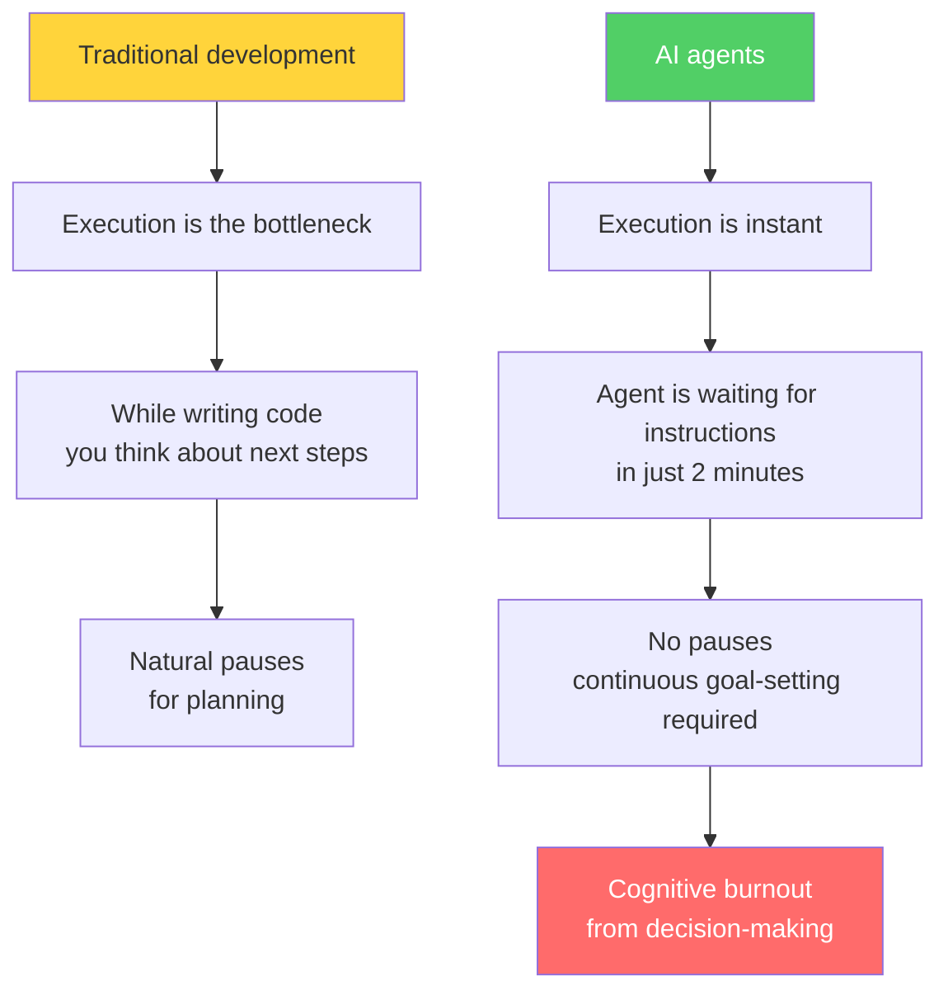
```mermaid
graph TD
    OLD[Traditional development] --> OLD1[Execution is the bottleneck]
    OLD1 --> OLD2[While writing code<br/>you think about next steps]
    OLD2 --> OLD3[Natural pauses<br/>for planning]

    NEW[AI agents] --> NEW1[Execution is instant]
    NEW1 --> NEW2[Agent is waiting for instructions<br/>in just 2 minutes]
    NEW2 --> NEW3[No pauses<br/>continuous goal-setting required]
    NEW3 --> BURN[Cognitive burnout<br/>from decision-making]

    style OLD fill:#ffd43b
    style NEW fill:#51cf66,color:#fff
    style BURN fill:#ff6b6b,color:#fff
```

**Quote from the lecture:**
> "We're used to programming taking a significant amount of time, and during that process we can think and plan. But here we get results almost instantly and aren't ready for the next steps. We need to pause and think about what to do next."

### 6.2 The Food Abundance Analogy

**"Intellectual Diabetes":**

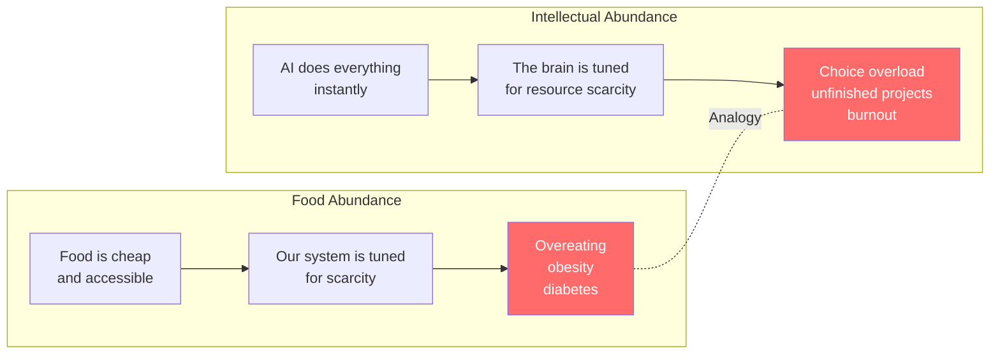
```mermaid
graph LR
    subgraph "Food Abundance"
        F1[Food is cheap<br/>and accessible] --> F2[Our system is tuned<br/>for scarcity]
        F2 --> F3[Overeating<br/>obesity<br/>diabetes]
    end

    subgraph "Intellectual Abundance"
        I1[AI does everything<br/>instantly] --> I2[The brain is tuned<br/>for resource scarcity]
        I2 --> I3[Choice overload<br/>unfinished projects<br/>burnout]
    end

    F3 -.Analogy.- I3

    style F3 fill:#ff6b6b,color:#fff
    style I3 fill:#ff6b6b,color:#fff
```

**Quote:**
> "With food, we ended up in a situation where it's infinitely available, cheap, accessible, and hyper-caloric, yet our entire system is tuned for food being scarce. We've found ourselves in exactly the same situation with intellectual labor."

### 6.3 Techniques for "Intellectual Hygiene"

**Proposed approaches:**

1. **Forced constraints (like a diet)**
   ```
   Rule: Maximum 3 new directions per day
   Everything else — only finishing what's already started
   ```

2. **Reflection cycle**
   ```
   After every result → 5-minute pause
   Write down: "Why this? What's next? Is it worth continuing?"
   ```

3. **Separate strategic sessions**
   ```
   Morning: one hour of planning WITHOUT the agent (pen + paper)
   Daytime: execution STRICTLY by the list
   ```

4. **Completion metrics, not speed metrics**
   ```
   Count: "How many things I brought to actual use"
   Don't count: "How many tasks I started"
   ```

5. **Collective calibration**
   ```
   Regular sessions: articulate WHY you did X
   An outside observer can spot aimless task-gorging
   ```

### 6.4 The New Role of the Human

**Shift in focus:**

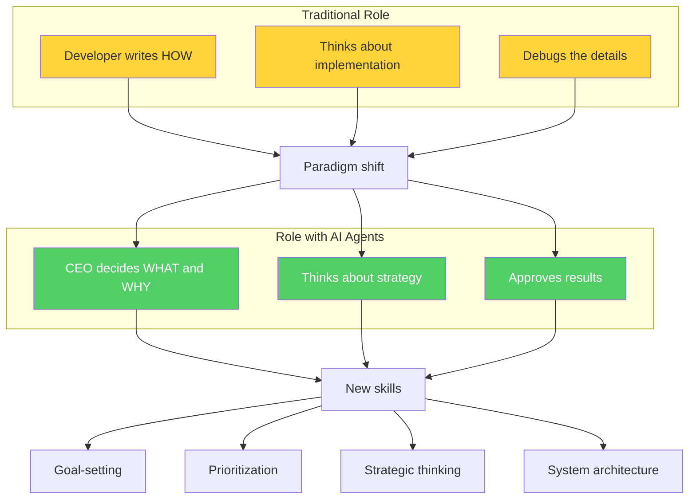
```mermaid
graph TB
    subgraph "Traditional Role"
        T1[Developer writes HOW]
        T2[Thinks about implementation]
        T3[Debugs the details]
    end

    subgraph "Role with AI Agents"
        A1[CEO decides WHAT and WHY]
        A2[Thinks about strategy]
        A3[Approves results]
    end

    T1 --> SHIFT[Paradigm shift]
    T2 --> SHIFT
    T3 --> SHIFT

    SHIFT --> A1
    SHIFT --> A2
    SHIFT --> A3

    A1 --> NEW[New skills]
    A2 --> NEW
    A3 --> NEW

    NEW --> N1[Goal-setting]
    NEW --> N2[Prioritization]
    NEW --> N3[Strategic thinking]
    NEW --> N4[System architecture]

    style T1 fill:#ffd43b
    style T2 fill:#ffd43b
    style T3 fill:#ffd43b
    style A1 fill:#51cf66,color:#fff
    style A2 fill:#51cf66,color:#fff
    style A3 fill:#51cf66,color:#fff
```

**Quote:**
> "When you can do anything, it becomes extremely difficult to choose what exactly you want to do next. Not just in programming, but in creativity, education, management. The focus shifts from 'how to do it' to 'how to choose what to do and why.'"

---

## 7. Technical Details and Tips

### 7.1 Working with Context

**Context enrichment technique via voice:**

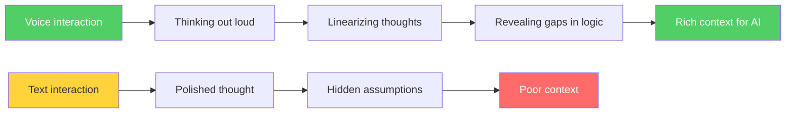
```mermaid
graph LR
    VOICE[Voice interaction] --> THINK[Thinking out loud]
    THINK --> LINEAR[Linearizing thoughts]
    LINEAR --> GAPS[Revealing gaps in logic]
    GAPS --> CONTEXT[Rich context for AI]

    TEXT[Text interaction] --> POLISH[Polished thought]
    POLISH --> HIDDEN[Hidden assumptions]
    HIDDEN --> POOR[Poor context]

    style VOICE fill:#51cf66,color:#fff
    style CONTEXT fill:#51cf66,color:#fff
    style TEXT fill:#ffd43b
    style POOR fill:#ff6b6b,color:#fff
```

**The "rubber duck" principle (Rubber Duck Debugging):**
> "Programmers used to keep a rubber duck on their desk; now there's an LLM that actually responds with useful input. Speaking out loud forces you to linearize your thoughts — in your head, ideas exist as a fuzzy cloud of connections, but when you formulate them verbally, you have to build a sequence."

### 7.2 Evolution of Claude's Autonomy

**Progress in planning:**

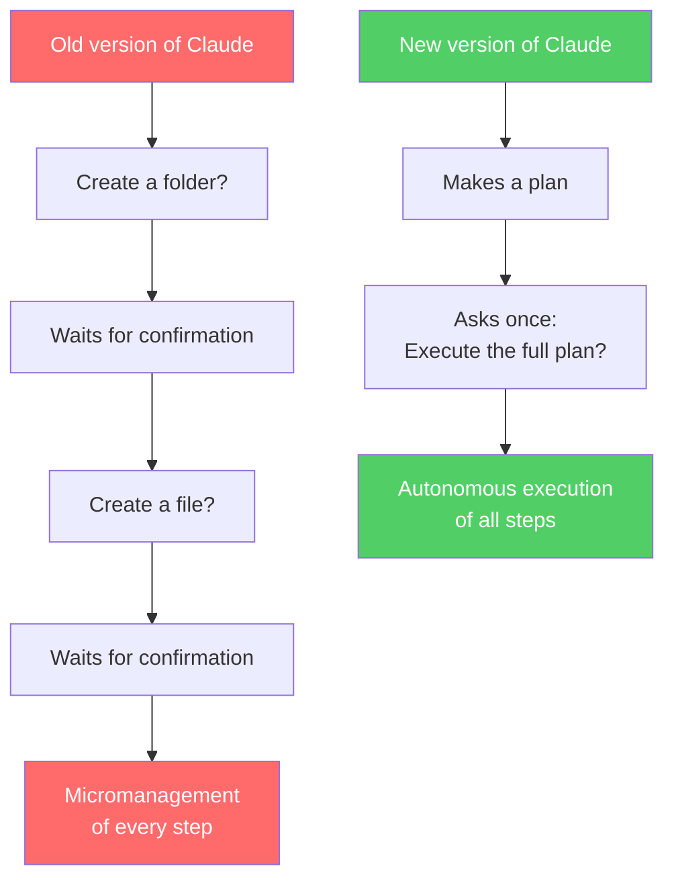
```mermaid
graph TD
    OLD[Old version of Claude] --> ASK1[Create a folder?]
    ASK1 --> WAIT1[Waits for confirmation]
    WAIT1 --> ASK2[Create a file?]
    ASK2 --> WAIT2[Waits for confirmation]
    WAIT2 --> MICRO[Micromanagement<br/>of every step]

    NEW[New version of Claude] --> PLAN[Makes a plan]
    PLAN --> APPROVE[Asks once:<br/>Execute the full plan?]
    APPROVE --> AUTO[Autonomous execution<br/>of all steps]

    style OLD fill:#ff6b6b,color:#fff
    style MICRO fill:#ff6b6b,color:#fff
    style NEW fill:#51cf66,color:#fff
    style AUTO fill:#51cf66,color:#fff
```

**Quote:**
> "It used to ask: should I create a folder? Should I create a file? Now it asks: here's the plan, may I execute it? Everything in the plan — we already assume we've sent it off for autonomous execution."

### 7.3 AI Generating Prompts for AI

**Anti-pattern: human writes prompts**
```python
# ❌ Human writes the prompt for the LLM
prompt = """
Analyze the transcription and determine:
1. Completeness of the answer
2. Confidence in phrasing
3. Use of terminology
"""
# Result: suboptimal, technical details missed
```

**Pattern: AI writes prompts for AI**
```python
# ✅ Ask the AI to create an optimal prompt
meta_prompt = """
Create a prompt for analyzing student responses.
The prompt should identify: depth of understanding, structure,
use of terminology, honesty of reflection.
Output format: JSON with fields for each criterion.
"""

# The AI creates a prompt that:
# - Uses the right trigger phrases
# - Is structured for another model
# - Includes examples and constraints
```

**Quote:**
> "Thinking that you'll write a better prompt than the machine — that's a misconception. An LLM writes prompts for other LLMs better than a human, because it understands which phrases trigger the desired behavior."

### 7.4 Managing Costs

**Token distribution in the project:**

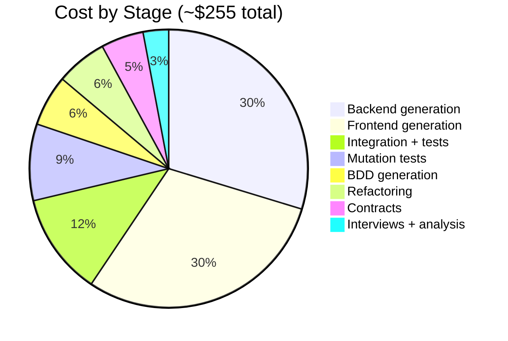
```mermaid
pie title Cost by Stage (~$255 total)
    "Backend generation" : 30
    "Frontend generation" : 30
    "Integration + tests" : 12
    "Mutation tests" : 9
    "BDD generation" : 6
    "Refactoring" : 6
    "Contracts" : 5
    "Interviews + analysis" : 3
```

**Cost optimization:**
- ✅ GPT-4o-mini for simple tasks (name identification)
- ✅ Gemini for large contexts (cheaper per token)
- ✅ Claude Sonnet 4.5 for complex code generation
- ❌ Avoid GPT-4 for routine tasks (10x more expensive)

---

## 8. Results and Conclusions

### 8.1 Achieved Results

**In 3 hours of live coding:**

✅ **Collected and structured data:**
- 166 conversations from Eleven Labs
- 97 actual attempts after cleanup
- 54% of students identified
- 21 unique active students discovered

✅ **Conducted multi-level analysis:**
- Basic statistics (duration, speech rate, temporal patterns)
- Matching with assignments
- Segmentation into 3 groups
- Personalized feedback for each student

✅ **Created a reproducible pipeline:**
- ETL for voice data processing
- Automated identification via LLM
- Prompt templates for analysis
- Ready-to-use system for future assignments

✅ **Identified meta-patterns:**
- What works for strong students
- What holds back inconsistent students
- Reasons for inactivity

### 8.2 ROI: Traditional vs. AI Approach

**Cost comparison:**

| Metric | Traditional Review | AI Automation | Gain |
|--------|-------------------|---------------|------|
| **Time to review** | 20+ hours (10 min x 120 students) | 3 hours (including development) | **7x** |
| **Cost** | $1,000 ($50/hr x 20h) | ~$300 (tokens + time) | **3x** |
| **Feedback quality** | Superficial ("Good/Bad") | Personalized + insights | **infinite** |
| **Reproducibility** | Start from scratch every time | Set up once, reuse forever | **infinite** |
| **Scalability** | Linear (more students = more time) | Logarithmic (cost barely grows) | **infinite** |

### 8.3 Key Lessons

**1. Context is more valuable than code:**
```
30 minutes discussing "why" → quality solution
vs
Jump straight to code → many clarification iterations
```

**2. Human errors > AI errors:**
```
All critical problems: environment setup, API keys, access permissions
Agent's code: worked correctly on the first try
```

**3. The new bottleneck is goal-setting:**
```
Traditional development: bottleneck = execution
AI development: bottleneck = deciding "what to do next"
```

**4. Scaling personalization:**
```
Without AI: personalization only possible for 5-8 people (Dunbar's number)
With AI: personalization scales to tens/hundreds of students
```

**5. Focus on outcomes, not tasks:**
```
Not: "I built a Telegram bot"
But: "Students received useful feedback and changed their behavior"
```

### 8.4 Applicability of the Approach

**Where this approach works:**

✅ **Data Science and Analytics:**
- Automating exploratory analysis
- Generating insights from large datasets
- Personalizing recommendations

✅ **Education:**
- Automated homework review
- Personalized student feedback
- Identifying problem topics

✅ **Customer Support:**
- Analyzing user inquiries
- Identifying problem patterns
- Automating routine responses

✅ **Research:**
- Processing experimental results
- Comparing approaches
- Automating documentation

❌ **Where the approach does NOT work (yet):**
- Tasks requiring physical interaction
- High-criticality systems (medicine, aviation) without human oversight
- Creative tasks requiring unique cultural context

---

## 9. Homework Assignment

### 9.1 Main Assignment

**Create your own data analysis system with AI agents:**

1. **Choose a personal task:**
   - Analyzing your finances
   - Habit tracking
   - Analyzing time spent on tasks
   - Processing personal correspondence

2. **Complete the full cycle:**
   - Articulate out loud: "Why do I need this?" (record it)
   - Formulate: "What do I want to learn?"
   - Delegate to AI: data collection and analysis
   - Obtain insights
   - Apply in practice

3. **Record your meta-observations:**
   - Where did you get stuck?
   - What took the most time?
   - What decisions did you have to make?
   - Did you feel "intellectual abundance"?

### 9.2 Bonus Assignment (for Advanced Students)

**Experiment with "intellectual hygiene":**

Choose one technique from the lecture and apply it for a week:

1. **Task limiting:** Maximum 3 new directions per day
2. **Reflection cycle:** 5-minute pause after every result
3. **Separate planning:** Morning without AI, daytime with AI following a list
4. **Completion metrics:** Count what you actually finished

Record:
- What changed in your productivity?
- Did you have fewer unfinished projects?
- Did your sense of control change?

### 9.3 Success Criteria

✅ **Minimum (pass):**
- A personal task is chosen
- The "why" question has been articulated
- AI was used for data analysis
- At least one insight was obtained

✅ **Good:**
- Full cycle from question to application
- Meta-observations recorded
- Patterns in your own behavior identified

✅ **Excellent:**
- An "intellectual hygiene" technique was applied
- A reproducible pipeline was created
- Limitations of the approach were identified

---

## 10. Additional Materials

### 10.1 Recommended Reading

- **On TDD/BDD:**
  - Kent Beck "Test-Driven Development: By Example"
  - Dan North "Introducing BDD"

- **On working with AI:**
  - Anthropic "Prompt Engineering Guide"
  - OpenAI "Best Practices for Prompt Engineering"

- **On cognitive load:**
  - Daniel Kahneman "Thinking, Fast and Slow"
  - Cal Newport "Deep Work"

### 10.2 Tools and Resources

**AI tools for development:**
- Claude (Anthropic) — best autonomy
- GPT-4o-mini — cheap routine tasks
- Gemini — massive context

**Data analysis tools:**
- Python + pandas for processing
- Matplotlib/Seaborn for visualization
- Jupyter for exploratory analysis

**Voice interaction tools:**
- Eleven Labs — voice agents
- Whisper — transcription
- ElevenLabs API — programmatic access

### 10.3 Philosophy and Metacognition

**Key questions for reflection:**

1. How will your work change when execution becomes free?
2. Are you ready for the role of CEO rather than developer?
3. How do you maintain focus in an era of infinite possibilities?
4. What do you do with "intellectual abundance"?

---

## Conclusion

**Main takeaway of the lecture:**

> When AI makes execution instantaneous, what becomes critical is not technical skills, but the ability to:
> - Ask the right questions
> - Make strategic decisions
> - Manage your attention
> - Focus on outcomes, not tasks

**Lecture metaphor:**
```
Traditional development = Resource scarcity
AI development = Abundance of possibilities

The problem is not HOW to do it
The problem is WHAT to do out of the infinite options

Like with food: the problem isn't hunger, but choosing from a buffet
```

**Final thought:**
> "Three hours of speaking drained cognitive energy not on programming, but on continuous high-level decision-making. Every two minutes the question 'what's next?', with no break for routine implementation."

---

**See you at the next lecture!**
